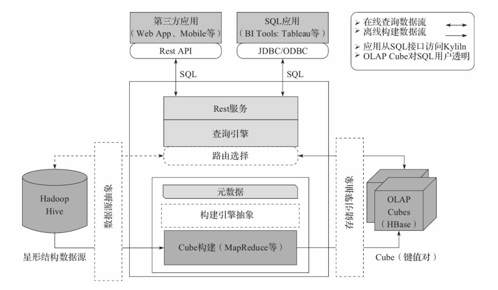

# Kylin

## 概述

- 是一个OLAP数据分析平台（新版本支持实时模块）。

- 优点：

  - 可以基于海量数据进行OLAP分析

  - 亚秒级交互式查询（查询性能好）

  - CUBE数据预聚合 （以空间换时间）

    > 以存储空间换取查询性能的提升，减少查询消耗的时间

    - Kylin拉取Hive中的历史数据，进行cube构建

    - cube会根据维度进行指标聚合

      > Cube负载加载Hive数据，通过维度字段对指标字段进行预聚合，聚合好之后将结果数据存储在Hbase

    - cube构建好之后会将结果数据保存在Hbase

      > 结果数据指的是：聚合好的指标数据
  >
      > 维度越多，在构建的时候越耗性能
  
    - web查询数据是通过Kylin的查询服务，直接查询Hbase的数据

## 启动

- 启动zookeeper

- 启动HDFS

- 启动YARN集群

- 启动HBASE

- 启动Hive

  - 启动MetaStore

    ~~~shell
    cd $HIVE_HOME/bin
    hive --service metastore &
    ~~~

  - 启动hivesever2

    ~~~shell
    cd $HIVE_HOME/bin
    hive --service hiveserver2 &
    ~~~

- 启动Yarn HistoryServer

  ~~~shell
  mr-jobhistory-daemon.sh start historyserver
  ~~~

- 启动Kylin

  ~~~shell
  cd $KYLIN_HOME/bin
  ./kylin.sh start
  ~~~

- 页面访问地址：

  ~~~
  http://node01:7070
  ~~~

  > 用户名:ADMIN
  >
  > 密码:KYLIN

## 使用

- 使用Kylin构建Cube
  - 1、首先数据必须先存在于Hive
  - 2、加载Hive中的数据
  - 3、创建Model，需要指定表，指定维度、指定聚合指标
  - 4、创建Cube，需要指定model名称，指定维度、指定聚合指标、指定构建引擎
  - 5、构建Cube
  - 6、数据查询

> 可能遇到的问题：
>
> 如果build不成功，考虑将HDFS上的元数据和Hbase中Kylin的元数据删除
>
> 具体步骤：
>
> - 清理HDFS上Kylin元数据目录下的文件
> - 清理HBase上Kylin元数据表的数据"KYLIN_Metadata"
> - 删除对应cube在HBase上的表

## 工作原理

> 本质上是MOLAP（多维立方体分析）

- Cube：多维立方体，是一个形象的说法，cube模型称为多维立方体模型，由Cuboid组成
- Cuboid：立方形，也是一个形象说法，对任意一组维度进行组合（维度的数量可以是0,1，或者更多），得到的聚合结果，被称为cuboid（任意多个维度组合形成的物化视图）。cuboid的数量取决于维度的数量，总数量=2^(维度的个数)次方

### 技术架构

- 在线查询模式主要处于上半部分，离线构建处于下半部分。以下为Kylin技术架构的具体内容：
  - 数据源主要是Hadoop Hive，数据以关系表的形式输入，且符合星形模型，保存着待分析的用户数据。根据元数据的定义，构建引擎从数据源抽取数据，并构建Cube

  - Kylin可以使用MapReduce或者Spark作为构建引擎。构建后的Cube保存在右侧的存储引擎中，一般选用HBase作为存储

  - 完成了离线构建后，用户可以从上方查询系统发送SQL进行查询分析

  - Kylin提供了各种Rest API、JDBC/ODBC接口。无论从哪个接口进入，SQL最终都会来到Rest服务层，再转交给查询引擎进行处理

  - SQL语句是基于数据源的关系模型书写的，而不是Cube

    - (1) Kylin在设计时，刻意对查询用户屏蔽了Cube的概念
    -  (2) 分析师只需要理解简单的关系模型就可以使用Kylin，没有额外的学习门槛，传统的SQL应用也很容易迁移

    - (3) 查询引擎解析SQL，生成基于关系表的逻辑执行计划，然后将其转译为基于Cube的物理执行计划，最后查询预计算生成的Cube并产生结果，**整个过程不会访问原始数据源**

### 增量构建

- **cube、cuboid和segment的关系**
  - 一个cube包含多个cuboid
  - 一个cube包含多个多个segment
    - 一个segment对应于Hbase中的一张表，在做增量构建的时候，每增量构建一次，形成一个segment
  - cuboid和segment的关系
    - cuboid是任意维度组合之后，聚合形成的结果数据，这些结果数据数据结构是一样的
    - segment是物理存储概念，每一张表（每一个segment）的数据结构是一样的
  - 每一个增量构建的segment是有起止时间的，是通过时间进行分区

#### 增量构建与全量构建的对比

| **全量构建**                      | **增量构建**                                               |
| --------------------------------- | ---------------------------------------------------------- |
| 每次更新时都需要更新整个数据集    | 每次只对需要更新的时间范围进行更新，因此离线计算量相对较小 |
| 查询时不需要合并不同Segment的结果 | 查询时需要合并不同Segment的结果，因此查询性能会受影响      |
| 不需要后续的Segment合并           | 累计一定量的Segment之后，需要进行合并                      |
| 适合小数据量或全表更新的Cube      | 适合大数据量的Cube                                         |

## 碎片管理

> 指的是对一个cube下的segment进行管理

- 管理方式
  - 合并：对多个segment进行合并操作，也就是对多个segment合并形成一个segment
    - 手动合并：在Model中，Action下面选择Merge操作，多个segment会被合并成一个，原来的segment将会被删除，在Merge的过程中不影响查询
    - 自动合并：(**推荐使用**)
  - 删除：对不再使用的segment进行删除，只保留有效的segment
  - 自定合并
    - 如果自动合并阈值里包含多条阈值数据
    - 首先判断各segment的日期合并，判断是否满足最大的阈值条件，满足就合并，反之不合并
    - 若上一步未满足，会判断是否满足较小的阈值条件，满足就合并，反之不合并

## Cuboid剪枝优化

减少一个维度，cuboid的数量直接减半