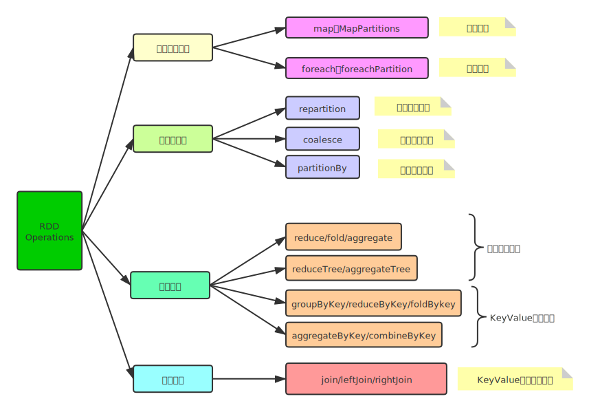

# Spark Core

## RDD

> 弹性分布式数据集（Resilient Distributed Datasets，RDD），是Spark中最基本的数据抽象，代表一个不可变、可分区的，元素可并行计算的集合
>
> *A Resilient Distributed Dataset (RDD), the basic abstraction in Spark. Represents an immutable,partitioned collection of elements that can be operated on in parallel*
>
> 来源于Paper：Resilient Distributed Datasets: A Fault-Tolerant Abstraction for In-Memory 
> Cluster Computing

RDD提供了一个抽象的数据模型，不必担心底层数据的分布式特性，只需将具体的应用逻辑表
达为一系列转换操作（函数），不同RDD之间的转换操作之间还可以形成依赖关系，进而实现管道化，从而避免了中间结果的存储，大大降低了数据复制、磁盘IO和序列化开销，并且还提供了更多的API(map/reduec/filter/groupBy等等)

- RDD核心点
  - 不可变immutable
  - 分区的partitioned
  - 并行计算的parallel

### 特性

~~~scala
Internally, each RDD is characterized by five main properties:
 - A list of partitions
 - A function for computing each split
 - A list of dependencies on other RDDs
 - Optionally, a Partitioner for key-value RDDs (e.g. to say that the RDD is hash-partitioned)
 - Optionally, a list of preferred locations to compute each split on (e.g. block locations for
   an HDFS file)
~~~

RDD数据结构内部有五个特性

- A list of partitions

  - 一个分区（分片）列表，即数据集的基本组成单位
  - 对于RDD来说，每个分片会被一个计算任务处理，分片决定并行度
  - 用户可以在创建RDD的时候指定RDD分片数，没有指定则会采用默认值

  ~~~scala
    /**
     * Implemented by subclasses to return the set of partitions in this RDD. This method will only
     * be called once, so it is safe to implement a time-consuming computation in it.
     *
     * The partitions in this array must satisfy the following property:
     *   `rdd.partitions.zipWithIndex.forall { case (partition, index) => partition.index == index }`
     */
    protected def getPartitions: Array[Partition]
  ~~~

  

- A function for computing each split

  - Spark中的RDD计算是以分片为单位的，compute函数会被作用在每个分区上

  ~~~scala
  /**
     * :: DeveloperApi ::
     * Implemented by subclasses to compute a given partition.
     */
    @DeveloperApi
    def compute(split: Partition, context: TaskContext): Iterator[T]
  ~~~

- A list of dependencies on other RDDs

  - RDD的每次转换都会生成一个新的RDD，故RDD之间就会形成类似流水线一样的前后依赖关系，在部分数据丢失时，就可以通过依赖关系重新计算丢失的分区数据，而不是对RDD所有的分区进行重新计算（容错机制）

  ~~~scala
    /**
     * Implemented by subclasses to return how this RDD depends on parent RDDs. This method will only
     * be called once, so it is safe to implement a time-consuming computation in it.
     */
    protected def getDependencies: Seq[Dependency[_]] = deps
  ~~~

- Optionally, a Partitioner for key-value RDDs (e.g. to say that the RDD is hash-partitioned)

  - 可选项，对于KeyValue类型的RDD会有一个Partitioner，即RDD的分区函数
  - 当前Spark中实现了两种类型的分区函数，一个是基于哈希的HashPartitioner，另外一个是基于范围的RangePartitioner。
  - 只有对于key-value的RDD，才有Partitioner，非key-value的RDD，Parititioner值是None
  - Partitioner函数不但决定了RDD本身的分片数量，也决定了parent RDD Shuffle输出时的分片数量

- Optionally, a list of preferred locations to compute each split on (e.g. block locations for an HDFS file)
  - 可选项，一个列表，存储存取每个Partition的优先位置（prefer location）
  - 对于一个HDFS文件来说，这个列表保存的就是每个Partition所在的块的位置
  - 按照"移动数据不如移动计算"的理念，Spark在进行任务调度的时候，会尽可能选择那些存有数据的worker节点来进行任务计算。（本地优先计算）

> RDD设计的一个重要优势是能够记录RDD间的依赖关系，也就是血统（lineage），通过丰富的转换操作（Transformation），可以构建一个复杂的DAG有向无环图，进而一步步计算

### 函数

> 主要有两类：Transformation和Action
>
> *Transformation操作只是建立计算关系，而Action 操作才是实际的执行者*

- Transformation

  - 返回一个新的RDD

    > which create a new dataset from an existing one

  - 所有Transformation函数都是`Lazy`，不会立即执行，需要Action函数触发

- Action

  - 返回值不是RDD（无返回值或者返回其他返回值）

    > which return a value to the driver program after running a computation on the dataset

  - 所有Action函数立即执行（Eager），比如count、first、collect、take等

> 注意：
>
> - RDD不实际存储真正要计算的数据，而是记录了数据的位置在哪，数据的转换关系
> - RDD中的所有转换都是惰性求值/延迟执行的，也就是说并不会直接计算。只有当发生一个要求返回结果给Driver的Action动作时，这些转换才会真正运行。之所以使用惰性求值/延迟执行，是因为这样可以在Action时对RDD操作形成DAG有向无环图进行Stage的划分和并行优化，这种设计让Spark更加有效率地运行

#### 一些重要函数

