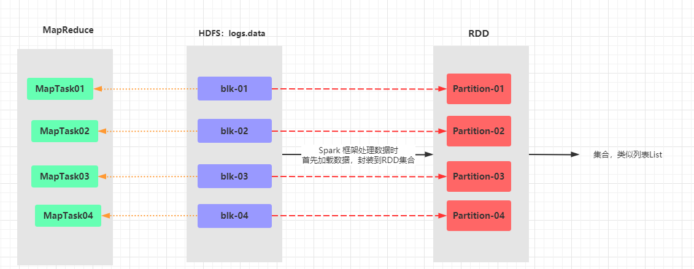
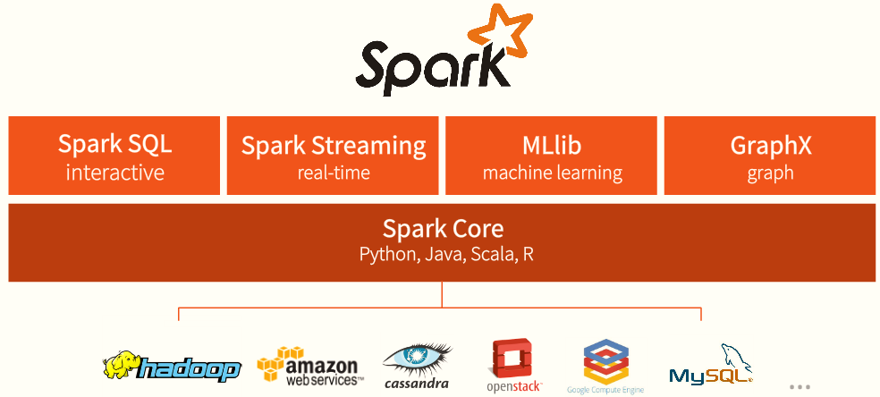
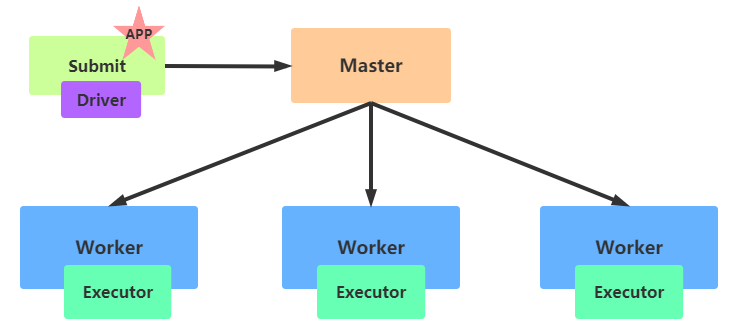

# Spark

> `Apache Spark is a unified analytics engine for large-scale data processing.`

> 起源于加州大学伯克利分校，来源于一篇论文[弹性分布式数据集(`RDD`)]()
>
> 1、分析引擎：类似MapReduce框架，分析海量数据
>
> 2、统一分析引擎：针对任意数据分析需求，都可以分析数据
>
> 3、大规模数据分析引擎：处理数据可以海量数据

## Introduction

- `RDD（弹性分布式数据集）`是Spark框架的核心概念，属于分布式集合，将数据划分到不同的partition中，每个分区数据被一个Task任务处理（类似MapReduce框架中处理一个Block数据使用一个MapTask任务）

- Spark与MapReduce框架的比较

  

- Spark框架仅仅是一个分析数据的框架
  - 数据来源：支持任何数据源，能够从任意存储引擎读写数据
  - 应用程序运行：本地模式、集群模式(Standalone、Hadoop YARN、容器)

- Spark应用程序运行模式：本地和集群、云端

  - [Spark框架将数据封装在RDD集合中，每个集合RDD由多个分区Partition组成，每个分区Partition数据被一个Task处理，每个Task任务启动一个线程Thread，每个Task运行需要一核CPU]()

> Spark程序运行本地模式，可以指定JVM启动几个线程Thread或者分配多少Core CPU

## 框架模块

### Spark Core

实现了Spark的基本功能，包含RDD、任务调度、内存管理、错误恢复、与存储系统交互等模块。

数据结构`RDD`

### Spark SQL

用来操作结构化数据的程序包，通过Spark SQL，可以使用SQL操作数据。

数据结构：DataSet/DataFrame = RDD + Schema

### Spark Streaming

Spark提供的堆实时数据进行流式计算的组件，提供了用来操作数据流的API。

数据结构：DStream = Seq[EDD]

### Spark MLlib

提供常见的机器学习(ML)功能的程序库。包括分类、回归、聚类、协同过滤等，还提供了模型评估、数据导入等额外的支持功能。 

数据结构：RDD或者DataFrame

### Spark GraphX

Spark中用于图计算的API，性能良好，拥有丰富的功能和运算符，能在海量数据上自如地运行复杂的图算法。

数据结构：RDD或者DataFrame

### Structured Streaming

Structured Streaming结构化流处理模块，将流式结构化数据封装到DataFrame中进行分析。

Structured Streaming是建立在SparkSQL引擎之上的可伸缩和高容错的流式处理引擎，可以像操作静态数据的批量计算一样来执行流式计算。当流式数据不断的到达的过程中Spark SQL的引擎会连续不断的执行计算并更新最终结果。

## 运行模式

- Spark 框架编写的应用程序可以运行在本地模式（Local Mode）、集群模式（Cluster Mode）和云服务（Cloud），方便开发测试和生产部署。

- 本地模式：Local Mode
  - 将Spark 应用程序中任务Task运行在一个本地JVM Process进程中，通常开发测试使用。

- 集群模式：Cluster Mode
  - 将Spark应用程序运行在集群上，比如Hadoop YARN集群，Spark自身集群Standalone及Apache Mesos集群
  - Hadoop YARN集群模式（生产环境使用）：运行在 yarn 集群之上，由 yarn 负责资源管理，Spark 负责任务调度和计算，好处：计算资源按需伸缩，集群利用率高，共享底层存储，避免数据跨集群迁移。
  - Spark Standalone集群模式（开发测试及生成环境使用）：类似Hadoop YARN架构，典型的Mater/Slaves模式，使用Zookeeper搭建高可用，避免Master是有单点故障的。
  - Apache Mesos集群模式（国内使用较少）：运行在 Mesos 资源管理器框架之上，由 Mesos 负责资源管理，Spark 负责任务调度和计算。

- 云服务：Kubernetes模式
  - Spark 2.3开始支持将Spark开发应用运行在K8S上

## Quick Start

> Spark 2.4.x本地模式使用Spark-Shell运行Word Count程序
>
> 集群环境 CentOS 7.7
>
> - node1
>
> 数据预先上传至HDFS目录: /datas/wordount.data

~~~scala
scala> val inputRDD = sc.textFile("/datas/wordcount.data")
inputRDD: org.apache.spark.rdd.RDD[String] = /datas/wordcount.data MapPartitionsRDD[1] at textFile at <console>:24

scala> val wordsRDD = inputRDD.flatMap(line => line.split("\\s+"))
wordsRDD: org.apache.spark.rdd.RDD[String] = MapPartitionsRDD[2] at flatMap at <console>:25

scala> val tuplesRDD = wordsRDD.map(word => (word, 1))
tuplesRDD: org.apache.spark.rdd.RDD[(String, Int)] = MapPartitionsRDD[3] at map at <console>:25

scala> val wordcountsRDD = tuplesRDD.reduceByKey((tmp, item) => tmp + item)
wordcountsRDD: org.apache.spark.rdd.RDD[(String, Int)] = ShuffledRDD[4] at reduceByKey at <console>:25

scala> wordcountsRDD.foreach(item => println(item))
(spark,4)
(hadoop,1)
(hive,3)
(sprk,1)
~~~

## Spark应用组成

> 当Spark Application程序运行在集群上时，由两部分组成：`Driver Program + Executors`，都是JVM进程
>
> - 1、`Driver Program`：应用管理者
>   - 类似于`Application Master`，管理整个应用中所有的Job的调度执行
>   - 运行JVM Process，运行陈旭的Main函数，必须创建SparkContext上下文对象
>   - 一个SparkApplication仅有一个
> - 2、`Executors`：
>   - 相当于一个线程池，运行JVM Process，其中有很多线程，每个线程运行一个Task任务，一个Task运行需要1 Core CPU，所有可以认为Executor中线程数就等于CPU Core核数
>   - 一个Spark Application可以有多个，可以设置个数和资源信息
>   - 类似MapTask和ReduceTask

## Spark Standalone集群

### 架构

Spark Standalone集群，类似于Hadoop YARN，管理集群资源和调度资源

- 主节点Master：类似ResourceManager

  - 管理整个集群资源，接收提交应用，分配资源给每个应用，运行Task任务

- 从节点Workers：类似NodeManager

  - 管理每个机器的资源，分配对应的资源来运行Task；

  - 每个从节点分配资源信息给Worker管理，资源信息包含内存Memory和CPU Cores核数

- 历史服务器HistoryServer：类似MRJobHistoryServer

  - Spark Application运行完成以后，保存事件日志数据至HDFS，启动HistoryServer可以查应用运行相关信息

### 搭建步骤

#### Step1：解压安装

~~~shell
## 解压软件包
tar -zxf /export/software/spark-2.4.5-bin-cdh5.16.2-2.11.tgz -C /export/server/
## 创建软连接，方便后期升级
ln -s /export/server/spark-2.4.5-bin-cdh5.16.2-2.11 /export/server/spark
## 进入配置目录
cd /export/server/spark/conf
## 修改配置文件名称
mv spark-env.sh.template spark-env.sh
vim spark-env.sh
## 添加内容如下：
JAVA_HOME=/export/server/jdk
SCALA_HOME=/export/server/scala
HADOOP_CONF_DIR=/export/server/hadoop/etc/hadoop
~~~

#### Step2：修改Slaves文件

~~~properties
## 进入配置目录
cd /export/server/spark/conf
## 修改配置文件名称
mv slaves.template slaves
vim slaves
## 内容如下：
node1
node2
node3
~~~

#### Step3：修改Spark-env.sh

- 配置Master、Workers、HistoryServer

  ~~~properties
  SPARK_MASTER_HOST=node1
  SPARK_MASTER_PORT=7077
  SPARK_MASTER_WEBUI_PORT=8080
  SPARK_WORKER_CORES=1
  SPARK_WORKER_MEMORY=1g
  SPARK_WORKER_PORT=7078
  SPARK_WORKER_WEBUI_PORT=8081
  SPARK_HISTORY_OPTS="-Dspark.history.fs.logDirectory=hdfs://node1:8020/spark/eventLogs/  -Dspark.history.fs.cleaner.enabled=true"
  ~~~

  

#### Step4：创建日志存储目录

启动HDFS，创建应用日志存储目录

~~~shell
hadoop-daemon.sh start namenode
hadoop-daemons.sh start datanode
hdfs dfs -mkdir -p /spark/eventLogs/
~~~

#### Step5：修改Spark-default.conf

- 配置Spark应用保存EventLogs

  ~~~shell
  ## 进入配置目录
  cd /export/server/spark/conf
  ## 修改配置文件名称
  mv spark-defaults.conf.template spark-defaults.conf
  vim spark-defaults.conf
  ## 添加内容如下：
  spark.eventLog.enabled true
  spark.eventLog.dir hdfs://node1:8020/spark/eventLogs/
  spark.eventLog.compress true
  ~~~

#### Step6：修改log4j.properties

- 设置日志级别

  ~~~properties
  ## 进入目录
  cd /export/server/spark/conf
  ## 修改日志属性配置文件名称
  mv log4j.properties.template log4j.properties
  ## 改变日志级别
  vim log4j.properties
  ~~~

#### Step7：分发配置至其余机器

~~~shell
cd /export/server/
scp -r spark-2.4.5-bin-cdh5.16.2-2.11 root@node2:$PWD
scp -r spark-2.4.5-bin-cdh5.16.2-2.11 root@ node3:$PWD
## 远程连接到node2和node3机器，创建软连接
ln -s /export/server/spark-2.4.5-bin-cdh5.16.2-2.11 /export/server/spark
~~~

### 启动服务

- 在主节点启动Master

  ~~~shell
  /export/server/spark/sbin/start-master.sh
  ~~~

  - 查看WEB-UI：http://node1:8080

- 在主节点启动从节点

  ~~~shell
  /export/server/spark/sbin/start-slaves.sh
  ~~~

  - 查看WEB-UI：http://node1:8080 可以看到从节点上线加入集群

### 提交程序运行Spark Submit

#### 示例

`--master spark://node1:7077`表示Standalone地址

~~~shell
SPARK_HOME=/export/server/spark

${SPARK_HOME}/bin/spark-submit \
--master spark://node1:7077 \
--class org.apache.spark.examples.SparkPi \
${SPARK_HOME}/examples/jars/spark-examples_2.11-2.4.5.jar \
10
~~~

#### 提交参数

##### 基本参数

~~~shell
# 表示运行的模式 本地模式local 集群模式
--master MASTER_URL
#本地模式local[2]     Standalone集群 spark://domain1.port, spark://domain2:port

# Driver Program运行的地方 也表示集群的部署模式默认为client 生产环境通常使用cluster
--deploy-mode DEPLOY_MODE

# 表示要运行的Application的类名称
--class CLASS_NAME

# 应用运行的全名 
--name  A NAME OF YOUR APPLICATION

# 要运行的jar包名称 通常在本地文件系统中 多个jar包用逗号隔开
--jar JARS

# 参数配置
--conf PROP=VALUE

~~~

##### Driver Program参数

~~~shell
# 指定Driver Program JVM内存大小 默认为1G
--driver-memory MEM
~~~

#### WEB-UI监控

- Spark 提供了多个监控界面，当运行Spark任务后可以直接在网页对各种信息进行监控查看。运行spark-shell交互式命令在Standalone集群上，命令如下：

  ~~~shell
  /export/server/spark/bin/spark-shell --master spark://node1:7077
  ~~~

- Spark Application程序运行时三个核心概念：Job、Stage、Task

  -  Task：被分配到各个 Executor 的单位工作内容，它是 Spark 中的最小执行单位，一
    般来说有多少个 Paritition（物理层面的概念，即分支可以理解为将数据划分成不同
    部分并行处理），就会有多少个 Task，每个 Task 只会处理单一分支上的数据。
  - Job：由多个 Task 的并行计算部分，一般 Spark 中的 action 操作（如 save、collect，后面
    进一步说明），会生成一个 Job。
  - Stage：Job 的组成单位，一个 Job 会切分成多个 Stage，Stage 彼此之间相互依赖顺序执行，
    而每个 Stage 是多个 Task 的集合，类似 map 和 reduce stage。 

## Spark On Yarn

> 无论是MapReduce、Flink、Spark应用程序，往往运行在Yarn上
>
> - 统一资源管理，节约运维成本
> - 充分使用集群

### 搭建步骤

#### 修改spark-env.sh文件

##### 添加

~~~shell
vim /export/server/spark/conf/spark-env.sh
## 添加内容
HADOOP_CONF_DIR=/export/server/hadoop/etc/hadoop
YARN_CONF_DIR=/export/server/hadoop/etc/hadoop
~~~

##### 分发同步

~~~shell
cd /export/server/spark/conf
scp -r spark-env.sh root@node2:$PWD
scp -r spark-env.sh root@node3:$PWD
~~~

#### 修改Yarn-site.xml文件

##### 添加

~~~xml
## 在node1上修改
vim /export/server/hadoop/etc/hadoop/yarn-site.xml
## 添加内容
<property>
 <name>yarn.log-aggregation-enable</name>
 <value>true</value>
</property>
<property>
 <name>yarn.log-aggregation.retain-seconds</name>
 <value>604800</value>
</property>
<property>
 <name>yarn.log.server.url</name>
 <value>http://node1:19888/jobhistory/logs</value>
</property>
~~~

##### 分发同步

~~~shell
cd /export/server/hadoop/etc/hadoop
scp -r yarn-site.xml root@node2:$PWD
scp -r yarn-site.xml root@node3:$PWD
~~~

#### 修改spark-default.conf

##### 添加

~~~shell
## 在node1上修改
vim /export/server/spark/conf/spark-defaults.conf
## 添加内容
spark.yarn.historyServer.address node1:18080
~~~

##### 分发同步

~~~shell
cd /export/server/spark/conf
scp -r spark-defaults.conf root@node2:$PWD
scp -r spark-defaults.conf root@node3:$PWD
~~~

#### 配置依赖JARS

> 当Spark Application应用提交运行在YARN上时，默认情况下，每次提交应用都需要将依赖
> Spark相关jar包上传到YARN 集群中，为了节省提交时间和存储空间，将Spark相关jar包上传到
> HDFS目录中，设置属性告知Spark Application应用。

##### 添加

~~~shell
## 启动HDFS，在node1上操作
hadoop-daemon.sh start namenode
hadoop-daemons.sh start datanode
## hdfs上创建存储spark相关jar包目录
hdfs dfs -mkdir -p /spark/apps/jars/
## 上传$SPARK_HOME/jars所有jar包
hdfs dfs -put /export/server/spark/jars/* /spark/apps/jars/
~~~

- spark-defatult.conf文件增加Spark相关JAR包存储的HDFS目录

  ~~~shell
  ## 在node1上操作
  vim /export/server/spark/conf/spark-defaults.conf
  ## 添加内容
  spark.yarn.jars hdfs://node1:8020/spark/apps/jars/*
  ~~~

##### 分发同步

~~~shell
## 在node1上操作
cd /export/server/spark/conf
scp -r spark-defaults.conf root@node2:$PWD
scp -r spark-defaults.conf root@node3:$PWD
~~~

#### Yarn资源检查

##### 设置资源不检查

~~~xml
## 编辑yarn-site.xml文件，在node1上操作
vim /export/server/hadoop/etc/hadoop/yarn-site.xml
## 添加内容
<property>
 <name>yarn.nodemanager.pmem-check-enabled</name>
 <value>false</value>
</property>
<property>
 <name>yarn.nodemanager.vmem-check-enabled</name>
 <value>false</value>
</property>
~~~

##### 分发同步

~~~shell
cd /export/server/hadoop/etc/hadoop
scp -r yarn-site.xml root@node2:$PWD
scp -r yarn-site.xml root@node3:$PWD
~~~

### 启动服务

启动HDFS、YARN、MRHistoryServer和Spark HistoryServer

~~~shell
## 启动HDFS和YARN服务，在node1执行命令
hadoop-daemon.sh start namenode
hadoop-daemons.sh start datanode
yarn-daemon.sh start resourcemanager
yarn-daemons.sh start nodemanager
## 启动MRHistoryServer服务，在node1执行命令
mr-jobhistory-daemon.sh start historyserver
## 启动Spark HistoryServer服务，，在node1执行命令
/export/server/spark/sbin/start-history-server.sh
~~~

## Deploy Mode

> Client模式和Cluster模式两种模式
>
> 本质的区别是：Driver Program运行在哪里
>
> - Client模式Driver Program运行在客户端
> - Cluster模式Driver Program运行在一台Worker节点上

#### Client模式

#### Cluster模式

>对比：
>
>- cluster模式：生产环境使用
>  - Driver程序运行在YARN集群中Worker节点上
>  - 应用程序的结果不在客户端显示
>- client模式：开发测试使用
>  - Driver程序运行在Client的SparkSubmit进程中
>  - 应用程序的结果会在客户端显示