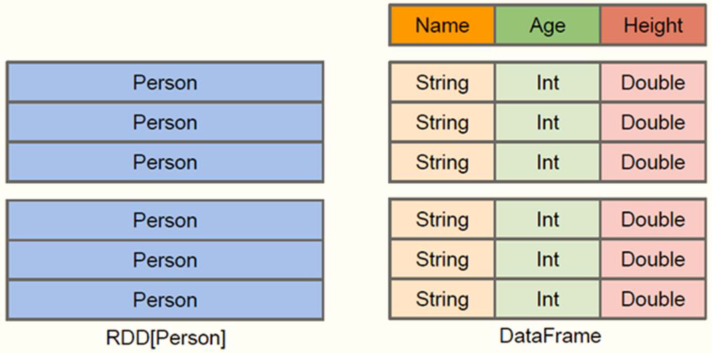
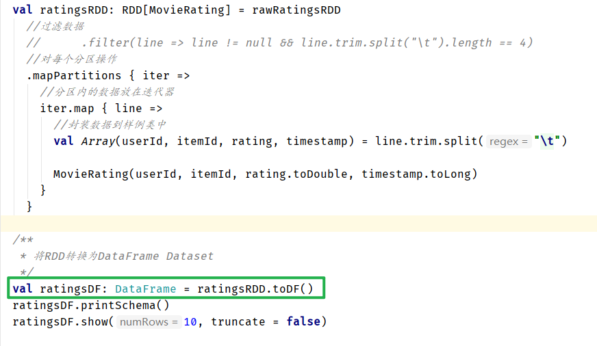
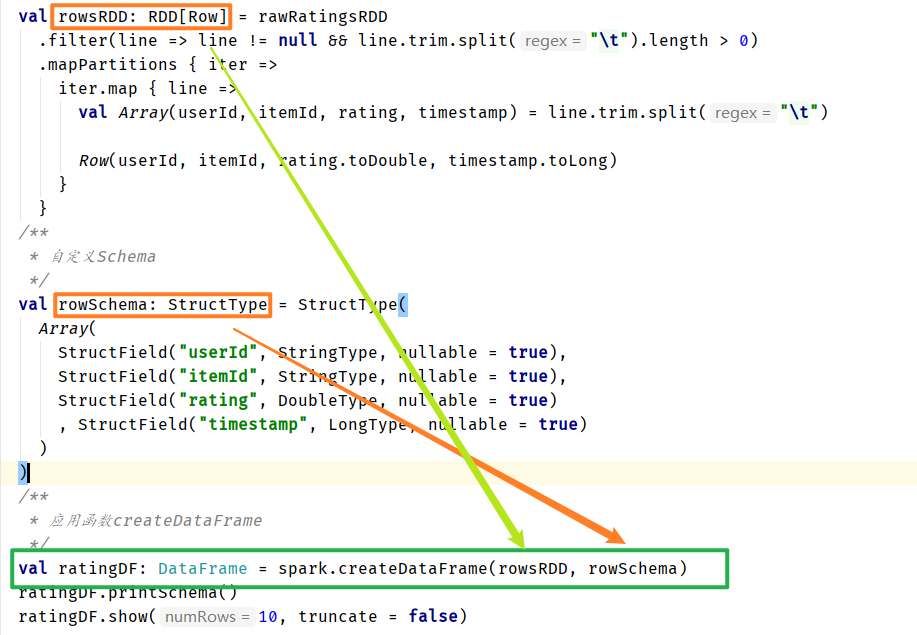

# Spark SQL 

## 概述

> **Spark SQL** is Apache Spark's module for working with structured data.
>
> *针对结构化数据处理的模块*

从Spark 2.2.0开始，在生产环境中既可以用于离线分析又可以用于实时分析

- 离线分析：`SparkSQL`模块
- 实时分析：`StructuredStreaming`模块，属于SparkSQL模块针对实时流式数据处理功能

### 历史时间线

> SparkSQL模块一直到Spark 2.0版本才算真正稳定，发挥其巨大功能

SparkSQL模块来源于Hive框架，但是其功能远大于Hive，SparkSQL用于Hive的所有功能，并且SparkSQL天然集成（兼容）Hive，从其中读取数据进行分析处理

### 数据结构

> DataFrame = RDD[Row] + Schema 

> Dataset =  RDD[case classes] + Schema 

> DataFrame = Dataset[Row]

## DataFrame

> 在Spark中，**DataFrame是一种以RDD为基础的分布式数据集，类似于传统数据库中的二维表格**
>
> DataFrame与RDD的主要区别在于，前者带有schema元信息，即DataFrame所表示的二维表数据集的每一列都带有名称和类型。使得Spark SQL得以洞察更多的结构信息，从而对藏于DataFrame背后的数据源以及作用于DataFrame之上的变换进行针对性的优化，最终达到大幅提升运行时效率。反观RDD，由于无从得
> 知所存数据元素的具体内部结构，Spark Core只能在stage层面进行简单、通用的流水线优化。

`DataFrame`： *A DataFrame is a DataSet organized into named columns*.（以列（列名，列类
型，列值）的形式构成的分布式的数据集，按照列赋予不同的名称）

- 特性：
  - 1）、分布式的数据集，并且以列的方式组合的，相当于具有schema的RDD；
  - 2）、相当于关系型数据库中的表，但是底层有优化；
  - 3）、提供了一些抽象的操作，如select、filter、aggregation、plot；
  - 4）、它是由于R语言或者Pandas语言处理小数据集的经验应用到处理分布式大数据集上；
  - 5）、在1.3版本之前，叫SchemaRDD；

### RDD与DataFrame的区别

DataFrame与RDD的主要区别在于，DataFrame带有schema元信息，即DataFrame所表示的二维表数据集的每一列都带有名称和类型。使得Spark SQL得以洞察更多的结构信息，从而对藏于DataFrame背后的数据源以及作用于DataFrame之上的变换进行了针对性的优化，最终达到大幅提升运行时效率的目标。

RDD，由于无从得知所存数据元素的具体内部结构，Spark Core只能在stage层面进行简单、通用的流水线优化。 DataFrame底层是以RDD为基础的分布式数据集，和RDD的主要区别的是：RDD中没有schema信息，而DataFrame中数据每一行都包含schema

`DataFrame = RDD[Row] + shcema`

### Shuffle分区数目

> 在SparkSQL中当Job中产生Shuffle时，默认的分区数（spark.sql.shuffle.partitions ）为200，在实际项目中要合理的设置。在构建SparkSession实例对象时，设置参数的值：

~~~scala
// 构建SparkSession实例对象
val spark: SparkSession = SparkSession.builder()
	.master("local[4]")
	.appName(this.getClass.getSimpleName.stripSuffix("$"))
	// TODO: 设置shuffle时分区数目
	.config("spark.sql.shuffle.partitions", "4")
	.getOrCreate()
	// 导入隐式转换
import spark.implicits._
~~~

## Dataset

> `Dataset`：*A DataSet is a distributed collection of data.* (分布式的数据集)

Dataset是一个强类型的特定领域的对象，这种对象可以函数式或者关系操作并行地转换.

从Spark 2.0开始，DataFrame与Dataset合并，每个Dataset也有一个被称为一个DataFrame的
类型化视图，这种DataFrame是Row类型的Dataset，即Dataset[Row]。Dataset API是DataFrames的扩展，它提供了一种类型安全的，面向对象的编程接口。它是一个强类型，不可变的对象集合，映射到关系模式。在数据集的核心 API是一个称为编码器的新概念，它负责在JVM对象和表格表示之间进行转换。表格表示使用Spark内部Tungsten二进制格式存储，允许对序列化数据进行操作并提高内存利用率。

> Dataset =  RDD[case class] + Schema 

## RDD、DataFrame和Dataset之间的转化关系

### 转换关系

`DataFrame = RDD[Row]+Schema`

`Dataset = RDD[case clase] + Schema`

`DataFrame = Dataset[Row]`

### RDD转DataFrame的方式及原因

将RDD转化为DataFrame有两种方式:

- 方式一：通过反射推断schema 要求：RDD的元素类型必须是case class

  

- 方式二、编程指定schema 要求：RDD的元素类型必须是Row 自己编写schema（StructType） 调用SparkSession的createDatafrmame（RDD[Row],schema）

  

### 理解说明

- RDD是弹性分布式数据集
- DataFrame类似于二维表格
- Row封装的是数据结果，就像其名字row一样，是一行数据，但是不清楚到底是什么数据，数据是什么结构，仅仅是一行数据而已
- 当Dataset里面装入的是不清楚结构的一些行数据，并且带有Schema信息，就成了DataFrame，这也就是说Dataset是强类型的，**Dataset是强类型的数据安全的**。
- 在存储上，Dataset里的数据按照特定的形式存储，节省存储空间。

## 如何理解RDD、DataFrame和Dataset

- 一、数据结构RDD：
  - DD（Resilient Distributed Datasets）叫做弹性分布式数据集，是Spark中最基本的数据
    抽象，源码中是一个抽象类，代表一个不可变、可分区、里面的元素可并行计算的集合。
  - 编译时类型安全，但是无论是集群间的通信，还是IO操作都需要对对象的结构和数据进行
    序列化和反序列化，还存在较大的GC的性能开销，会频繁的创建和销毁对象。
- 二、数据结构DataFrame：
  - 与RDD类似，DataFrame是一个分布式数据容器，不过它**更像数据库中的二维表格**，除了
    数据之外，还记录这数据的结构信息（即schema）。
  - DataFrame也是懒执行的，性能上要比RDD高（主要因为执行计划得到了优化）。
  - 由于DataFrame每一行的数据结构一样，且存在schema中，Spark通过schema就能读懂
    数据，因此在通信和IO时只需要序列化和反序列化数据，而结构部分不用。
  - Spark能够以二进制的形式序列化数据到JVM堆以外（off-heap：非堆）的内存，这些内
    存直接受操作系统管理，也就不再受JVM的限制和GC的困扰了。但是DataFrame不是类
    型安全的。
- 三、数据结构Dataset：
  - Dataset是DataFrame API的一个扩展，是Spark最新的数据抽象，结合了RDD和DataFrame
    的优点。
  - DataFrame=Dataset[Row]（Row表示表结构信息的类型），**DataFrame只知道字段，但**
    **是不知道字段类型，而Dataset是强类型的，不仅仅知道字段，而且知道字段类型**。
  - **样例类CaseClass被用来在Dataset中定义数据的结构信息，样例类中的每个属性名称直接**
    **对应到Dataset中的字段名称。**
  - Dataset具有类型安全检查，也具有DataFrame的查询优化特性，还支持编解码器，当需
    要访问非堆上的数据时可以避免反序列化整个对象，提高了效率。

