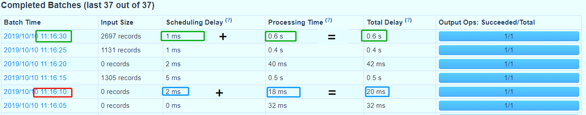
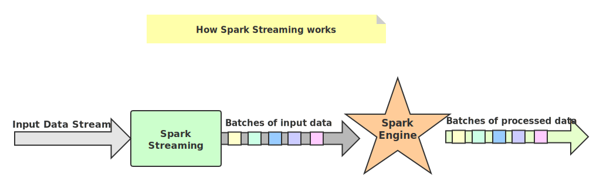

# Spark Streaming

> Spark中针对流式数据处理的方案有：
>
> - Spark Streaming
> - Structured Streaming（Spark SQL模块的部分功能：针对流式数据）

> **Spark Streaming与Flink流式计算的本质区别是什么？**
>
> Spark Streaming是基于微批(Micro batch)的，而Flink基于实时流，来一条数据处理一条数据

## 计算思想

> *Spark Streaming makes it easy to build scalable fault-tolerent streaming applications.*

Spark Streaming是Spark生态系统当中一个重要的框架，它建立在Spark Core之上，**Spark Streaming底层就是Spark Core 只不过是划分了微批**

对于Spark Streaming来说，将流式数据按照时间间隔BatchInterval划分为很多部分，每一部分Batch（批次），针对每批次数据Batch当做RDD进行快速分析和处理

它的核心是DStream[^1]，DStream类似于RDD，它实质上一系列的RDD的集合，DStream可以按照秒、分等时间间隔将数据流进行批量的划分。首先从接收到流数据之后，将其划分为多个batch，然后提交给Spark集群进行计算，最后将结果批量输出到HDFS或者数据库以及前端页面展示等等
$$
DStream = Seq[RDD]
$$

[^1]:  DStream(Discretized Stream，离散化数据流，连续不断的数据流)

将流式数据按照【X seconds】划分很多批次Batch，每个Batch数据封装到RDD中进行处理分析，最后每批次数据进行输出

> Notes：对于目前版本的Spark Streaming而言，其最小的Batch Size的选取在0.5~5秒钟之间，所以Spark Streaming能够满足流式准实时计算场景，对实时性要求非常高的如高频实时交易场景则不太适合。

## 编程步骤

1. Define the input sources by creating input DStreams.
    定义从哪个数据源接收流式数据，封装到DStream中

2. Define the streaming computations by applying transformation and output operations to DStreams.
    针对业务调用DStream中函数，进行数据处理和输出[^2]

3. Start receiving data and processing it using streamingContext.start().

   streamingContext对象的start()方法开始接收数据

4. Wait for the processing to be stopped (manually or due to any error) using streamingContext.awaitTermination().

   使用streamingContext.awaitTermination()等待程序处理结束（手动或者是报出异常）

5. The processing can be manually stopped using streamingContext.stop().
    启动流式应用，并且一直等待程序终止（人为或异常），最后停止运行

[^2]:说了一大堆，就第二点最重要，第二点还不会写 :)

## 应用监控

>  当流式处理程序运行时，可以通过主机名+端口号4040访问程序监控页面

TD = SD + PD[^3]

$$
TD = SD + PD
$$

[^3]:每批次Batch数据处理总时间TD = 批次调度延迟时间SD + 批次数据处理时间PT

- 性能衡量：
  - 每批次数据处理时间TD <= BatchInterval每批次时间间隔

## 工作原理

> SparkStreaming处理流式数据时，按照时间间隔划分数据为微批次（Micro-Batch），每批次数据当做RDD，再进行处理分析。

### Streaming Context

当SparkStreaming流式应用启动（streamingContext.start）时，首先创建StreamingContext流式上下文实例对象，整个流式应用环境构建，底层还是SparkContext

当StreamingContext对象构建以后，启动接收器Receiver，专门从数据源端接收数据，**此接收器作为Task任务运行在Executor中，一直运行（Long Runing），一直接收数据**

从WEB UI界面【Jobs Tab】可以看到【Job-0】是一个Receiver接收器，一直在运行，以Task方式运行，需要1Core CPU

### Receiver接收数据

启动每个接收器Receiver以后，实时从数据源端接收数据（比如TCP Socket），也是按照时间间隔将接收的流式数据划分为很多**Block**（块）

接收器 Receiver划分流式数据的时间间隔BlockInterval ，**默认值为 200ms**，通过属性【spark.streaming.blockInterval】设置。接收器将接收的数据划分为Block以后，按照设置的存储级别对Block进行存储，从TCP Socket中接收数据默认的存储级别为：MEMORY_AND_DISK_SER_2，先存储内存，不足再存储磁盘，存储2副本

### 汇报接收Blocks

接收器Receiver将实时汇报接收的数据对应的Block信息，当BatchInterval时间达到以后，StreamingContext将对应时间范围内数据block当做RDD，加载SparkContext处理数据

### 重要参数

- 批次时间间隔BatchInterval[^4]
  - 每批次数据的时间间隔，每隔多久加载一个Job
- Block时间间隔：BlockInterval
  - 接收器划分流式数据的时间间隔，可以调整大小哦，官方建议最小值不能小于50ms
  - 默认值为200ms，属性：spark.streaming.blockInterval，调整设置

[^4]:举个栗子：BatchInterval：1s = 1000ms = 5 * BlockInterval 每批次RDD数据中，有5个Block，每个Block就是RDD一个分区数据

## DStream

> SparkStreaming模块将流式数据封装的数据结构：DStream（Discretized Stream，离散化数据流，连续不断的数据流），代表持续性的数据流和经过各种Spark算子操作后的结果数据流

**那么DStream究竟是什么？**

> 离散数据流（DStream）是Spark Streaming最基本的抽象。它代表了一种连续的数据流，要么从某种数据源提取数据，要么从其他数据流映射转换而来。DStream内部是由一系列连续的RDD组成的，每个RDD都包含了特定时间间隔内的一批数据

**DStream[^5]本质上是一个：一系列时间上连续的RDD（Seq[RDD]）**
$$
DStream = Seq[RDD]
$$

[^5]:DStream相当于一个序列（集合），里面存储的数据类型为RDD（Streaming按照时间间隔划分流式数据）

DStream中每批次数据RDD在处理时，各个RDD之间存在依赖关系，DStream之间也有依赖关系，RDD具有容错性，那么DStream也具有容错性

### 函数

> 主要有两大类：
>
> 一类是将一个DStream转换为另一个DStream的Transformation
>
> 另一类是DStream中每批次RDD经处理输出的Output Operations

- Transformation函数
  - map
  - flatmap
  - filter
  - count
  - reduce
  - countByKey
  - reduceByKey
  - union
  - join
  - cogroup
- Output函数
  - print
  - saveAsTextFile
  - saveAsObjectFiles
  - saveAsHadoopFile
  - foreachRDD

> 注意：在DStream中有两个重要的函数，都是针对每批次数据RDD进行操作的，更加接近底层，性能
> 更好，强烈推荐使用
>
> - 转换函数transform：将一个DStream转换为另外一个DStream
>   - [代码模板](https://github.com/roohom/CodeIndex/blob/main/Spark/Spark-streaming/src/main/scala/me/iroohom/spark/rdd/StreamingTransformRDD.scala)
> - 输出函数foreachRDD：将一个DStream输出到外部存储系统
>   - [代码模板](https://github.com/roohom/CodeIndex/blob/main/Spark/Spark-streaming/src/main/scala/me/iroohom/spark/output/StreamingOutputRDD.scala)

### **一个建议**

对RDD操作的就不要对DStream操作，当调用DStream中某个函数在RDD中也存在，使用针对RDD操作

## 流式应用状态

SparkStreaming流式计算框架，针对具体业务主要分为三类，使用不同函数进行处理：

- 业务一：无状态Stateless
  - 使用[transform](https://github.com/roohom/CodeIndex/blob/main/Spark/Spark-streaming/src/main/scala/me/iroohom/spark/rdd/StreamingTransformRDD.scala)和[foreachRDD](https://github.com/roohom/CodeIndex/blob/main/Spark/Spark-streaming/src/main/scala/me/iroohom/spark/output/StreamingOutputRDD.scala)函数
  - 比如实时增量数据ETL：实时从Kafka Topic中获取数据，经过初步转换操作，存储到Elasticsearch索引或HBase表中
- 业务二：有状态State
  - 双十一大屏幕所有实时累加统计数字（比如销售额和销售量等），比如销售额、网站PV、UV等等
  - 函数：[updateStateByKey](https://github.com/roohom/CodeIndex/blob/main/Spark/Spark-streaming/src/main/scala/me/iroohom/spark/app/state/StreamingUpdateState.scala)、[mapWithState](https://github.com/roohom/CodeIndex/blob/main/Spark/Spark-streaming/src/main/scala/me/iroohom/spark/app/state/StreamingMapWithState.scala)
- 业务三：窗口统计
  - 每隔多久时间统计最近一段时间内数据，比如饿了么后台报表，每隔5分钟统计最近20分钟订单数
  - [Window](https://github.com/roohom/CodeIndex/blob/main/Spark/Spark-streaming/src/main/scala/me/iroohom/spark/app/window/StreamingWindow.scala)

