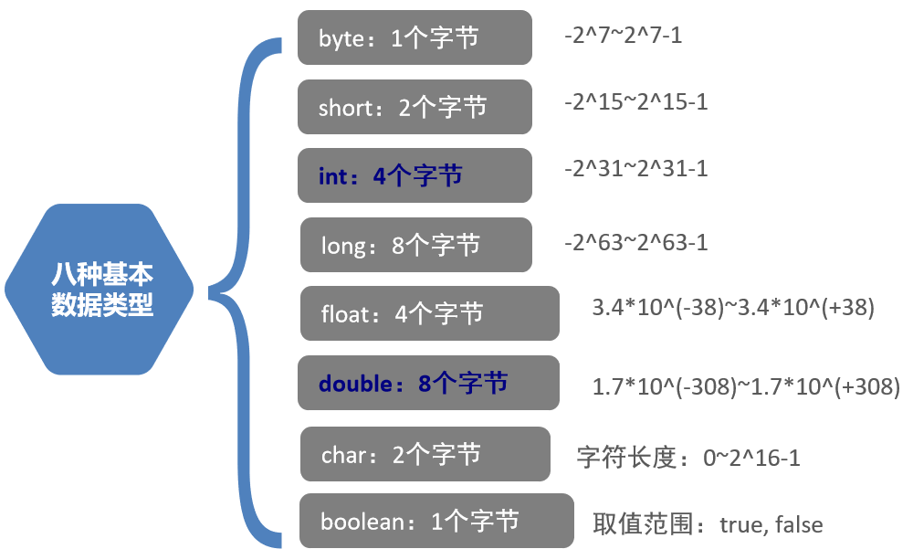

# JAVA Cookbook

[TOC]

### IDEA 常用快捷键
> Alt+shift+上下方向键 移动当前代码行（选中的代码块）  
> ctrl+N 当前项目中的文件过多时，方便快速查找定位文件  
> ctrl+D 复制光标所在行（选中的代码块）  
> ctrl+Y 删除光标所在行（选中的代码块）  
> Ctrl+ALT+L 针对当前的代码进行代码格式化 
> ALT+Enter 在IDEA中当书写程序时，遇到红色提示时可以使用该快捷键来解决该提示问题 


### 常量
- 字符常量
    - 字符和字符串
        - 字符使用单引号，如 'A'
        - 字符串使用双引号，如"ABC"
- 字符串常量
- 布尔常量
    - True or False
- 空常量
    - null                  
    - 不能通过输出语句直接打印
    
### 变量
在程序运行过程中可以改变的量  
变量的定义格式: 数据类型 变量名=变量值 如 int a=10；    

### 数据类型
Java是一门**强类型**语言：在定义变量时就指定了变量的具体类型，在程序运行过程中无法对变量的类型进行修改
弱类型:Scala语言
- 基本数据类型
    - 整数
        - byte     一个字节，取值范围:-128~127
        - short   两个字节， 15次方
        - 默认 int   四个字节，31次方
        - long    八个字节
            - 为了区分，在值末尾加上L
    - 小数
        - float 四个字节，单精度浮点数 默认六到八位
        - 默认 double 八个字节，双精度浮点数 
    - 字符
        - char 两个字节， 英文单引号包含的单个字符
    - 布尔Boolean 一个字节
        - True
        - False
    
- 引用数据类型
    - 类
    - 接口
    - 数组[]

- 标识符
给程序中变量、类、方法、数组等起的名字
要求(命名规则):
    - 标识符只能由:大小字母、数字、下划线、$组成
    - 必须是以：英文字母或下划线或$开头（不能是数字开头）
    - 不能是Java中的关键字
- 命名规范:    
    - 类名、接口的命名规范:大驼峰命名法
    - 变量、方法的命名规范:小驼峰命名法
    - 包的命名全部都以小写字母为主，通常名称是使用域名倒着写    
    
    
### 类型转换
- 自动类型转换(隐式类型转换)
    - 原则:小类型转换为大类型
        byte -> short int long float double 
        short -> int  long float double
        int -> long float double
        float -> double 
        char -> int -> long
- 强制类型转换(显示类型转换)    
    - 原则: 在程序中，把大类型转换为小类型，不能自动转换，需要手动强制进行转换
    格式: 小类型名 变量=(小类型名) 大类型的运算结果
    
### 运算符
- 在Java中任何数据类型和字符串相加，"+"的作用都变成了拼接，其结果都是拼接字符串
    - 例:S.o.p("5+5"+5+5); 输出是5+5=55
    - 而S.o.p("5+5"+(5+5));结果才是5+5=10     
- 在Java中一元运算的优先级高于二元运算    
    - 一元运算
        - 自增
            - 只能用于变量
            - b = a++ 先赋值,再参与运算
            - b = ++a 先参与运算，再赋值
        - 自减
            - 道理同自增
    - a += 1之类的计算结果等同于  a = a+1
    - 但是内部机制并不是如此:
        short s=1;
        s += 10;
        其实等价于
        short s=1;
        s = (short) (s+10);
    - 二元运算
        - 加、减、乘、除、取余           

- 逻辑运算符
只能针对Boolean进行运算 
    - **短路与**&&
        - 作用：等同于逻辑与(&)
        - 特殊之处:
            - 当&&之前的运算结果为false时，其后面的运算不会再执行(在与操作中已经得到了一个否，则结果必为否)。
            - 执行速度更快
    - **短路或**||   
        - 作用:等同于逻辑或(|)
        - 特殊之处:
            - 当||之前的结果为false时，其后面的表达式便不会再执行
            - 速度更快
  
- 三元运算符
格式:  
数据类型 变量名 = (关系表达式) ? 表达式1:表达式2  
> 变量接收的是表达式1的运算结果或者是表达式2的运算结果
> 如果关系表达式为true，则执行表达式1
> 如果关系表达式为false，则执行表达式2


- 键盘录入
试用步骤:
    - 1.导入Scanner包 import java.util.Scanner;
    - 2.创建Scanner对象,Scanner sc = new Scanner(System.in);
    - 3.获取键盘录入的数据:
        如:String str = sc.next(); 
        如:int num = sc.nextInt();
  
### 分支结构
- switch语句
    - 当判断的条件不是进行区间比较时，仅只是进行两个数据之间相等的比较时
    - switch之后的括号里可以接收变量、常量和表达式需要确保其类型必须是byte、short、int、char、String或枚举
    - default可以书写在任何位置，但除了末尾的位置都必须写break
    - case穿透现象
    - **假设表达式的值 = 值1, 则执行完语句体1后, 不会判断第二个case, 直接执行语句体2**
        ~~~java
        witch(表达式){
            case 值1: 	
                语句体1;	//假设表达式的值 = 值1, 则执行完语句体1后, 不会判断第二个case, 直接执行语句体2;
            case 值2:
                语句体2;
                break;
            case 值3:
                语句体3;
                break;
                  ...    //根据需求, 可以写多组case.
            default:	
                语句体n;
                break;
      }
      ~~~
    - 案例 SwitchPenetrate.java
### 循环
- 三种循环
    - for循环
        - 流程
            - 1.执行循环初始值
            - 2.判断循环条件是否满足
            - 3.执行for循环体重的代码
            - 4.修改循环条件中的值
            - 重复2、3、4
            - 直到不满足循环条件
        - 特点:
          
            - 先判断，再执行循环体
        - 句式语法
            - ~~~java
              for(循环初始值;循环条件;循环条件中值的修改)
              {
                  code block;
              }
              ~~~
    - while循环
    - do...while循环
- 循环三要素
    - 循环初始值
    - 循环条件
    - 循环条件中值的修改(修改循环条件)  
- 循环差异
    - 在for循环执行完之后，无法使用for循环里的初始化条件，比如循环执行过程中自动改变的变量
    - 而在while循环执行完之后，他的循环条件却还可以使用         
    
    
### 随机数
在java中提供的一个获取[0.0~1.0)之间的随机数字的包Random
~~~java
1.导入包（省去）
2.创建对象
3.使用获取随机数的功能
~~~
- 使用
    - 格式
    Math.random()   
    ~~~java
    int num = (int)(Math.random()*100+1); //生成一个1-100之间的随机整数
    ~~~
- 在java中如果使用Math.random()生成随机数  
如果是要生成[10,100]的随机数， (int)(Math.random()*91+10)   
提取其中的(**公式**) :将Math.random()用MR代替。
如果是要求[a,b]范围，则是MR*((b-a)+1)+a  
如果是[a,b)范围，则是MR*(b-a)+a  

### 数组
定义的方式:  
举例:
- 动态初始化
    - int array[] = new int[5]
    - int[] array = new int[5]    
- 静态初始化
    - int[] array = new int[]{1,2,3,4,5}   
    - int array[] = {1,2,3,4,5}
- 数组的遍历可以使用for循环，同时java也提供了一个方法来直接打印数组 -> Arrays.toString(arr)
打印的结果形式是[元素,元素,...]
### **Java程序的内存划分**
- 栈
    - 作用:存储局部变量，程序要运行的代码，局部变量就是定义在方法中的变量，栈中存放的就是方法
    - 特点:先进后出(FILO)
- 堆
    - 作用:存储使用new关键字，创建出来的内容(即:对象)
    - 特点:存储在堆中的内容，是由Java中的垃圾回收器(GC),统一管理回收
- 方法区:
    - 存放.class文件
- 本地方法区
    - 常量存放在常量池中，而常量池就在方法区中
- 寄存器            

### 方法
- 什么是方法?
    - 在程序中把一段代码进行抽取并封装，封装为一个具有独立功能的代码块，这块代码起个名称之后就成为“方法”
    - main()就是一个方法
    - 方法(method)也叫函数(function),在具体实现上是一样的
    - public static void main(String[] args),public static是修饰符,void表示没有返回值,main就是方法名,String[] args是参数
    
- 方法可以传递数据    
- 方法可以返回结果
- 好处:提高了代码的**复用率**

- 方法的重载
    - 同样的方法，不同的参数列表(参数个数、参数类型以及参数的顺序)    
    - 参数的传递有基本数据类型和引用数据类型
    - 当传递的参数是基本数据类型，形参的改变对实参没有任何影响
        ~~~java
          public static void main(String[] args) {
                  int number = 100;
                  System.out.println("调用change方法前：" + number);
                  change(number);	 //实参.
                  System.out.println("调用change方法后：" + number);
              }     
              public static void change(int number) {	//形参.
                  number = 200;
              }    
        ~~~
      <font color="red">上面代码在调用change和调用之后number的数值都是100</font>
    - 方法中传递的参数类型是引用数据类型时，传递的是地址值(内存中开辟的空间的地址值)，当在方法中对传递的引用类型的参数
    进行相关操作时，会直接影响实参  
        ~~~java
          public static void main(String[] args) {
                  int[] arr = {10, 20, 30};
                  System.out.println("调用change方法前：" + arr[1]);
                  change(arr);
                  System.out.println("调用change方法后：" + arr[1]);
              }
          
              public static void change(int[] arr) {
                  arr[1] = 200;
              }
        ~~~
      调用之前打印的是20，调用之后打印的是200
      
      
> 不建议在一个.java文件中书写多个类
> 一个.java中只允许出现一个public class
> .java文件的名称必须和public class类名保持一致      

### 类和对象

- 成员变量和局部变量
    - 在方法中定义的变量，称为局部变量
        - 局部变量会随着方法的入栈而存在，随着方法的出栈而销毁(存活时间:方法在栈中执行时)
    - 在类中定义的变量，称为成员变量
        - 随着对象的创建，而存在堆空间，随着对象对的销毁(GC的回收)而消失  
    - 二者区别        
        - 定义位置不同
            - 成员变量: 定义在类中, 方法外
            - 局部变量: 定义在方法中, 或者方法声明上
        - 在内存中的存储位置不同
            - 成员变量: 存储在堆内存 
            - 局部变量: 存储在栈内存 
        - 生命周期不同
            - 成员变量: 随着对象的创建而存在, 随着对象的消失而消失
            -  局部变量: 随着方法的调用而存在, 随着方法的调用完毕而消失
        - 初始化值不同
            - 成员变量: 有默认值
            - 局部变量: 没有默认值, 必须先定义, 再赋值, 然后才能使用
    - **就近原则**
        - 当在方法中和方法所属的类中，有相同名称的变量时，在方法中使用变量时，**优先使用局部变量**   

- 在java语言中，是使用类进行编写java程序

- ~~~java
  class 类名{
      //书写java代码
  }
  ~~~
- 在类中可以书写的内容有哪些？
  - 变量
  - 方法
- 在java语言中，类除了是用来定义所书写的程序外，类的另一个作用：自定义类型   

- 当书写完自定义类后，需要对类进行初始化（数据类型  变量=初始化）

- 怎么对类进行初始化（初始化的动作，底层：开辟堆内存空间）

  - ~~~java
    类名  对象名 =  new  类名();
    
    类名 ：  数据类型
    对象名  ：  变量名
    new  ：  告知JVM要开辟堆空间
    类名()  ：  告知JVM要开辟空间的大小 （ 类中所书写的所有内容[变量]，进行换算，然后开辟空间 ）
               自动调用构造方法
    ~~~
    
    
### 面向对象的三大特征:封装 继承 多态
####封装  
什么是封装?
在面向对象中，对于事物描述是使用类进行的(把事物的属性和行为封装到类中)

好处:
- 使用类封装，提高代码的复用性
- 安全性:隐藏了代码的内容 (private)
  
- private关键字
    - 用来修饰类中的成员变量和成员方法
    - 被private修饰的内容只能在本类中使用    
    - 在程序中如果使用private修饰了成员变量后，需要针对该成员变量提供public方法
    虽然把成员变量饰为private，但还是需要对外提供可以访问私有成员变量的接口:public方法
    ~~~java
      public class Student {
          //属性, 全部用private修饰.
          //姓名
          private String name;
          //年龄
          private int age;
      
          public String getName() {
              return name;
          }
          public void setName(String n) {
              name = n;
          }
      
          public int getAge() {
              return age;
          }
          public void setAge(int a) {
              age = a;
          }
      
          //行为, 也就是成员方法.
          public void study() {
              System.out.println("键盘敲烂, 月薪过万!");
          }
          public void eat() {
              System.out.println("学习饿了就要吃饭!.");
          }
      }
      
      //测试类
      public class StudentTest {
          public static void main(String[] args) {
              //1. 创建学生对象.
              Student s = new Student();
              //2. 设置成员变量值.
              s.setName("张三");
              s.setAge(23);
              //3. 打印成员变量值.
              System.out.println(s.getName() + "..." + s.getAge());
              //4. 调用成员方法.
              s.study();
              s.eat();
          }
      }
    ~~~
    - 在开发中，通常会把类中所有的成员变量，全部修饰为private，然后提供public 数据类型 getXxx() 、
    public void setXxx(数据类型 变量)方法 
        - 快捷键 Alt+Insert 点击generate下的Getter and Setter快速生成  
    
- this关键字
是java中的关键字，表示当前类(本类对象)，其实就是**用来区分局部变量和成员变量的**
(前提是存在局部变量和成员变量重名)

- super关键字
    - 使用方式上和this很像，super是对父类对象的引用
    - super.成员变量名 -> 一定是书写在子类中

- static
    - 静态方法中不能使用this关键字
    - 静态方法中只能调用静态方法    
    
#### 构造方法
1.用来创建对象
2.用来给类中的成员变量进行赋值

- 特征
    - 因为没有返回值，所以不需要return 
    - 构造方法名和类名完全一致
    - 构造方法没有返回值，连void都不需要写
    - 构造方法通常是在使用new关键字时，由JVM自动加载到栈中执行   
- 当一个类中没有书写任何构造方法时，在对类进行编译时，会自动向生成的.class文件中添加一个无参的构造方法(默认构造方法)
- 当在一个类中，有上写构造方法时，在对类进行编译时，不会再自动向生成的.class添加一个
无参的构造方法(默认的),**为了确保会自动编译默认的构造方法(果需要)，必须手动将默认的构造方法进行重载**

- 了解构造方法中的隐式三步 [去了解](https://blog.csdn.net/kingzone_2008/article/details/45015301)
    - 1、调用父类的构造函数(super())
        - 三种情况:
        1）构造方法体的第一行是this语句，则不会执行隐式三步，
        2）构造方法体的第一行是super语句，则调用相应的父类的构造方法，
        3）构造方法体的第一行既不是this语句也不是super语句，则隐式调用super()，即其父类的默认构造方法，这也是为什么一个父类通常要提供默认构造方法的原因；

    - 2、给非静态成员变量赋予显示值 
    
    - 3、执行构造代码块


#### 继承
1.什么是继承?
    在一个累的基础上，另一个类继承该类，继承类可以继承前面类中的属性和行为  
2.使用extends关键字来实现继承

3.书写格式:    
    - 至少需要两个类
    - 需要使用extends关键字
    - 继承后，继承的类可以使用被继承类中的非私有的成员变量和成员方法
    
```java
//人类，父类
class person{
    String name;
    ...
}
//学生类，子类
class Student extends Person{
//String name;
int age;
....
}

//Person类有name成员变量，Student类中也有name成员变量，可以省略Student类中
的name成员变量
//子类继承父类就可以拥有父类的一些成员变量，成员方法的访问权限(private不能访问)
```

- 好处
    - 代码复用
    - 代码的可维护性
    - 让类和类之间建立了关系(为多态的前提)    
    
- 特点
    - 只能单一继承(子类只能继承于一个父类)    
    - 支持多层继承(A继承于B,B继承与C)

- 构造方法的特点
    - 子类的每一个构造方法，默认都会先调用父类中默认的构造方法
    - 当子类中没有默认的构造方法时，子类构造方法在执行时，如没有
    书写super(参数)代码，则报错
    - 当子类构造方法中，需要调用父类的有参构造方法时，必须在子类的构造方法中书写super(参数)，并且
    **必须书写在第一行**
    
- 在继承中成员方法的特点
    - 1.在父子类同时具有一模一样的成员方法时，在使用子类对象.成员方法，优先调用子类的成员方法，此即是**就近原则**
    - 2.如果子类没有，就去父类中找，父类也没有就报错  
    
- 方法的重写(override)
    - 为什么要重写
        - 父类的该方法功能不全或者不好用，不能满足实际需求，故重写
    - 在子类中
    - 子类中的方法必须和父类中的方法**一模一样**(名称、参数、返回值)    
    - 父类的private方法不能重写
    - static静态方法不能被重写，静态方法只能被继承，如果子类中定义了同名同形式的静态方法，它对父类方法只能起到
    隐藏的作用，调用的时候用谁的引用，就调用谁的版本
    - 父类中的方法使用public修饰时，子类中要对其重写，必须也用public
    - 子类的中方法重写权限不能更低
    - 白话:保证一模一样就啥事没有
    
    
    
### 抽象类
- 抽象方法:当方法体中不清楚应该怎么样写具体的功能时，就可以不写具体的功能(省略方法体代码)
    - 当方法省略体内具体的功能时，就描述不清楚
        - 针对描述不清楚的内容，在java中统一使用:抽象
    - 仅声明方法，没有具体的方法体功能代码，这个方法称为:抽象方法
        - 抽象方法:public **abstract** void method(){...}  
    
- 抽象类:当对事物描述不清楚时，就用抽象类
    - 抽象类通常是父类
    - 抽象方法只能书写在抽象类中
    - 抽象类不能实例化(无法实例化)
    - 抽象类通常必须有一个子类
        - 利用多态，实现抽象类的实例化: 抽象类 父引用= new 子类; 
- 抽象类的意义:在于“被继承”,抽象类被其子类“抽象”出了公共的部分，通常也定义了子类所必须具体实现的抽象方法。
    - 若一个类继承自抽象类必须重写抽象方法，否则自己也应该变成抽象类
    - 因此，抽象类对子类具有强制性和规范性，这叫做模板设计模式


### 接口
- 定义类的关键字关键字class ，定义接口的关键字是interface
  继承类的关键字是extends，而实现接口的关键字是implements
  当多个类型之间具有相同的行为能力的时候，java中就可以通过接口来进行类型之间的联系，通过接口可以解决单继承所带来的的一些无法共享的问题
- 语法格式
    ~~~java
  修饰符 interface 接口名称 [extends 父接口1,父接口...]{
      零个到多个常量的定义
      零个到多个抽象方法的定义
      零个到多个默认方法的定义
      零个到多个静态方法的定义
  }
  ~~~
  
- 注意:
    > 1.接口可以实现多继承，也就是说一个接口可同时继承多个父接口  
     2.实现接口的类如果不能实现所有接口中待重写的方法，则必须设置为抽象类      
     3.一个类可以继承自一个父类，可以同时实现多个接口  
     4.成员变量要用 public static final修饰，也就是常量  
     5.接口中所有成员方法必须有public abstract共同修饰，也就是抽象方法    


### static关键字    
> 通常情况下成员变量都隶属于对象层级，每个对象都拥有独立的内存空间来记录自己独有的成员变量，当所有的
> 对象的成员变量的值都完全一样时，若每个对象单独记录则会造成内存空间的浪费，此时应该将该成员变量由对象层级提升至
> 类层级，在内存空间中只保留一份且被所有的对象所共享，为了实现该效果，故使用static关键字来修饰，表示静态的含义。
> static关键字可以修饰成员变量和成员方法表示隶属于类层级，推荐使用"类名."的方式访问

- 使用方式
    1.对于非静态的成员方法来说，既可以访问非静态的成员同时也可以访问静态的成员；(成员:成员变量+成员方法)
    2.对于**静态的成员**方法来说，**只能访问静态的成员**，不能访问非静态的成员；(如果非要调用非静态方法，必须使用"对象.非静态方法"的方式访问，对于非静态变量也是如此)
    (执行静态方法的时候**可能还没有创建对象**，非静态成员隶属于对象层级)
    3.只有被所有对象共享的内容才能被static修饰，不能随便加

- 静态成员
    - 存放在JVM的方法区内
    - 使用“类名.”访问
    - 随着类的加载而存在，早于对象的创建
- 非静态成员
    - 存放在JVM的堆内存中    
    - 通过“对象.”访问
    - 随着对象的创建而存在，晚于对象的创建
    
- 注意事项:
    - 静态方法中是无法使用this和super的       

### 对象创建的过程
#### 单个对象创建的过程
1.将xxx.class文件中的相关类信息读取到内存空间的方法区，这个过程叫做类的加载
2.当程序开始运行时找main()方法去执行方法体重的语句，使用new来创建对象
3.若没有指定初始值，采用默认的初始化，否则采用指定的数值来初始化
4.可以通过构造块来进行更改成员变量的数值
5.执行构造方法体中的语句，可以进行再次的修改成员变量的数值
6.此时对象创建完毕，继续执行后续的语句

TestSuperObject类中的静态语句块
TestSuperObject类中的构造块
TestSuperObject()的方法体

#### 子类对象创建的过程
1.先加载父类再去加载子类，先执行父类的静态语句块，再执行子类的静态语句块；
2.执行父类的构造块，再执行父类的构造方法体，此时父类部分构造完毕
3.执行子类的构造块，再执行子类的构造方法体，此时子类对象构造完毕        

TestSuperObject类中的静态语句块
TestSubObject类中的静态语句块
TestSuperObject类中的构造块
TestSuperObject()的方法体
TestSubObject类中的构造块
TestSubObject()的方法体

总结: **静态块>main()>构造块>构造方法** 


#### 多态
- 三个条件
    - 1.要有继承
    - 2.要有重写
    - 3.父类引用指向子类对象  
    
- 引用类型之间的转换
    - 1.引用类型转换必须发生在父子类之间，分为自动类型转换(向上转型)和强制类型转换(向下转型)    
    - 2.向上转型(子类类型向父类转换)  
    如:Person p = new Student();
    > 注意: 父类中的静态方法无法被子类重写，所以需要向上转型之后才能调用父类原有的静态方法
    - 3.向下转型(父类类型向子类类型转换)
    子类引用父类实例，必须进行强制类型转换，可以调用子类特有的方法，必须满足转型的条件才能。
    使用instanceof运算符进行判断  
    父类的静态方法只能被子类继承而无法被子类重写
    - 4.当没有父子类关系时发生强制类型转换编译报错，当拥有父子类关系时编译通过
    - 为了避免上述错误的发生，通常只要进行强制类型转换就需要进行判断，格式:
    if(引用变量名 instanceof 数据类型){}
    
    
    
- 多态的意义    
  
    - 多态的意义在于:可以屏蔽不同子类的差异性编写通用的代码，从而产生不同的效果

~~~java
//父类
abstract class Person{
    private String name;
    private int age;
    
    ....
    
    //通常父类中的方法无法明确具体的功能代码时，只需要针对方法进行声明（只定义没有方法体）
    //抽象方法： 只定义没有方法体
    public abstract void eat();
}

class Student extends Person{
    //子类在继承了抽象类后，必须重写抽象方法（java语法规定）
    public void eat(){
      System.out.println("去校区食堂吃饭...");
    }
} 
class Teacher extends Person{
    //子类在继承了抽象类后，必须重写抽象方法（java语法规定）
    public void eat(){
      System.out.println("去校外吃饭...");
    }
}

 class Test{
     public static void main(String[] args){
         //创建学生对象
         Student stu = new Student();
       
         method1( stu  , "zs" , 20  ,   .....)
         
         //创建老师对象
         Teacher tea = new Teacher();
          
         method2(  tea ,"ls" ,33 , ...... )
         
     }  
     
     
     
     //在书写程序时：当发现有重复的代码，建议都进行抽取封装：方法、类  （复用性）
     
      public static void method1( Student stu, String name , int age , ... ){
         stu.setName( name  );//因为Student继承了Person，可以使用父类中的非私有成员
         stu.setAge(  age  );
         ....
         stu.eat();  
      }
     
      public static void metho2 ( Teacher  tea , String name , int age , ...  ){
         tea.setName(  name   );
         tea.setAge(  age  );
         ....
         tea.eat(); 
      }
     
     //添加就业班
     
     //观察以上两个方法中的代码：除了对象名不同，其它都一样   (99%都是重复代码)
     针对代码，再次精进：
     
      public void method(  ?   , String name , int age , ...){
     
         ?.setName(  name   );
         ?.setAge(  age  );
         
         ....
         ?.eat();  
      }  
     
     ? 有两个类型：  Student 、 	Teacher
     Student类型和Teacher类型有什么相同？
     继承的父类是同一个    
     
     java语言提供了一种方案：多态
     多态的使用:
     1、要有继承关系
     2、子类要重写父类中的方法
     3、 父类的引用指向子类对象
         父类  父引用  =  new  子类();
     
     
     Person p1 = new Student();
     p1.setName(...)
     p1.eat()//调用的是对象中的eat方法
         
     Person p2 = new Teacher();
     p2.setName(....)
     p2.eat();
     
     
    
     
     
      public static void method(  Person p  ,  String name , int age , ...  ){
          
         p.setName(  name   );
         p.setAge(  age  );
         
         ....
         p.eat();  
      }
     
     
     
     Student stu = new Student();
     Person p = stu ; //多态
     
     method( stu ,"ls" , 20 ,....);
     
     
     Teacher tea = new Teacher();
       method( tea   );
     
         
 }
~~~


~~~java
//父类
abstract class Person{
    private String name;
    private int age;
    
    ....
    
    //通常父类中的方法无法明确具体的功能代码时，只需要针对方法进行声明（只定义没有方法体）
    //抽象方法： 只定义没有方法体
    public abstract void eat();
}

class Student extends Person{
    //子类在继承了抽象类后，必须重写抽象方法（java语法规定）
    public void eat(){
      System.out.println("去校区食堂吃饭...");
    }
} 
class Teacher extends Person{
    //子类在继承了抽象类后，必须重写抽象方法（java语法规定）
    public void eat(){
      System.out.println("去校外吃饭...");
    }
}


     
     
//需求升学：老师需要划分为基础班老师、就业班老师
//父类
abstract class Person{
    private String name;
    private int age;
    
    ....
    
    //通常父类中的方法无法明确具体的功能代码时，只需要针对方法进行声明（只定义没有方法体）
    //抽象方法： 只定义没有方法体
    public abstract void eat();
}

class Student extends Person{
    //子类在继承了抽象类后，必须重写抽象方法（java语法规定）
    public void eat(){
      System.out.println("去校区食堂吃饭...");
    }
} 
     
//基础班老师    
class BasicTeacher extends Person{
    //子类在继承了抽象类后，必须重写抽象方法（java语法规定）
    public void eat(){
      System.out.println("吃外卖...");
    }
}     
//就业班老师    
class WorkTeacher extends Person{
    //子类在继承了抽象类后，必须重写抽象方法（java语法规定）
    public void eat(){
      System.out.println("去校外吃饭...");
    }
}      
     

 class Test{
     public static void main(String[] args){
         //创建学生对象
         Student stu = new Student();
         
      
         //创建基础老师对象
         BasicTeacher tea = new BasicTeacher();
         
         //创建就业班老师对象
         WorkTeacher tea2 = new WorkTeacher();
        
      
         method(  stu , "zs" , 20  )
         method(  tea , "ls" , 33  )  
             
         method(  tea2  , "ja"  30  )    
         
     }  
     
     public static void method(  Person  p ,  String name, int age ){
         p.setName( name )
         p.setAge(age)
         ...
         
         p.eat();    
      }
 }
~~~

> 在使用多态时，存在 一个问题：父引用无法使用子类中特有的成员
> 解决方案： 使用向下转型 （强制类型转换）
>
> 格式：子类  子类对象 = (子类) 父引用
>
> 当在进行强制类型转换时，如果父引用指向的对象类型 和 要转换的类型不匹配，就会发生：错误
>
> 父引用指向的对象类型 ：  Person p = new Student();  //类型：Student
> 要转换的类型：  Teacher 
> 错误代码：  Teacher tea  = (Teacher ) p;//类型转换错误
>
> 通常在进行向下转型时，会先进行判断：
>
> if( p  instanceo  Teacher){ 
>
>   Teacher tea  = (Teacher ) p;
>
> }
>
> 父引用  instanceof  子类类型    ：  判断父引用指向的对象类型 是否为 子类类型


​        
### 包
- 注意事项:
    - package必须书写在程序的第一行
    - 一个.java文件中只允许写一个package
- 命名规则
    - 全部小写字符
    - 包名通常是域名倒着写(企业标准)           
    - 通常创建报名有多个包，包之间用.连接
- 导包
    - package com.xxxx 自己的包 //本类归属的包
    - import java.util.Scanner //导包，别人写好的包    
    
    
### 访问修饰符
1.public  
2.private  
3.默认  
4.protected  

```java
public class Student extends Person{
	Protected String name;//受保护的，子类专用
}
```

- 概览
    访问控制            访问权限          本类            本包中的其他类         子类          其他包中的其他类
---------------------------------------------------------------------------------------------------------------
       public          公开的            1                   1               1               1
       protected       保护的            1                   1               1
       默认方式          默认的           1                  1                            
       private         私有的            1


​     
​    
​    