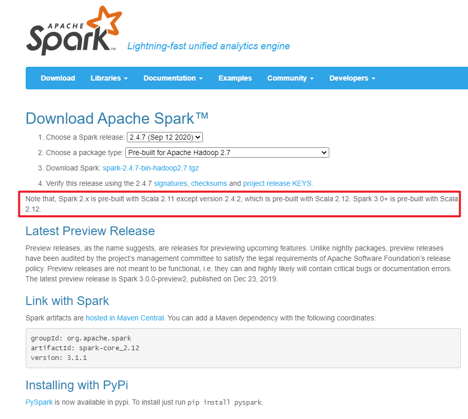

# PySpark

> REFERENCE: [官方文档](http://spark.apache.org/docs/latest/api/python/getting_started/quickstart.html)

## 先决条件

> 以下所说的都为在Windows环境测试

环境为**Anaconda**、**Spark2.4.7**、**JDK1.8**、**Python3.7**、**PySpark2.4.7**

Anaconda是一个杰出的数据分析工具，内部集成了大量的有关数据分析的Python包，方便使用，我们使用Anaconda来安装PySpark，Anaconda默认自带Python环境，此处默认已经配置好了Python环境

### Step1

在本地安装JDK并配置环境变量

### Step2

下载合适版本的Spark，并将Spark放置在合适目录，并配置环境变量

[去下载](http://spark.apache.org/downloads.html)

> NOTE：Spark2除了Spark2.4.2是用Scala2.12预编译的之外其他都是用Scala2.11，Spark3.0+都是用Scala2.12预编译的

### Step3

在本地安装PySpark，**注意PySpark版本需要与Spark版本保持一致**，如果不一致可能会带来意想不到的错误

~~~shell
pip uninstall pyspark
pip install pyspark==2.4.7
~~~

安装与Spark版本一致的PySpark，否则运行时会报错，可能会报Scala版本不一致的错误

## 即刻开始

### 运气好

如果运气好的话，打开Anaconda，从中打开Jupyter Lab或者Jupyter Notebook，使用以下代码即刻快速开始使用PySpark进行数据分析

~~~python
from pyspark.sql import SparkSession
spark = SparkSession.builder.getOrCreate()

from datetime import datetime, date
import pandas as pd
from pyspark.sql import Row

df = spark.createDataFrame([
    Row(a=1, b=2., c='string1', d=date(2000, 1, 1), e=datetime(2000, 1, 1, 12, 0)),
    Row(a=2, b=3., c='string2', d=date(2000, 2, 1), e=datetime(2000, 1, 2, 12, 0)),
    Row(a=4, b=5., c='string3', d=date(2000, 3, 1), e=datetime(2000, 1, 3, 12, 0))
])
df
~~~

~~~
DataFrame[a: bigint, b: double, c: string, d: date, e: timestamp]
~~~

### 运气不好

当然也有可能，由于安装存在种种问题，在使用上述代码进行开发的时候，总是报种种错误，下面这些代码是经过总结得到的，一般绝不会出错

~~~python
import pyspark
import os
import findspark
# 路径需要改为自己的
findspark.init("E:\spark-2.4.7-bin-hadoop2.7")
# 路径改为自己本地的SPARK_HOME路径
os.environ ['SPARK_HOME'] = 'E:\spark-2.4.7-bin-hadoop2.7'

spark = SparkSession.builder.master("local[1]").getOrCreate()

df = spark.sql("SELECT 1 AS test")
df.show()

spark.stop()
~~~

## 正式使用

上述代码不适合复用，我们将其封装成为函数

~~~python
def initSparkSession():
    """
    实例化一个SparkSession对象
    """
    import os
    from pyspark.sql import SparkSession

    os.environ["PYSPARK_SUBMIT_ARGS"] = '--jars kudu-spark2_2.11-1.13.0.jar pyspark-shell'
    os.environ ['JAVA_HOME'] = 'C:\Program Files\Java\jdk1.8.0_201'
    os.environ ['SPARK_HOME'] = 'E:\spark-2.4.7-bin-hadoop2.7'

    import findspark
    findspark.init("E:\spark-2.4.7-bin-hadoop2.7")
    spark = SparkSession.builder.master("local[2]").appName("PySparkLocal").getOrCreate()
    return spark
~~~

## PySpark读取Kudu

> 如果想要成功读取Kudu，还需要Kudu-Spark的Jar包，放在合适的位置，在代码中由`os.environ["PYSPARK_SUBMIT_ARGS"] = '--jars kudu-spark2_2.11-1.13.0.jar pyspark-shell'`指定，示例中使用的是`kudu-spark2_2.11-1.13.0.jar`,位置为代码所在的目录，当然也可以使用绝对路径

~~~python
def initSparkSession():
    """
    实例化一个SparkSession对象
    """
    import os
    from pyspark.sql import SparkSession

    os.environ["PYSPARK_SUBMIT_ARGS"] = '--jars kudu-spark2_2.11-1.13.0.jar pyspark-shell'
    os.environ ['JAVA_HOME'] = 'C:\Program Files\Java\jdk1.8.0_201'
    os.environ ['SPARK_HOME'] = 'E:\spark-2.4.7-bin-hadoop2.7'

    import findspark
    findspark.init("E:\spark-2.4.7-bin-hadoop2.7")
    spark = SparkSession.builder.master("local[2]").appName("PySparkLocal").getOrCreate()
    return spark

def readKuduTable(spark, kuduMaster, kuduTable):
    df = spark.read.format("org.apache.kudu.spark.kudu") \
            .option("kudu.table","{}".format(kuduTable)) \
            .option("kudu.master", "{}".format(kuduMaster)) \
            .load()
    return df

if __name__ == '__main__':
    # 实例化一个SparkSession对象
    spark = initSparkSession()
    # 将对象作为参数传入函数
    df = readKuduTable(spark, "node1:7051", "fox_tm_vehicle_series")
    
    df.show() # 将DF的内容打印
    df.createOrReplaceTempView("tab") # 创建临时表，方便后面使用sql
	spark.sql("SELECT id, name, name_alias FROM tab").show() # 选取几个字段进行展示打印
    spark.sql("SELECT COUNT(*) FROM tab").show()
    df.toPandas() # 以pandas的表格形式展示
    spark.sql("SELECT * FROM tab LIMIT 20").toPandas() # 如果原表数据量太大，直接调用toPandas()的话，可能会导致Driver内存溢出，这里使用sql选取20行再以pandas的表格形式展示
    
    spark.stop()
~~~

