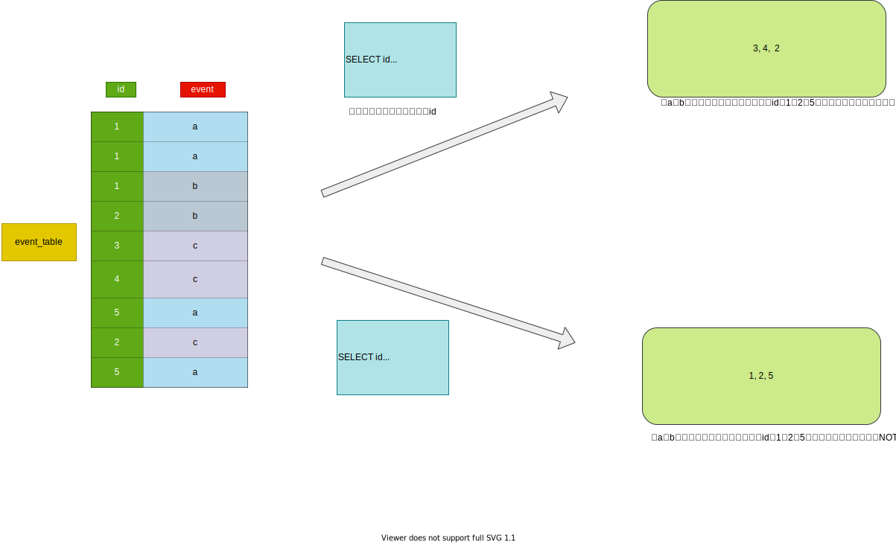

# `IN` OR `NOT IN` , IS A PROBLEM

## 废话前言

在SQL中，IN和NOT IN表示是否存在，即判断筛选出来的数是否在一个结果集中，如`SELECT * FROM (SELECT 'aaa' as a) b WHERE b.a IN ('aaa', 'bbb');` 

的结果为：

~~~sql
+-----+
| a   |
+-----+
| aaa |
+-----+
1 row in set (0.00 sec)
~~~

> 以上结果地球人应该都知道

## 正片开始

现在有客户表，客户行为表两张表，客户表中有客户的id，客户行为表中有客户的id和客户的行为事件(event字段)，现在有这样一个需求：<u>需要统计在客户行为表中指定的时间段之内的，不活跃的客户，返回客户的id，也就是说，在指定的时间段内，客户如果没有对应的event事件，那么该客户就是非活跃的。</u>

具体的思路和步骤都在图中表示了，结果告诉我们要在使用`IN` 和 `NOT IN`时要仔细思考好逻辑关系，难倒是不难，要仔细。

