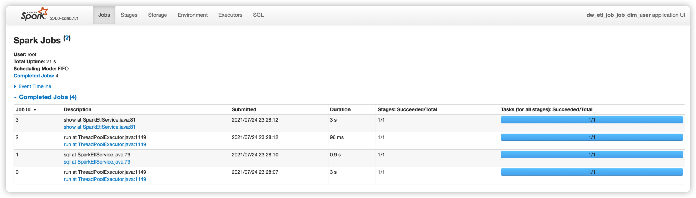
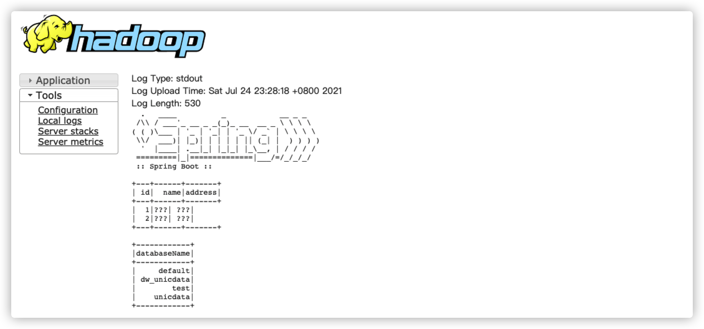
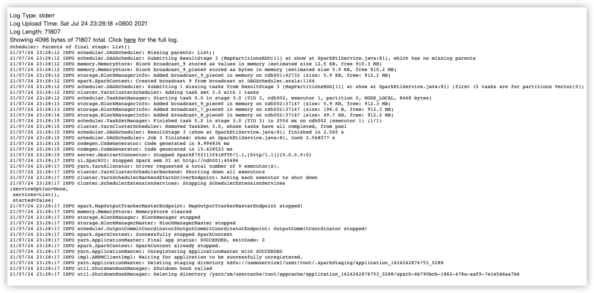
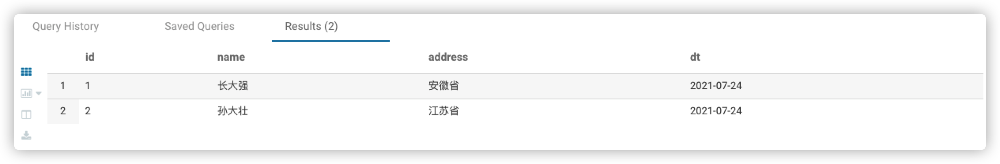

# Springboot整合Spark, 本地、集群部署

> 最近需要完善一个底层执行引擎为Spark的数仓项目，其功能宏观上看类似于`hive -f `命令，让不懂java的但会写sql的人也能胜任数仓开发。项目使用Springboot2.4 和Spark2.4 ，代码为java完成，最终实现可以在本地、集群包括client模式和cluster模式来提交运行。这其中坑也不少，下面是对该探索过程的总结，主要探讨的是上线部署过程中遇到的种种问题以及解决方式。

下面文字略显臃肿，默认设置了`verbose=true`

## 先决条件

当然是Springboot2.4，Spark2.4，在项目的`pom.xml`中添加好相关的依赖，主要有

- spring-boot-starter
- spark-core
- spark-sql
- Spark-hive
- org.codehaus.janino
- Hadoop-client
- hadoop-common
- Hadoop-hdfs

相关依赖可以详见附录部分

**说明**：项目上集群环境是spark2.4 + hadoop3.0.0-cdh6.1.1+Hive2.1.0-cdh6.1.1

## 遇到的问题

### 0、本地错误

此处默认本地代码已经写好，并且可以在本地成功运行，如果如果集群环境是hadoop3.0.0，那么在本地的maven中需要导入hadoop3.0.0的依赖包，可能会在本地无法运行，主要报错表现为`Unrecognized Hadoop major version number: 3.0.0-cdh6.1.1`或者`HIVE_STATS_JDBC_TIMEOUT` 

这是因为当你导入Spark的相关依赖包之后，spark2.x默认导入的是hadoop2.6.5的包，而为了适配集群环境，我们又显示地导入了hadoop3.0.0的依赖包，而Hive2.x版本不能加载hadoop版本号为3的hadoop(粗糙点这么说，仔细的原因没有研究过)，所以跑出了异常，`HIVE_STATS_JDBC_TIMEOUT`也大致如此，百度博客园上也有位兄弟说是spark-hive源码的问题，这里贴出地址：[传送门](https://www.cnblogs.com/fbiswt/p/11798514.html)

~~~java
Caused by: java.lang.IllegalArgumentException: Unrecognized Hadoop major version number: 3.0.0-cdh6.1.1
	at org.apache.hadoop.hive.shims.ShimLoader.getMajorVersion(ShimLoader.java:174)
	at org.apache.hadoop.hive.shims.ShimLoader.loadShims(ShimLoader.java:139)
	at org.apache.hadoop.hive.shims.ShimLoader.getHadoopShims(ShimLoader.java:100)
	at org.apache.hadoop.hive.conf.HiveConf$ConfVars.<clinit>(HiveConf.java:368)
	... 63 more
~~~

如果你的代码在引入hadoop3.0.0去为了适配集群环境之前，就可以本地成功运行，那么在引入hadoop3.0.0依赖包之后，大胆地clean and package，毕竟人和代码有一个能跑就行了

### 1、Log4j日志依赖冲突

当项目代码写好后，使用maven打包，将jar上传到服务器，使用spark-submit提交咱们的代码，当你满心期待控制台会一行行的汇报spark的运行状态从ACCEPT切换为RUNNING的时候，突然，报错了，大致抛出了以下异常，你开始满脸疑惑。

~~~java
Exception in thread "main" java.lang.IllegalArgumentException: LoggerFactory is not a Logback LoggerContext but Logback is on the classpath. Either remove Logback or the competing implementation......
~~~

于是你开始百度，突然你找到了一篇这样的博文，当然，我也看到了，[Maven项目同时包含Spark和Springboot时导致Log4j与Logback依赖冲突问题解决](https://blog.csdn.net/hz371071798/article/details/106221415),个人感觉这篇文章写得还是很好的，思路清晰，分析到位。

上面的报错信息大致是说，实际得到的LoggerContext不是一个Logback的，但是Logback却在类路径上要么将logback移除，要么自己实现xxx

啥？要改源码？那不可能，果断放弃！

于是我们选择将logback移除吧！

在移除之前我们来分析下为什么：

<u>springboot默认使用logback来输出日志，而spark默认使用log4j来输出日志，并且，spark的日志输出是强制使用log4j的，所以两个日志系统并存之后产生了冲突，并且唯一选择是将logback排除，而使用log4j作为统一的输出工具。</u>

**解决办法**：在IDEA中使用maven-helper，搜索logback，挨个儿将其exclude掉，也就是使用exclusion标签排除掉。保险的是所有的日志相关都排除掉，然后手动引入log4j的依赖包。

### 2、LoggerContext转换异常

你以为找到解决办法，把日志都排除手动引入log4j不就好了嘛，一切都搞定，clear and package，ok，丢包上服务器，spark-submit启动！于是又抛出了下面的异常：

~~~java
Caused by: java.lang.ClassCastException: org.apache.logging.log4j.simple.SimpleLoggerContext cannot be cast to org.apache.logging.log4j.core.LoggerContext
at org.springframework.boot.logging.log4j2.Log4J2LoggingSystem.getLoggerContext(Log4J2LoggingSystem.java:308)
at org.springframework.boot.logging.log4j2.Log4J2LoggingSystem.beforeInitialize(Log4J2LoggingSystem.java:148)
at org.springframework.boot.context.logging.LoggingApplicationListener.onApplicationStartingEvent(LoggingApplicationListener.java:232)
at org.springframework.boot.context.logging.LoggingApplicationListener.onApplicationEvent(LoggingApplicationListener.java:213)
......
~~~

日志说得很清楚, `org.apache.logging.log4j.simple.SimpleLoggerContext`不能被转换为`org.apache.logging.log4j.core.LoggerContext`，一开始我以为是日志依赖包的问题，是不是哪里没有排除干净，检查了很久，参考了[SpringBoot + Spark on Yan踩坑记](https://www.codeleading.com/article/8988997674/)之后设置springboot停止加载任何LoggerContext

~~~java
--driver-java-options "-Dorg.springframework.boot.logging.LoggingSystem=none"
~~~

对照着一想，spark以集群模式运行的时候，日志输出是在Driver节点上的，只要对Driver动手脚就可以了。

### 3、GsonBuilder异常

上面日志转换的异常通过设置`driver-java-options`之后，解决了，但是新的问题又来了，真是一波未平一波又起，老天这是在捉弄我啊，抛了个下面的异常：

~~~java
Caused by: org.springframework.beans.BeanInstantiationException: Failed to instantiate [com.google.gson.GsonBuilder]: Factory method 'gsonBuilder' threw exception; nested exception is java.lang.BootstrapMethodError: java.lang.NoSuchMethodError: com.google.gson.GsonBuilder.setLenient()Lcom/google/gson/GsonBuilder;
at org.springframework.beans.factory.support.SimpleInstantiationStrategy.instantiate(SimpleInstantiationStrategy.java:185)
at org.springframework.beans.factory.support.ConstructorResolver.instantiate(ConstructorResolver.java:651)
... 24 more
~~~

日志说得很清楚，不能实例化一个GsonBuilder，冷静分析一波，不能实例化一个，怎么会？去看看maven，通过maven-helper一搜，在的啊，已经被自动引入了，难道说是依赖又冲突了？可是maven-helper并没有显示其冲突了，随着这个猜测，又手动将所有依赖gson的地方都排除，而手动引入，OK，打包上集群，跑起来，仍然报错，经过我的尝试，

- 不引入该依赖，报同样的错
- 排除所有该依赖再手动引入，报同样的错
- 百度之后说换低版本(2.6.2)的gson(spark2.4和springboot2.4默认引入的是gson2.8.6)可以解决，换之，报同样的错
- 将所有依赖包打包成一个fat jar，该jar足足有157MB，这个时候，报错变了！

怎么会呢，我在IDEA中搜索了`com.google.gson.GsonBuilder.setLenient()`,显示在2.8.6版本的源码中明明就有这个方法！

此问题悬而未决，继续看下面的分析。

### 4、HftpFileSystem异常

打成所有依赖包在内的fat jar之后，一提交任务，还没有等到yarn汇报状态位ACCEPT的时候，就抛出了异常，如下：

~~~java
java.lang.IllegalAccessError: class org.apache.hadoop.hdfs.web.HftpFileSystem cannot access its superinterface org.apache.hadoop.hdfs.web.TokenAspect$TokenManagementDelegator
~~~

这啥玩意？本地都可以抛，为什么打包上集群就给我报这个错？

是我的错吗？是我不该写代码吗？

静下心来，想了一下，这种问题肯定都是依赖包问题，我不甘心，我继续尝试，一定是打包之后的依赖包与集群环境的依赖包存在冲突，于是抛弃使用这种方法。

### 5、继续Gson异常

上面提到的踩坑记里面说到，<u>将Spark自带的GSON库重命名</u>，于是我去试了试，仍然报错！仍然无法实例化一个GsonBuilder，我突然想到，将部署模式切换为client模式，日志是不是好管理呢，于是我将spark-submit的部署模式设置为client重新跑了一遍，好家伙！日志变了，控制台开始打印出那个大大的Sprintboot的Banner了！Yarn也开始汇报状态位ACCEPT了！Nice！

~~~
  .   ____          _            __ _ _
 /\\ / ___'_ __ _ _(_)_ __  __ _ \ \ \ \
( ( )\___ | '_ | '_| | '_ \/ _` | \ \ \ \
 \\/  ___)| |_)| | | | | || (_| |  ) ) ) )
  '  |____| .__|_| |_|_| |_\__, | / / / /
 =========|_|==============|___/=/_/_/_/
 :: Spring Boot ::
~~~

跑着跑着，并没有运行成功，不过下面倒是出现了这样的日志：

~~~ini
Error starting ApplicationContext. To display the conditions report re-run your application with 'debug' enabled.
21/07/22 23:19:54 ERROR diagnostics.LoggingFailureAnalysisReporter: 

***************************
APPLICATION FAILED TO START
***************************

Description:
An attempt was made to call a method that does not exist. The attempt was made from the following location:
    java.lang.invoke.MethodHandleNatives.resolve(Native Method)
The following method did not exist:
    com.google.gson.GsonBuilder.setLenient()Lcom/google/gson/GsonBuilder;
The method's class, com.google.gson.GsonBuilder, is available from the following locations:
    jar:file:/opt/cloudera/parcels/CDH-6.1.1-1.cdh6.1.1.p0.875250/jars/gson-2.2.4.jar!/com/google/gson/GsonBuilder.class
The class hierarchy was loaded from the following locations:
    com.google.gson.GsonBuilder: file:/opt/cloudera/parcels/CDH-6.1.1-1.cdh6.1.1.p0.875250/jars/gson-2.2.4.jar

Action:
Correct the classpath of your application so that it contains a single, compatible version of com.google.gson.GsonBuilder
~~~

日志中说得很明白，`com.google.gson.GsonBuilder.setLenient()Lcom/google/gson/GsonBuilder`这个方法不存在，但是这个方法的class从这个路径可以获取到`jar:file:/opt/cloudera/parcels/CDH-6.1.1-1.cdh6.1.1.p0.875250/jars/gson-2.2.4.jar!/com/google/gson/GsonBuilder.class`

类的层级是从下面的路径中加载的：`com.google.gson.GsonBuilder: file:/opt/cloudera/parcels/CDH-6.1.1-1.cdh6.1.1.p0.875250/jars/gson-2.2.4.jar`， **这说明项目实际加载的是版本为2.2.4的Gson，而没有加载版本为2.8.6的Gson**。奇了怪了！我已经在第5异常中将spark底层自带的Gson库jiar包重命名了，这个从哪来的！于是我去找了其他地方也没找到！

于是我又去上面提到的踩坑记里面看了看，想着是不是项目在集群环境运行的时候加载错了依赖包或者有其默认的加载方式，而这正好冲突了。

我在spark-submit的参数中的`--driver-java-options`中继续添加了参数，使项目能够找到足够的依赖包，并且指定我所想要项目使用的jar包，在这里我手动指定gson的jar包为集群机器上有的版本为2.8.1的gson-2.8.1.jar，具体参数为：

~~~shell
--driver-java-options "-Dorg.springframework.boot.logging.LoggingSystem=none -Djava.ext.dirs=/opt/cloudera/parcels/CDH-6.1.1-1.cdh6.1.1.p0.875250/lib/spark/jars/gson-2.8.1.jar,/opt/cloudera/parcels/CDH-6.1.1-1.cdh6.1.1.p0.875250/lib/hive/lib/* -Dspark.yarn.dist.files=/opt/cloudera/parcels/CDH-6.1.1-1.cdh6.1.1.p0.875250/etc/hadoop/conf.dist/yarn-site.xml" \
--driver-class-path "/opt/cloudera/parcels/CDH-6.1.1-1.cdh6.1.1.p0.875250/jars/gson-2.8.1.jar" \
~~~

当我使用了这些参数之后，好家伙！**跑起来了**！

这些参数和jar包是经过我尝试的出来的，已经足够运行，当然在不同的集群上需要替换为不同的目录，可能依赖包也不同，需要一定的调试。

现在不光是人能跑，代码也能跑了！

Driver的控制台输出：

日志打印输出：

成功创建了表，并且在表里写入了数据：

## 总结

- 本地代码可以运行成功，那么后面的大部分问题都是依赖包问题，这是一个复杂的过程，需要不断去调试
- 分析错误一定要有推断，根据现象去推断，适当的时候需要去看源码
- 看日志尤其重要！
- 新学习了一个单词：hierarchy，日志的意思应该是首先的意思，该包具有统治地位，那么就是首先嘛！

## 参考和感谢

- [SpringBoot + Spark on Yan踩坑记](https://www.codeleading.com/article/8988997674/)
- [Spark任务提交与SpringBoot项目集成](https://blog.csdn.net/lyd882/article/details/103806085)

## 附录

### 1、pom.xml

~~~xml
<?xml version="1.0" encoding="UTF-8"?>
<project xmlns="http://maven.apache.org/POM/4.0.0"
         xmlns:xsi="http://www.w3.org/2001/XMLSchema-instance"
         xsi:schemaLocation="http://maven.apache.org/POM/4.0.0 http://maven.apache.org/xsd/maven-4.0.0.xsd">
    <modelVersion>4.0.0</modelVersion>

    <groupId>com.svw</groupId>
    <artifactId>dw-spark-etl</artifactId>
    <version>1.0-SNAPSHOT</version>
    <properties>
        <spark.version>2.4.0</spark.version>
        <project.build.sourceEncoding>UTF-8</project.build.sourceEncoding>
        <maven.compiler.source>1.8</maven.compiler.source>
        <maven.compiler.target>1.8</maven.compiler.target>
        <scala.version>2.11</scala.version>
        <hive.version>2.1.1-cdh6.1.1</hive.version>
        <hadoop.version>3.0.0-cdh6.1.1</hadoop.version>
    </properties>
    <parent>
        <groupId>org.springframework.boot</groupId>
        <artifactId>spring-boot-starter-parent</artifactId>
        <version>2.4.0</version>
        <!--        <relativePath>/</relativePath>-->
    </parent>

    <pluginRepositories>
        <pluginRepository>
            <id>alimaven spring plugin</id>
            <name>alimaven spring plugin</name>
            <url>https://maven.aliyun.com/repository/spring-plugin</url>
        </pluginRepository>

    </pluginRepositories>
    <repositories>
        <repository>
            <id>cloudera</id>
            <url>https://repository.cloudera.com/artifactory/cloudera-repos/</url>
        </repository>
    </repositories>

    <dependencies>
        <dependency>
            <groupId>org.springframework.boot</groupId>
            <artifactId>spring-boot-starter</artifactId>
            <exclusions>
                <exclusion>
                    <artifactId>logback-core</artifactId>
                    <groupId>ch.qos.logback</groupId>
                </exclusion>
                <exclusion>
                    <artifactId>logback-classic</artifactId>
                    <groupId>ch.qos.logback</groupId>
                </exclusion>
                <exclusion>
                    <artifactId>log4j-to-slf4j</artifactId>
                    <groupId>org.apache.logging.log4j</groupId>
                </exclusion>
                <exclusion>
                    <groupId>org.springframework.boot</groupId>
                    <artifactId>spring-boot-starter-logging</artifactId>
                </exclusion>
                <exclusion>
                    <artifactId>gson</artifactId>
                    <groupId>com.google.code.gson</groupId>
                </exclusion>
            </exclusions>
        </dependency>

        <dependency>
            <groupId>org.springframework.boot</groupId>
            <artifactId>spring-boot-starter-test</artifactId>
            <scope>test</scope>
        </dependency>
        <dependency>
            <groupId>org.apache.spark</groupId>
            <artifactId>spark-core_2.11</artifactId>
            <version>${spark.version}</version>
            <scope>provided</scope>
            <exclusions>
                <exclusion>
                    <groupId>org.slf4j</groupId>
                    <artifactId>slf4j-log4j12</artifactId>
                </exclusion>
                <exclusion>
                    <groupId>log4j</groupId>
                    <artifactId>log4j</artifactId>
                </exclusion>
                <exclusion>
                    <artifactId>log4j-to-slf4j</artifactId>
                    <groupId>org.apache.logging.log4j</groupId>
                </exclusion>
                <exclusion>
                    <artifactId>gson</artifactId>
                    <groupId>com.google.code.gson</groupId>
                </exclusion>
                <exclusion>
                    <groupId>org.apache.hadoop</groupId>
                    <artifactId>hadoop-client</artifactId>
                </exclusion>
                <exclusion>
                    <groupId>org.apache.hadoop</groupId>
                    <artifactId>hadoop-hdfs</artifactId>
                </exclusion>
                <exclusion>
                    <artifactId>jackson-core-asl</artifactId>
                    <groupId>org.codehaus.jackson</groupId>
                </exclusion>
            </exclusions>
        </dependency>
        <!--显式引入log4j-->
        <dependency>
            <groupId>org.slf4j</groupId>
            <artifactId>log4j-over-slf4j</artifactId>
            <version>1.7.31</version>
            <scope>provided</scope>
        </dependency>
        <dependency>
            <groupId>com.google.code.gson</groupId>
            <artifactId>gson</artifactId>
            <version>2.8.6</version>
            <scope>provided</scope>
        </dependency>
        <dependency>
            <groupId>org.slf4j</groupId>
            <artifactId>slf4j-api</artifactId>
            <version>1.7.31</version>
            <scope>provided</scope>
        </dependency>
        <dependency>
            <groupId>org.slf4j</groupId>
            <artifactId>slf4j-simple</artifactId>
            <version>1.7.31</version>
            <scope>provided</scope>
        </dependency>

        <dependency>
            <groupId>com.google.code.gson</groupId>
            <artifactId>gson</artifactId>
            <version>2.8.1</version>
            <scope>provided</scope>
        </dependency>

        <dependency>
            <groupId>org.apache.spark</groupId>
            <artifactId>spark-sql_2.11</artifactId>
            <version>${spark.version}</version>
            <scope>provided</scope>
        </dependency>

        <dependency>
            <groupId>org.apache.spark</groupId>
            <artifactId>spark-hive_2.11</artifactId>
            <version>${spark.version}</version>
            <scope>provided</scope>
            <exclusions>
                <exclusion>
                    <artifactId>apache-log4j-extras</artifactId>
                    <groupId>log4j</groupId>
                </exclusion>
                <exclusion>
                    <artifactId>jackson-mapper-asl</artifactId>
                    <groupId>org.codehaus.jackson</groupId>
                </exclusion>
            </exclusions>
        </dependency>

        <dependency>
            <groupId>org.codehaus.janino</groupId>
            <artifactId>janino</artifactId>
            <version>3.0.8</version>
        </dependency>

        <dependency>
            <groupId>org.apache.commons</groupId>
            <artifactId>commons-lang3</artifactId>
            <version>3.11</version>
            <scope>provided</scope>
        </dependency>
        <dependency>
            <groupId>junit</groupId>
            <artifactId>junit</artifactId>
            <version>4.11</version>
            <scope>test</scope>
        </dependency>

        <dependency>
            <groupId>org.projectlombok</groupId>
            <artifactId>lombok</artifactId>
            <version>1.18.10</version>
            <scope>provided</scope>
        </dependency>
        <dependency>
            <groupId>com.fasterxml.jackson.dataformat</groupId>
            <artifactId>jackson-dataformat-yaml</artifactId>
            <version>2.10.2</version>
        </dependency>

        <dependency>
            <groupId>org.apache.hadoop</groupId>
            <artifactId>hadoop-client</artifactId>
            <version>${hadoop.version}</version>
            <scope>provided</scope>
        </dependency>
        <dependency>
            <groupId>org.apache.hadoop</groupId>
            <artifactId>hadoop-hdfs</artifactId>
            <version>${hadoop.version}</version>
            <scope>provided</scope>
        </dependency>
        <dependency>
            <groupId>org.apache.hadoop</groupId>
            <artifactId>hadoop-common</artifactId>
            <version>${hadoop.version}</version>
            <scope>provided</scope>
            <exclusions>
                <exclusion>
                    <artifactId>gson</artifactId>
                    <groupId>com.google.code.gson</groupId>
                </exclusion>
            </exclusions>
        </dependency>
        <dependency>
            <groupId>commons-cli</groupId>
            <artifactId>commons-cli</artifactId>
            <version>1.4</version>
            <scope>provided</scope>
        </dependency>

    </dependencies>

    <build>
        <resources>
            <resource>
                <directory>src/main/java</directory>
                <includes>
                    <include>**/*.yml</include>
                    <include>**/*.sql</include>
                </includes>
            </resource>
            <resource>
                <directory>src/main/resources</directory>
                <includes>
                    <include>**/*.yml</include>
                    <include>**/*.sql</include>
                </includes>
            </resource>
        </resources>

        <plugins>
            <plugin>
                <groupId>org.apache.maven.plugins</groupId>
                <artifactId>maven-assembly-plugin</artifactId>
                <version>2.5.5</version>
                <configuration>
                    <archive>
                        <manifest>
                            <mainClass>com.csvw.dwsparketl.DwEtlApplication</mainClass>
                        </manifest>
                    </archive>
                    <finalName>${project.artifactId}-${project.version}</finalName>
                    <appendAssemblyId>false</appendAssemblyId>
                    <descriptors>
                        <descriptor>src/main/assembly/release.xml</descriptor>
                    </descriptors>
                </configuration>
                <executions>
                    <execution>
                        <id>make-assembly</id>
                        <phase>package</phase>
                        <goals>
                            <goal>single</goal>
                        </goals>
                    </execution>
                </executions>
            </plugin>

            <plugin>
                <groupId>org.apache.maven.plugins</groupId>
                <artifactId>maven-shade-plugin</artifactId>
                <!--                <version>3.1.1</version>-->
                <executions>
                    <execution>
                        <phase>package</phase>
                        <goals>
                            <goal>shade</goal>
                        </goals>
                        <configuration>
                            <keepDependenciesWithProvidedScope>false</keepDependenciesWithProvidedScope>
                            <createDependencyReducedPom>false</createDependencyReducedPom>
                            <filters>
                                <filter>
                                    <artifact>*:*</artifact>
                                    <excludes>
                                        <exclude>META-INF/*.SF</exclude>
                                        <exclude>META-INF/*.DSA</exclude>
                                        <exclude>META-INF/*.RSA</exclude>
                                    </excludes>
                                </filter>
                            </filters>
                            <transformers>
                                <transformer
                                        implementation="org.apache.maven.plugins.shade.resource.AppendingTransformer">
                                    <resource>META-INF/spring.handlers</resource>
                                </transformer>
                                <transformer
                                        implementation="org.springframework.boot.maven.PropertiesMergingResourceTransformer">
                                    <resource>META-INF/spring.factories</resource>
                                </transformer>
                                <transformer
                                        implementation="org.apache.maven.plugins.shade.resource.AppendingTransformer">
                                    <resource>META-INF/spring.schemas</resource>
                                </transformer>
                                <transformer
                                        implementation="org.apache.maven.plugins.shade.resource.ServicesResourceTransformer"/>
                                <transformer
                                        implementation="org.apache.maven.plugins.shade.resource.ManifestResourceTransformer">
                                    <mainClass>com.csvw.dwsparketl.DwEtlApplication</mainClass>
                                </transformer>
                            </transformers>
                        </configuration>
                    </execution>
                </executions>
            </plugin>
        </plugins>
    </build>
</project>
~~~

### 2、spark启动脚本

~~~shell
spark-submit \
--master yarn \
--deploy-mode cluster \
--driver-java-options "-Dorg.springframework.boot.logging.LoggingSystem=none -Djava.ext.dirs=/opt/cloudera/parcels/CDH-6.1.1-1.cdh6.1.1.p0.875250/lib/spark/jars/gson-2.8.1.jar,/opt/cloudera/parcels/CDH-6.1.1-1.cdh6.1.1.p0.875250/lib/hive/lib/* -Dspark.yarn.dist.files=/opt/cloudera/parcels/CDH-6.1.1-1.cdh6.1.1.p0.875250/etc/hadoop/conf.dist/yarn-site.xml" \
--driver-class-path "/opt/cloudera/parcels/CDH-6.1.1-1.cdh6.1.1.p0.875250/jars/gson-2.8.1.jar" \
--driver-cores 2 \
--driver-memory 2G \
--num-executors 2 \
--executor-cores 2 \
--executor-memory 2G \
--conf spark.dynamicAllocation.enabled=false \
--conf spark.yarn.maxAppAttempts=1 \
--name $name \
./dw-spark-etl-1.0-SNAPSHOT.jar 
~~~

