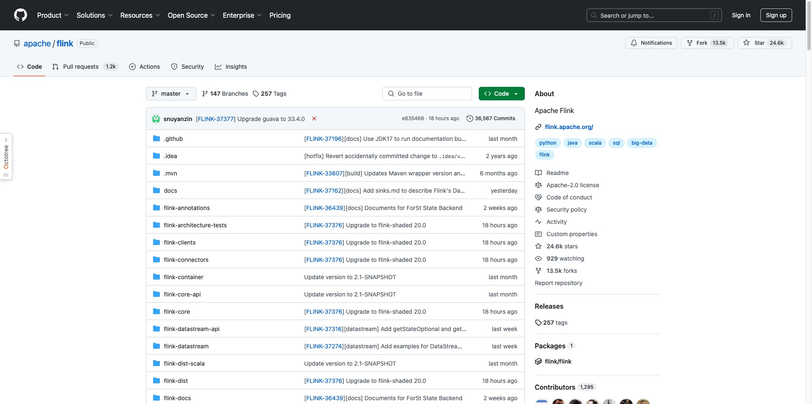
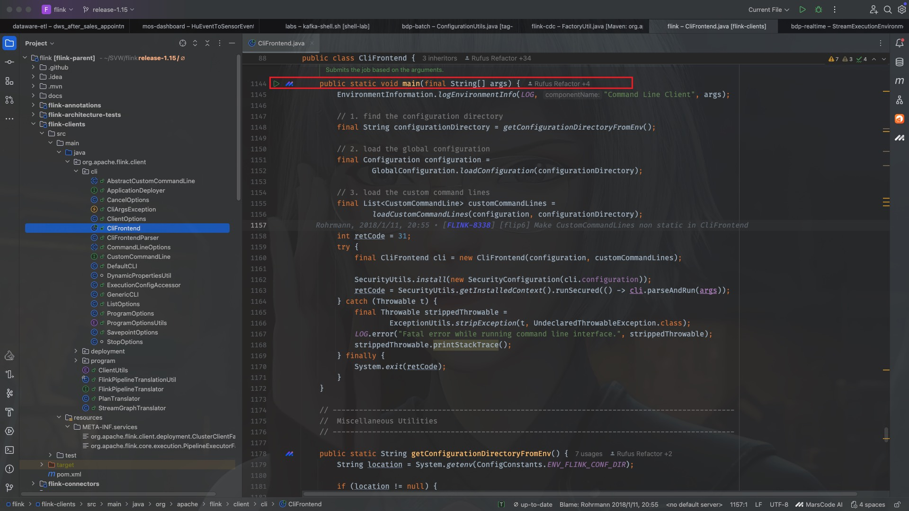
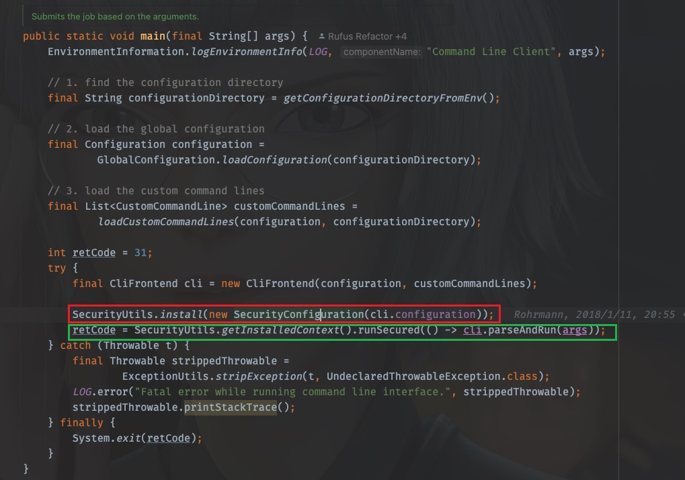
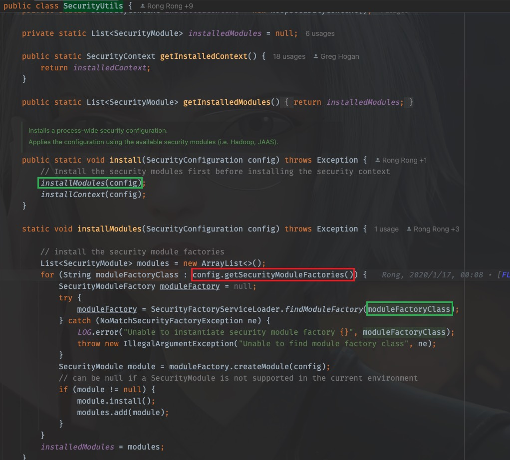
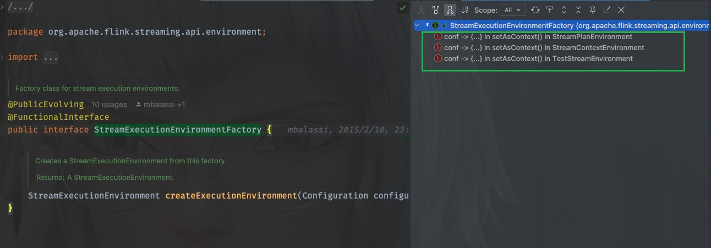
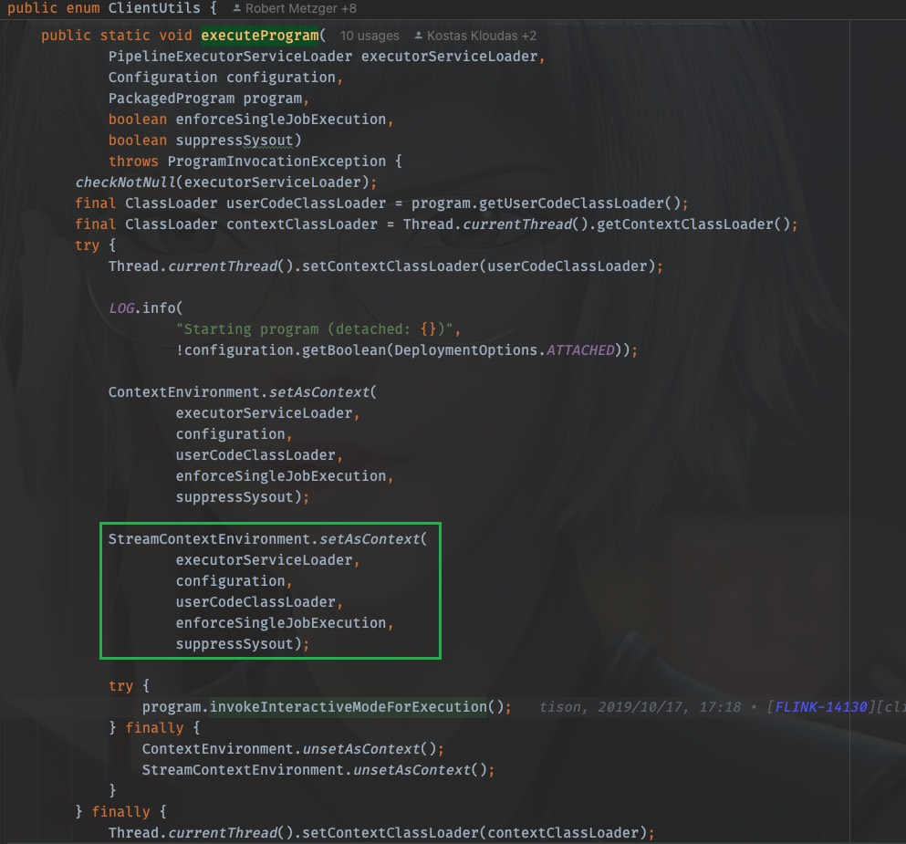
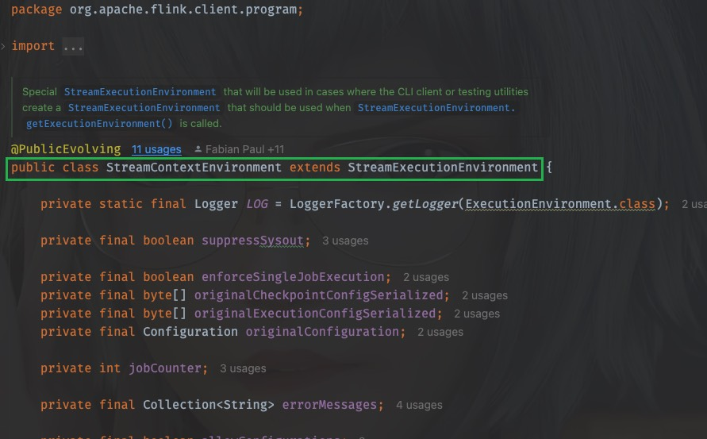

# [Flink源码]Flink任务是如何启动的

## 背景

最近写了一个Spark任务，任务在启动初始化的时候，需要加载内置在jar内的yml配置中的默认配置，还需要接收并解析用户命令行传入的自定义参数，于是为了适配和统一，定义了很多类来接收参数，管理起来很麻烦、混乱，且不方便使用。于是为了整合那么多参数，且方便调用使用，我准备参考一下Flink是如何管理这些参数的，于是我打开了flink-cdc的项目源码，一顿分析，发现里面引用了很多flink源码，于是我又打开flink源码，又一顿分析，源码特别多，调用关系相当复杂，稍不注意就分析偏了，这也是看源码时正常的情况，后来，就有了这一篇文章。不过不要紧，参数管理的目的，后面接着研究，下面着重从源码分析一下，一个用户写的Flink程序是如何启动的，这也是我第一篇分析源码的文章。

## 准备工作

我们首先打开[Flink](https://github.com/apache/flink)的开源项目，把代码pull一份到本地(**以下分析以1.15版本为例**)

假设我们现在已经有了一个jar包，该jar可以通过flink run 或者 run-application去启动

## 启动

正常来说，启动flink任务的脚本可以简化成以下片段，如果你部署的是application模式，那么其中的原理会有不同，因为需要去使用YARN API与YARN打交道，为了方便分析，简化问题的探讨，在此仅分析Client模式

~~~shell
$ ./bin/flink run \
      --detached \
      ./examples/streaming/StateMachineExample.jar
~~~

## 脚本入手

拿到了flink的启动命令，我们从flink的启动脚本入手，看脚本都干了些啥，先看bin/flink中的内容：

~~~shell
#!/usr/bin/env bash
################################################################################
#  Licensed to the Apache Software Foundation (ASF) under one
#  or more contributor license agreements.  See the NOTICE file
#  distributed with this work for additional information
#  regarding copyright ownership.  The ASF licenses this file
#  to you under the Apache License, Version 2.0 (the
#  "License"); you may not use this file except in compliance
#  with the License.  You may obtain a copy of the License at
#
#      http://www.apache.org/licenses/LICENSE-2.0
#
#  Unless required by applicable law or agreed to in writing, software
#  distributed under the License is distributed on an "AS IS" BASIS,
#  WITHOUT WARRANTIES OR CONDITIONS OF ANY KIND, either express or implied.
#  See the License for the specific language governing permissions and
# limitations under the License.
################################################################################

target="$0"
# For the case, the executable has been directly symlinked, figure out
# the correct bin path by following its symlink up to an upper bound.
# Note: we can't use the readlink utility here if we want to be POSIX
# compatible.
iteration=0
while [ -L "$target" ]; do
    if [ "$iteration" -gt 100 ]; then
        echo "Cannot resolve path: You have a cyclic symlink in $target."
        break
    fi
    ls=`ls -ld -- "$target"`
    target=`expr "$ls" : '.* -> \(.*\)$'`
    iteration=$((iteration + 1))
done

# Convert relative path to absolute path
bin=`dirname "$target"`

# get flink config
. "$bin"/config.sh

if [ "$FLINK_IDENT_STRING" = "" ]; then
        FLINK_IDENT_STRING="$USER"
fi

CC_CLASSPATH=`constructFlinkClassPath`

log=$FLINK_LOG_DIR/flink-$FLINK_IDENT_STRING-client-$HOSTNAME.log
log_setting=(-Dlog.file="$log" -Dlog4j.configuration=file:"$FLINK_CONF_DIR"/log4j-cli.properties -Dlog4j.configurationFile=file:"$FLINK_CONF_DIR"/log4j-cli.properties -Dlogback.configurationFile=file:"$FLINK_CONF_DIR"/logback.xml)

# Add Client-specific JVM options
FLINK_ENV_JAVA_OPTS="${FLINK_ENV_JAVA_OPTS} ${FLINK_ENV_JAVA_OPTS_CLI}"

# Add HADOOP_CLASSPATH to allow the usage of Hadoop file systems
exec "${JAVA_RUN}" $JVM_ARGS $FLINK_ENV_JAVA_OPTS "${log_setting[@]}" -classpath "`manglePathList "$CC_CLASSPATH:$INTERNAL_HADOOP_CLASSPATHS"`" org.apache.flink.client.cli.CliFrontend "$@"
~~~

直接看最后一句，因为上面无非是加载配置文件，装载配置信息，最后一句exec很显然是执行的内容，是实际做的事儿

可以看到，执行的类是`org.apache.flink.client.cli.CliFrontend`，这是一个核心突破口，我们打开flink项目源码，找到这个类

## 源码从main()开始

可以看到，该类位于`flink-clients`这个module下，并且包含了一个main方法，可以肯定，这是flink程序的入口类

main方法中核心做了四件事儿

1. 定位配置目录。找到核心配置文件所在的目录，即`${FLINK_HOME}/conf`目录
2. 文件加载即配置解析。将配置文件flink-conf.yaml中的内容加载并解析，装载进入`Configuration`类中
3. 解析命令行参数。获取命令行参数内容，并解析
4. 执行。通过反射调用UserCode的main方法。

下面着重介绍第4步

## security配置

在实际调用`SecurityUtils.getInstalledContext().runSecured(() -> cli.parseAndRun(args))`去执行job之前，还需要安装环境安全配置

`SecurityUtils.install(new SecurityConfiguration(cli.configuration))`

1. 安装security模块
2. 安装security上下文

我们进入`SecurityUtils`中去看看实际进行了什么动作，以Security Module的安装为例，在`SecurityUtils`中，核心方法是`install(SecurityConfiguration config)`

~~~java
/**
 * Installs a process-wide security configuration.
 *
 * 
Applies the configuration using the available security modules (i.e. Hadoop, JAAS).
 */
public static void install(SecurityConfiguration config) throws Exception {
    // Install the security modules first before installing the security context
    installModules(config);
    installContext(config);
}

static void installModules(SecurityConfiguration config) throws Exception {

    // install the security module factories
    List<SecurityModule> modules = new ArrayList<>();
    for (String moduleFactoryClass : config.getSecurityModuleFactories()) {
        SecurityModuleFactory moduleFactory = null;
        try {
            moduleFactory = SecurityFactoryServiceLoader.findModuleFactory(moduleFactoryClass);
        } catch (NoMatchSecurityFactoryException ne) {
            LOG.error("Unable to instantiate security module factory {}", moduleFactoryClass);
            throw new IllegalArgumentException("Unable to find module factory class", ne);
        }
        SecurityModule module = moduleFactory.createModule(config);
        // can be null if a SecurityModule is not supported in the current environment
        if (module != null) {
            module.install();
            modules.add(module);
        }
    }
    installedModules = modules;
}

~~~

一眼看过去，可以看到`installModules(SecurityConfiguration config)`方法中有一个`SecurityFactoryServiceLoader.findModuleFactory(moduleFactoryClass)`的方法调用，根据我为数不多的经验可以看出来，这是java的**SPI机制**，里面一定有ServiceLoader的加载调用

进入`SecurityFactoryServiceLoader`中，可以看到调用链路是

~~~java
/** Find a suitable {@link SecurityModuleFactory} based on canonical name. */
public static SecurityModuleFactory findModuleFactory(String securityModuleFactoryClass)
        throws NoMatchSecurityFactoryException {
    return findFactoryInternal(
            securityModuleFactoryClass,
            SecurityModuleFactory.class,
            SecurityModuleFactory.class.getClassLoader());
}

private static <T> T findFactoryInternal(
        String factoryClassCanonicalName, Class<T> factoryClass, ClassLoader classLoader)
        throws NoMatchSecurityFactoryException {

    Preconditions.checkNotNull(factoryClassCanonicalName);

    ServiceLoader<T> serviceLoader;
    if (classLoader != null) {
        serviceLoader = ServiceLoader.load(factoryClass, classLoader);
    } else {
        serviceLoader = ServiceLoader.load(factoryClass);
    }

    List<T> matchingFactories = new ArrayList<>();
    Iterator<T> classFactoryIterator = serviceLoader.iterator();
    classFactoryIterator.forEachRemaining(
            classFactory -> {
                if (factoryClassCanonicalName.matches(
                        classFactory.getClass().getCanonicalName())) {
                    matchingFactories.add(classFactory);
                }
            });

    if (matchingFactories.size() != 1) {
        throw new NoMatchSecurityFactoryException(
                "zero or more than one security factory found",
                factoryClassCanonicalName,
                matchingFactories);
    }
    return matchingFactories.get(0);
}
~~~

既然有了SPI机制，那么一定有一个顶层接口类，才能加载到其实现类，那么这个顶层接口是什么呢？

让我们回退到`org.apache.flink.runtime.security.SecurityUtils`中，再看一眼调用链路，这个顶层接口的类名其实来自于`SecurityConfiguration`

那么接下来，我们只要找到这个SecurityConfiguration中是怎么加载的就可以了，回到install方法被调用的地方，

~~~java
SecurityUtils.install(new SecurityConfiguration(cli.configuration))
~~~

可以看到SecurityConfiguration在实例化的时候传入的是配置configuration对象，进入到SecurityConfiguration中，内部构造方法里很清晰地就可以看到对于Module工厂类的传入

~~~java
public SecurityConfiguration(Configuration flinkConf) {
    this(
            flinkConf,
            flinkConf.get(SECURITY_CONTEXT_FACTORY_CLASSES),
            flinkConf.get(SECURITY_MODULE_FACTORY_CLASSES));
}
~~~

于是可以看到，对于工厂类的提供使用了可选参数，如果不指定，将会有默认参数，这些定义在`org.apache.flink.configuration.SecurityOptions`中

~~~java
public static final ConfigOption<List<String>> SECURITY_CONTEXT_FACTORY_CLASSES =
        key("security.context.factory.classes")
                .stringType()
                .asList()
                .defaultValues(
                        "org.apache.flink.runtime.security.contexts.HadoopSecurityContextFactory",
                        "org.apache.flink.runtime.security.contexts.NoOpSecurityContextFactory")
                .withDescription(
                        "List of factories that should be used to instantiate a security context. "
                                + "If multiple are configured, Flink will use the first compatible "
                                + "factory. You should have a NoOpSecurityContextFactory in this list "
                                + "as a fallback.");
public static final ConfigOption<List<String>> SECURITY_MODULE_FACTORY_CLASSES =
        key("security.module.factory.classes")
                .stringType()
                .asList()
                .defaultValues(
                        "org.apache.flink.runtime.security.modules.HadoopModuleFactory",
                        "org.apache.flink.runtime.security.modules.JaasModuleFactory",
                        "org.apache.flink.runtime.security.modules.ZookeeperModuleFactory")
                .withDescription(
                        "List of factories that should be used to instantiate security "
                                + "modules. All listed modules will be installed. Keep in mind that the "
                                + "configured security context might rely on some modules being present.");
~~~

对于Security Context的装配配置也是类似

## RUN

一切准备工作做好，接下来就是实际执行用户的代码了

~~~java
SecurityUtils.getInstalledContext().runSecured(() -> cli.parseAndRun(args))
~~~

进入到parseAndRun(`org.apache.flink.client.cli.CliFrontend#parseAndRun`)中，

~~~java

/**
 * Parses the command line arguments and starts the requested action.
 *
 * @param args command line arguments of the client.
 * @return The return code of the program
 */
public int parseAndRun(String[] args) {

    // check for action
    if (args.length < 1) {
        CliFrontendParser.printHelp(customCommandLines);
        System.out.println("Please specify an action.");
        return 1;
    }

    // get action
    String action = args[0];

    // remove action from parameters
    final String[] params = Arrays.copyOfRange(args, 1, args.length);

    try {
        // do action
        switch (action) {
            case ACTION_RUN:
                run(params);
                return 0;
            case ACTION_RUN_APPLICATION:
                runApplication(params);
                return 0;
            case ACTION_LIST:
                list(params);
                return 0;
            case ACTION_INFO:
                info(params);
                return 0;
            case ACTION_CANCEL:
                cancel(params);
                return 0;
            case ACTION_STOP:
                stop(params);
                return 0;
            case ACTION_SAVEPOINT:
                savepoint(params);
                return 0;
            case "-h":
            case "--help":
                CliFrontendParser.printHelp(customCommandLines);
                return 0;
            case "-v":
            case "--version":
                ......
                return 1;
        }
    } catch (CliArgsException ce) {
        return handleArgException(ce);
    }
    ......
}
~~~

到这里，剧情就变得熟悉起来，看到`ACTION_RUN`,`ACTION_RUN_APPLICATION`等分支，很自然可以想到命令行启动程序时传入的action参数，按照本文开头说的，我们进入到`ACTION_RUN`分支中，一探究竟

~~~java
/**
 * Executions the run action.
 *
 * @param args Command line arguments for the run action.
 */
protected void run(String[] args) throws Exception {
    LOG.info("Running 'run' command.");

    final Options commandOptions = CliFrontendParser.getRunCommandOptions();
    final CommandLine commandLine = getCommandLine(commandOptions, args, true);

    // evaluate help flag
    if (commandLine.hasOption(HELP_OPTION.getOpt())) {
        CliFrontendParser.printHelpForRun(customCommandLines);
        return;
    }

    final CustomCommandLine activeCommandLine =
            validateAndGetActiveCommandLine(checkNotNull(commandLine));

    final ProgramOptions programOptions = ProgramOptions.create(commandLine);

    final List<URL> jobJars = getJobJarAndDependencies(programOptions);

    final Configuration effectiveConfiguration =
            getEffectiveConfiguration(activeCommandLine, commandLine, programOptions, jobJars);

    LOG.debug("Effective executor configuration: {}", effectiveConfiguration);

    try (PackagedProgram program = getPackagedProgram(programOptions, effectiveConfiguration)) {
        executeProgram(effectiveConfiguration, program);
    }
}
~~~

直接看最后一行，`executeProgram(effectiveConfiguration, program)`触发执行就在于此，那么上面的代码根据方法命名可以猜到，同样是在做准备工作，配置加载，参数校验，顺着`executeProgram`我们找到它实际执行的动作，摘掉它一层层的面纱

~~~java
//org.apache.flink.client.cli.CliFrontend#executeProgram
protected void executeProgram(final Configuration configuration, final PackagedProgram program)
        throws ProgramInvocationException {
    ClientUtils.executeProgram(
            new DefaultExecutorServiceLoader(), configuration, program, false, false);
}

//org.apache.flink.client.ClientUtils#executeProgram
public static void executeProgram(
     PipelineExecutorServiceLoader executorServiceLoader,
     Configuration configuration,
     PackagedProgram program,
     boolean enforceSingleJobExecution,
     boolean suppressSysout)
     throws ProgramInvocationException {
 checkNotNull(executorServiceLoader);
 final ClassLoader userCodeClassLoader = program.getUserCodeClassLoader();
 final ClassLoader contextClassLoader = Thread.currentThread().getContextClassLoader();
 try {
     Thread.currentThread().setContextClassLoader(userCodeClassLoader);

     LOG.info(
             "Starting program (detached: {})",
             !configuration.getBoolean(DeploymentOptions.ATTACHED));

     ContextEnvironment.setAsContext(
             executorServiceLoader,
             configuration,
             userCodeClassLoader,
             enforceSingleJobExecution,
             suppressSysout);

     StreamContextEnvironment.setAsContext(
             executorServiceLoader,
             configuration,
             userCodeClassLoader,
             enforceSingleJobExecution,
         suppressSysout);

        try {
            program.invokeInteractiveModeForExecution();
        } finally {
            ContextEnvironment.unsetAsContext();
            StreamContextEnvironment.unsetAsContext();
        }
    } finally {
        Thread.currentThread().setContextClassLoader(contextClassLoader);
    }
}
~~~

看到`program.invokeInteractiveModeForExecution()`，再进去看看干了什么，

~~~java
/**
 * This method assumes that the context environment is prepared, or the execution will be a
 * local execution by default.
 */
public void invokeInteractiveModeForExecution() throws ProgramInvocationException {
    FlinkSecurityManager.monitorUserSystemExitForCurrentThread();
    try {
        callMainMethod(mainClass, args);
    } finally {
        FlinkSecurityManager.unmonitorUserSystemExitForCurrentThread();
    }
}
~~~

有一个`callMainMethod(mainClass, args)`,已经很明显了，接着进去，已经迫不及待了！

~~~java
private static void callMainMethod(Class<?> entryClass, String[] args)
        throws ProgramInvocationException {
    Method mainMethod;
    ......
	try {
	    mainMethod = entryClass.getMethod("main", String[].class);
	} catch (NoSuchMethodException e) {
	    ......
	}

    try {
        mainMethod.invoke(null, (Object) args);
    } catch (IllegalArgumentException e) {
        ......
    }
}
~~~

源码可以看到做了很多的对于入口类、main方法限定关键字的校验，是否是public，是否是static，一切校验通过，就可以invoke了

**到此，即执行了用户代码的main方法**

## StreamExecutionEnvironment

此时，用户代码中一般使用`StreamExecutionEnvironment.getExecutionEnvironment()`来获得一个流执行环境

~~~java
StreamExecutionEnvironment sEnv = StreamExecutionEnvironment.getExecutionEnvironment();
~~~

那么当执行`StreamExecutionEnvironment.getExecutionEnvironment()`的时候都干了什么呢？

让我们进入到StreamExecutionEnvironment(`org.apache.flink.streaming.api.environment.StreamExecutionEnvironment`)中一探究竟，找到调用链路

~~~java
//org.apache.flink.streaming.api.environment.StreamExecutionEnvironment#getExecutionEnvironment()
public static StreamExecutionEnvironment getExecutionEnvironment() {
    return getExecutionEnvironment(new Configuration());
}

//org.apache.flink.streaming.api.environment.StreamExecutionEnvironment#getExecutionEnvironment(org.apache.flink.configuration.Configuration)
public static StreamExecutionEnvironment getExecutionEnvironment(Configuration configuration) {
    return Utils.resolveFactory(threadLocalContextEnvironmentFactory, contextEnvironmentFactory)
            .map(factory -> factory.createExecutionEnvironment(configuration))
            .orElseGet(() -> StreamExecutionEnvironment.createLocalEnvironment(configuration));
}

~~~

可以看到，这里使用工厂类StreamExecutionEnvironmentFactory(`org.apache.flink.streaming.api.environment.StreamExecutionEnvironmentFactory`)

来构造我们需要的StreamExecutionEnvironment，步骤是

1、先得到工厂类

2、调用工厂类的createExecutionEnvironment方法

3、如果没找到工厂，则调用createLocalEnvironment方法，创建一个本地运行环境

接下来，只要找到工厂类的“诞生”的位置就OK了

## StreamExecutionEnvironmentFactory

进入到StreamExecutionEnvironmentFactory(`org.apache.flink.streaming.api.environment.StreamExecutionEnvironmentFactory`)中，使用快捷键control + H(macOS, windows不详)调出实现类，可以看到有3个使用了lambda表达式的实现类

凭着大数据直觉，我们选第二个进去，此时我们来到了一个叫StreamContextEnvironment`org.apache.flink.client.program.StreamContextEnvironment`的类中，并且进入到方法`org.apache.flink.client.program.StreamContextEnvironment#setAsContext`中，还记得吗，这个方法很熟悉！

什么？不熟悉？没关系，看了这么多代码一定脑子懵懵的，我们慢慢接着分析~

其实这个方法就在上面的executeProgram方法中有过调用：

先看看这个方法干了啥：

~~~java
public static void setAsContext(
        final PipelineExecutorServiceLoader executorServiceLoader,
        final Configuration configuration,
        final ClassLoader userCodeClassLoader,
        final boolean enforceSingleJobExecution,
        final boolean suppressSysout) {
    StreamExecutionEnvironmentFactory factory =
            conf -> {
                final List<String> errors = new ArrayList<>();
                final boolean allowConfigurations =
                        configuration.getBoolean(
                                DeploymentOptions.ALLOW_CLIENT_JOB_CONFIGURATIONS);
                if (!allowConfigurations && !conf.toMap().isEmpty()) {
                    conf.toMap()
                            .forEach(
                                    (k, v) ->
                                            errors.add(
                                                    ConfigurationNotAllowedMessage
                                                            .ofConfigurationKeyAndValue(k, v)));
                }
                Configuration mergedConfiguration = new Configuration();
                mergedConfiguration.addAll(configuration);
                mergedConfiguration.addAll(conf);
                return new StreamContextEnvironment(
                        executorServiceLoader,
                        mergedConfiguration,
                        userCodeClassLoader,
                        enforceSingleJobExecution,
                        suppressSysout,
                        allowConfigurations,
                        errors);
            };
    initializeContextEnvironment(factory);
}
~~~

和你想的一样，实例化一个StreamExecutionEnvironmentFactory，但是，你发现没？lambda表达式中，return的是一个StreamContextEnvironment对象，不是我们要的工厂呀！咋回事？

别慌~

看见没，StreamContextEnvironment继承了StreamExecutionEnvironment，即StreamContextEnvironment就是我们苦苦寻找的StreamExecutionEnvironment，

但是细心地你又问了，刚才的代码段中左边是工厂类，右边是一段lambada表达式，但是lambada表达式返回的却不是工厂类啊，那是实实在在的StreamContextEnvironment呀，咋回事儿？

哈哈，事情变得有趣起来。

让我们再回去看看那个工厂类，这会眼睛睁大点看清楚了：

~~~java
/** Factory class for stream execution environments. */
@PublicEvolving
@FunctionalInterface
public interface StreamExecutionEnvironmentFactory {

    /**
     * Creates a StreamExecutionEnvironment from this factory.
     *
     * @return A StreamExecutionEnvironment.
     */
    StreamExecutionEnvironment createExecutionEnvironment(Configuration configuration);
}
~~~

这个工厂类使用了一个注解`@FunctionalInterface`,这就是大名鼎鼎的**函数式注解**，工厂类只有一个需要实现的方法，那么lambda表达式就可以直接实现该接口，因此

**Lambda 表达式 `conf -> { ... }` 实际上实现了 `createExecutionEnvironment` 方法，而返回的 `StreamContextEnvironment` 是 `StreamExecutionEnvironment` 的子类，因此类型完全兼容。这是延迟绑定特性。**

由此产生出了一个新话题：这里的工厂类为什么要这么写？延迟绑定有什么好处？和普通的使用时再手动构造工厂再创建实例有什么区别？

> 这里不做解答，也是对我自己的一个提醒，提醒我自己在看到这个问题时，都要去再搜索一遍该问题的答案，以加深印象。

由此，我们得到了我们需要的StreamExecutionEnvironment，该对象中包含了execute方法，可以用来触发执行整个用户代码所构成的任务的执行。

## 发散话题

- 上面的分析中得到的是StreamContextEnvironment，但其实还有LocalStreamEnvironment、RemoteStreamEnvironment和TestStreamEnvironment等，这些又是什么时候被激活使用的呢？程序是怎么发现当前处于什么环境的呢？
- 这里用到了什么设计模式？（询问了deepseek发现使用了工厂模式+策略模式，StreamContextEnvironment使用了工厂模式，加载启动不同的environment则使用了策略模式）
- StreamContextEnvironment有什么用？不是已经有了StreamExecutionEnvironment了吗，为什么还需要设计它？

问题留在这里，今后还需要慢慢探索学习flink的精妙之处。