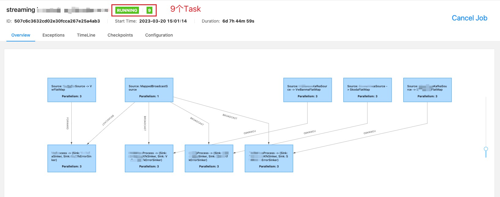
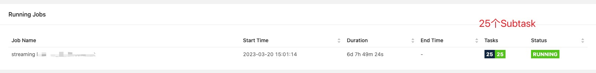
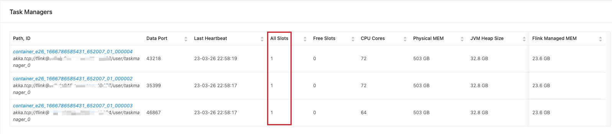

# [Flink]Flink的并行度与TaskSlot

## 背景

之前在提交一个flink任务的时候，配置修改默认的并行度为不同值时，发现在Flink的WebUI上除了可以看到算子的parallelism发生变化，也可以看到Task Managers的数量在发生变化，对这二者的关系不是太了解，一直想抽一个时间弄清楚他们之间的关系，于是今天这篇文章就来理解理解并整理一下。

了解这块的知识最好的工具当然是官网了，以Flink1.13版本为例，猛戳去了解，[Flink Architecture](https://nightlies.apache.org/flink/flink-docs-release-1.13/docs/concepts/flink-architecture/)

### Flink架构

#### JobManger

一个任务至少有一个JobManager，它负责生成任务的执行图、调度任务的执行、协调CHK的生成以及恢复失败的任务等

#### TaskManger

一个任务至少有一个TaskManager，它负责执行数据流的任务，缓存和交换数据流上的数据。

> The smallest unit of resource scheduling in a TaskManager is a task *slot*. The number of task slots in a TaskManager indicates the number of concurrent processing tasks. Note that multiple operators may execute in a task slot.

**一个TaskManager的最小的资源调度单位是任务槽**。TaskManager上的任务槽的数量表明了该任务可以并发处理的任务数，多个算子可能在同一个任务槽中执行。

### 任务和算子链

> Chaining operators together into tasks is a useful optimization: it reduces the overhead of thread-to-thread handover and buffering, and increases overall throughput while decreasing latency. The chaining behavior can be configured; see the [chaining docs](https://nightlies.apache.org/flink/flink-docs-release-1.13/docs/dev/datastream/operators/overview/#task-chaining-and-resource-groups) for details.

在Flink中每个task都由一个线程执行，Flink会将一些算子链起来，这样的操作有很多好处，比如一些算子如Source和Map算子之间可以链在一起，这样就减少了线程间的切换和缓冲的开销，并且降低了延迟的同时也提高了吞吐量。

上图是一个具有代表性的任务执行图，该任务由Source、Map、ke y B y()/window()/apply()和Sink算子组成，其中source、map和keyBy()算子都具有2个并行度，而sink算子具有1个并行度(比如说出于减少小文件的个数的考虑，这很正常)，根据程序的优化，source和map算子被链在一起，而在数据流去往keyBy算子时可能会进行shuffle(跨网络传输，去往不同机器上的线程)，所以map算子和keyBy就没有被链在一起。

## TaskSlot

每个任务槽都是TaskManager上的一系列资源的子集。TaskManager的资源会均匀的分配到每个Slot上，它分配的是TaskManager的Managed memory，这样每个字任务就不会从其他任务上抢占managed memory。（这其中不包含CPU的隔离）

Flink允许任务槽的共享，也就是说来自不同任务(task)的子任务(substask)可以运行在同一个Slot上，当然前提是这些task和substask都是来自于同一个job

下面的图是**任务和算子**链中提到的任务图的解释：

前面已经知道source、map、keyBy算子的并行度都为2，他们算在一起一共是2个task，每个task有2个substask，整个任务一个5个substask，由于source和map被链在一起，并且任务槽可以共享，所以source和map将运行在一个slot中，这样的source和map的链一共两组，所以上图中左右各一组，每组在一个slot中，keyBy算子占用两个不同的slot，由于sink算子的并行度为1，所以独占一个slot。

**这样该任务总共占用5个slot**。

如果我们单纯将该任务的并行度提高到6，仍然保持sink算子的并行度为1，这样整个任务将会有13个子任务(source和map共6个，keyBy的6个，sink的1个)，同样，source和map链在一起，将会有6组，占用6个不同的slot，keyBy也同样，sink算子并行度为1，由于slot可以共享，所以sink算子将可以跟前面的算子任意一组同处于同一个slot，实际的slot划分是这样的：

**可以提高任务的并行度为6之后，该任务实际占用了6个slot**。

优雅，太优雅了！

## 并行度和TaskSlot的关系

TaskSlot是静态的，它表征了一个任务可以并发执行任务的能力，任务的最大并行度不会超过TaskSlot的数量。TaskSlot的数量可以通过`flink-conf.yml`文件中的`taskmanager.numberOfTaskSlots: 8`进行配置。并行度是动态的，是指TaskManager的实际并行执行能力，可以通过`parallelism.default`来指定。

如果你提交了一个任务的并行度超过了槽的数量，程序将不能正常执行，会报错提示任务不能划分足够的资源，这在本地运行时经常会发生。

## 举个例子

一个任务的执行图如图,该任务一共有9个Task

一共有25个subtask

很简单，任务在提交的时候使用的默认并行度为3，而MappedBradcastSource算子的代码级别的并行度被设置为1，所以Task数量很容易知道，task的数量即为：`4(source)*1 + 4(sink)*1 + 1(MappedBradcastSource)*1 = 9`,而substask的数量即为：`4(source)*3 + 4(sink) * 3 + 1(MappedBradcastSource)*1=25`

那么该任务一共是用了几个TaskSlot呢？答案是3个。

 

为什么？

因为在`flink-conf.yml`中指定了每个taskmanager能提供的任务槽数为1:

~~~yaml
taskmanager.numberOfTaskSlots: 1
~~~

所以该任务只需要3个Slot即可，由于每个taskmanager只能提供1个slot，所以一共需要3个taskmanager

清晰，太清晰了！

至此，对于flink的并行度和slot，我算有了一个大致的了解，知道了WebUI上这些框框和数字是咋来的了！

## 参考文章

1. [Flink TaskSlot与并行度](https://blog.csdn.net/leilei1366615/article/details/117003182)
2. [Flink 任务（Tasks）和任务槽（Task Slots）](https://blog.csdn.net/weixin_45417821/article/details/124127045)

完成时间：2023-03-26 23:04