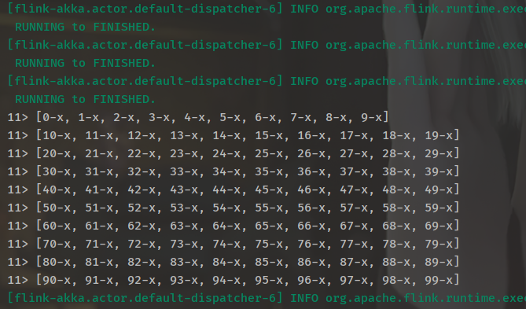

# [Flink]使用状态算子将stream聚合输出

## 场景需求

现在有这样一种场景，两个业务系统之间通过接口传递数据，A平台计算好数据之后将数据落入Hive，使用微服务将数据通过接口Sink到B平台，考虑到B端微服务的耐受程度，A端在Sink数据的时候需要将数据以批次的形式发送，比如一次发送一千条。

该场景里应用了，Flink读取Hive，将表转换成流之后自定义HttpSink将数据Sink到B端(这是我的个人的拙略办法，暂时这么解决)。我目前的难点在于如何将Hive表读取到的数据划分批次再Sink到Http接口，下面记录了我的一个思考和实现(模拟实现)。

## 模拟实现

### 定义流幻境以及数据源造数

~~~java
StreamExecutionEnvironment env = StreamExecutionEnvironment.getExecutionEnvironment();
List<Tuple2<Long, String>> list = new ArrayList<>();
Long i = 0L;
while (true) {
    list.add(Tuple2.of(1L, i + "-x"));
    i++;
    if (i > 100) {
        break;
    }
}
~~~

以上使用for循环造了100个Tuple2，f0为Long类型，f1为字符串

### 划分批次

核心在于如何去对每个流中的元素进行计数，如何让分布式的程序知道该元素为流中的第多少个元素，下面是**用Flink提供的State算子ValueState去达到该目的**。

~~~java
package me.roohom.operator;

import org.apache.flink.api.common.functions.RichFlatMapFunction;
import org.apache.flink.api.common.state.ValueState;
import org.apache.flink.api.common.state.ValueStateDescriptor;
import org.apache.flink.api.common.typeinfo.TypeHint;
import org.apache.flink.api.common.typeinfo.TypeInformation;
import org.apache.flink.api.java.tuple.Tuple2;
import org.apache.flink.configuration.Configuration;
import org.apache.flink.util.Collector;

import java.util.ArrayList;

public class ValueFlatMapFunction extends RichFlatMapFunction<Tuple2<Long, String>, String> {

    private transient ValueState<Long> reduceOut;
    private ArrayList<String> strList;

    @Override
    public void open(Configuration parameters) throws Exception {
        strList = new ArrayList<>();
        super.open(parameters);
        ValueStateDescriptor<Long> descriptor =
                new ValueStateDescriptor<>(
                        "reduceOutput", 
                        TypeInformation.of(new TypeHint<Long>() {
                        }), 
                        0L); 
        reduceOut = getRuntimeContext().getState(descriptor);
    }

    @Override
    public void flatMap(Tuple2<Long, String> value, Collector<String> out) throws Exception {
        Long current = reduceOut.value();
        current += 1;
        strList.add(value.f1);
        reduceOut.update(current);
        if (current % 10 == 0) {
            out.collect(strList.toString());
            strList.clear();
        }
    }
}

~~~

以上自定义了一个RichFlatMapFunction，在open初始化方法中定义了一个ValueState算子为reduceOut，初始值为0。它的作用用来记录flatMap接收到的元素为流中的第多少个元素，每接收到一个元素就将该算子加1，我们还在open方法中定义了一个list，用来存放本批次的所有元素，当reduceOut接收到的元素值为批次大小的整数倍时，将list收集到的数据输出，并且清空list准备下一次的接收。在这里定义的批次大小为10。

### 结果处理及输出

~~~java
DataStreamSource<Tuple2<Long, String>> inputStream = env.fromCollection(list);
inputStream.keyBy(x -> x.f0)
        .flatMap(new ValueFlatMapFunction())
        .print();
env.execute();
~~~

以上将元素按照第0个元素分组，通过自定义flatmap方法处理聚合，输入数据共100个，批次大小为10，那么print时将会输出10组数据，每组10个，即一个长度为10的list。

达到了我要的效果。