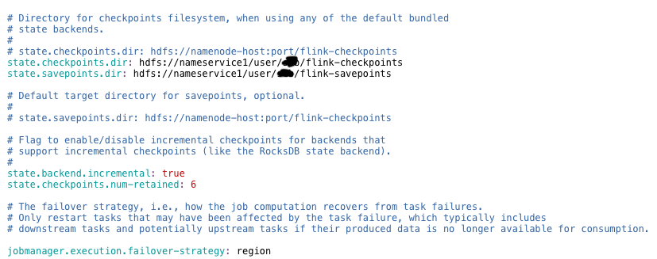

# [Flink]关于Flink的Checkpoint的一次问题排查

## 问题背景

### 版本说明

Flink-1.10.0

### 背景

最近接手的一个Flink项目由于checkpoint一直失败导致数据积压，从而导致监控任务持续告警，从分析排查的过程中，给了我对Checkpoint的新的认识。

该Flink任务的DAG图如下所示：

红色框中是Brocast算子，**定时周期性地**将查询到的一个具有九百万数据量的Map广播到其他几条流上，Source从Kafka消费数据，Process算子处理数据，Sink端再写到Kafka。

某一天任务告警，Kafka的offset存在严重的LAG，从Flink的WebUI上看到了严重的背压，日志中提示：

~~~java
2023-03-17 13:37:12
org.apache.flink.streaming.connectors.kafka.FlinkKafka011Exception: Failed to send data to Kafka: Expiring 7 record(s) for xxxxxx_topic-0: 61981 ms has passed since last append
~~~

并且Checkpoint也一直失败,或者是一开始checkpoint成功了，但是到后面checkpoint却失败了，并且一直失败。

## 问题定位过程

### 生产者问题

报错的日志中可以看出是Sink到Kafka的Producer出了问题，百度搜索一番后调大了两个配置：

~~~java
properties.put("batch.size", 655360); //640K
properties.put("linger.ms", 5); //0ms
~~~

原本以为可行，后来还是不行。

### 数据积压

持续观察任务，还是依旧的错误，观察Kafka的topic的offset后发现了大量的数据没有被消费，产生了严重的LAG。

从消费速率入手考虑，一定是算子的处理速度跟不上源端摄取数据的速度，一步一步堆叠往上，由于Flink的背压机制，导致源端摄取的速度变慢，最终导致Kafka Topic的Lag持续上涨。

**从普遍可以思考到的优化方向考虑，增大Flink每个算子的并行度一定可以提高处理速度，从而使得消费速度提高，从而减少数据积压。**于是提高了任务的并行度，设置每个算子默认的并行度为3，速度确实提高了，可是不出意外的话，还是出了意外，观察了一会儿过后，发现数据积压的现象并没有得到解决。

为什么？

夜已经很晚了，我盯着Flink的WebUI看着那几个红色的HIGH陷入了沉思，为什么？我不理解。

### 检查点失败

通过思考Flink消费Kafka实现Exactly-Once的原理的时候想到，为了确保exactly-once一致性语义，flink会有两阶段提交，会在检查点创建的时候提交Kafka的offset，如果任务失败，也可以从最近的检查点恢复，从而不会丢失数据。难道是Flink的检查点并没有成功创建，从而没有提交offset？

**果然！**

在Flink的WebUI上我发现了：

**检查点如期开始，只是都失败了。**

1、难道是该任务没有设置CHK？ 

2、难道是没有设置CHK目录？

经检查发现，上述两点都不满足，代码设置了开启检查点，并且flink-conf.yml文件中也设置了检查点目录。

~~~java
        final StreamExecutionEnvironment env = StreamExecutionEnvironment.getExecutionEnvironment();
        env.enableCheckpointing(10*60*1000L);
~~~

### 观察日志

无从下手的时候，多看日志。于是我在日志中发现了这些告警信息：

~~~java
2023-03-18 02:20:33.877 [Checkpoint Timer] INFO  org.apache.flink.runtime.checkpoint.CheckpointCoordinator - Triggering checkpoint 2 @ 1679077233860 for job 44ec04da13306281d7a8da2c808d5b71.
2023-03-18 02:21:03.057 [jobmanager-future-thread-19] INFO  org.apache.flink.runtime.checkpoint.CheckpointCoordinator - Decline checkpoint 2 by task be2e6a80e37d5c4ae0fbf9a4d30db27e of job 44ec04da13306281d7a8da2c808d5b71 at container_e26_1666786585431_638207_01_000003 @ svlhdp003.csvw.com (dataPort=40778).
2023-03-18 02:21:03.061 [jobmanager-future-thread-19] INFO  org.apache.flink.runtime.checkpoint.CheckpointCoordinator - Discarding checkpoint 2 of job 44ec04da13306281d7a8da2c808d5b71.
org.apache.flink.util.SerializedThrowable: Could not materialize checkpoint 2 for operator AProcess -> (Sink: AKfkSinker, Sink: AKfkErrorSinker) (1/3).
    at org.apache.flink.streaming.runtime.tasks.StreamTask$AsyncCheckpointRunnable.handleExecutionException(StreamTask.java:1238) ~[flink-xxxxxxxxx-1.0-SNAPSHOT-jar-with-dependencies.jar:na]
    at org.apache.flink.streaming.runtime.tasks.StreamTask$AsyncCheckpointRunnable.run(StreamTask.java:1180) ~[flink-xxxxxxxxx-1.0-SNAPSHOT-jar-with-dependencies.jar:na]
    at java.util.concurrent.ThreadPoolExecutor.runWorker(ThreadPoolExecutor.java:1149) ~[na:1.8.0_232]
    at java.util.concurrent.ThreadPoolExecutor$Worker.run(ThreadPoolExecutor.java:624) ~[na:1.8.0_232]
    at java.lang.Thread.run(Thread.java:748) ~[na:1.8.0_232]
Caused by: org.apache.flink.util.SerializedThrowable: java.io.IOException: Size of the state is larger than the maximum permitted memory-backed state. Size=540384834 , maxSize=5242880 . Consider using a different state backend, like the File System State backend.
    at java.util.concurrent.FutureTask.report(FutureTask.java:122) ~[na:1.8.0_232]
    at java.util.concurrent.FutureTask.get(FutureTask.java:192) ~[na:1.8.0_232]
    at org.apache.flink.runtime.concurrent.FutureUtils.runIfNotDoneAndGet(FutureUtils.java:461) ~[flink-xxxxxxxxx-1.0-SNAPSHOT-jar-with-dependencies.jar:na]
    at org.apache.flink.streaming.api.operators.OperatorSnapshotFinalizer.<init>(OperatorSnapshotFinalizer.java:53) ~[flink-xxxxxxxxx-1.0-SNAPSHOT-jar-with-dependencies.jar:na]
    at org.apache.flink.streaming.runtime.tasks.StreamTask$AsyncCheckpointRunnable.run(StreamTask.java:1143) ~[flink-xxxxxxxxx-1.0-SNAPSHOT-jar-with-dependencies.jar:na]
    ... 3 common frames omitted
Caused by: org.apache.flink.util.SerializedThrowable: Size of the state is larger than the maximum permitted memory-backed state. Size=540384834 , maxSize=5242880 . Consider using a different state backend, like the File System State backend.
    at org.apache.flink.runtime.state.memory.MemCheckpointStreamFactory.checkSize(MemCheckpointStreamFactory.java:64) ~[flink-xxxxxxxxx-1.0-SNAPSHOT-jar-with-dependencies.jar:na]
    at org.apache.flink.runtime.state.memory.MemCheckpointStreamFactory$MemoryCheckpointOutputStream.closeAndGetBytes(MemCheckpointStreamFactory.java:145) ~[flink-xxxxxxxxx-1.0-SNAPSHOT-jar-with-dependencies.jar:na]
    at org.apache.flink.runtime.state.memory.MemCheckpointStreamFactory$MemoryCheckpointOutputStream.closeAndGetHandle(MemCheckpointStreamFactory.java:126) ~[flink-xxxxxxxxx-1.0-SNAPSHOT-jar-with-dependencies.jar:na]
    at org.apache.flink.runtime.state.DefaultOperatorStateBackendSnapshotStrategy$1.callInternal(DefaultOperatorStateBackendSnapshotStrategy.java:179) ~[flink-xxxxxxxxx-1.0-SNAPSHOT-jar-with-dependencies.jar:na]
    at org.apache.flink.runtime.state.DefaultOperatorStateBackendSnapshotStrategy$1.callInternal(DefaultOperatorStateBackendSnapshotStrategy.java:108) ~[flink-xxxxxxxxx-1.0-SNAPSHOT-jar-with-dependencies.jar:na]
    at org.apache.flink.runtime.state.AsyncSnapshotCallable.call(AsyncSnapshotCallable.java:75) ~[flink-xxxxxxxxx-1.0-SNAPSHOT-jar-with-dependencies.jar:na]
    at java.util.concurrent.FutureTask.run(FutureTask.java:266) ~[na:1.8.0_232]
    at org.apache.flink.runtime.concurrent.FutureUtils.runIfNotDoneAndGet(FutureUtils.java:458) ~[flink-xxxxxxxxx-1.0-SNAPSHOT-jar-with-dependencies.jar:na]
    ... 5 common frames omitted
~~~

其中有醒目的一行：

~~~java
Size of the state is larger than the maximum permitted memory-backed state. Size=540384834 , maxSize=5242880 . Consider using a different state backend, like the File System State backend.
~~~

> 其中540384834为515M，5242880为5M

翻译一下：**状态的大小超过了最大允许的内存持久化大小限制。请考虑使用别的状态后端，比如文件系统状态后端。**

**关键啊！**思考一下，可能是由于在做检查点的时候，默认先放在内存，然后再往flink-conf.yml文件中配置的HDFS路径写入，但是由于状态太大了，超过了内存中限制的大小，所以失败了。（存疑）

### 解决

抱着试试看的态度，我在代码中手动设置了状态后端的地址：

~~~java
env.setStateBackend(new FsStateBackend("hdfs://nameservice1/path/to/checkpoint/dir"));
~~~

OK，上线运行！

成了！检查点成功创建！

再次观察Kafka的offset，LAG已经大为下降，再过几个小时后发现，LAG已经可以算没有了。

妥！

不用担心过多的检查点占用较大HDFS空间，Flink会周期性保存一定数量的检查点个数（默认为1），这个可以在flink-conf.yml文件中配置

~~~yaml
state.checkpoints.num-retained: 10
~~~

再思考一下该程序的逻辑：四条流实时从上游Kafka拉取数据，每六个小时使用impala从Kudu全量拉取一下含有大量映射关系数据为map，再将映射关系的数据通过广播流广播到四条数据流上，四条流分别根据该数据实时查询再将处理完的数据发送至下游Kafka

合理！该程序的CHK的体积有惊人的6.05GB就可以理解了，在Process算子的CHK中保存了这些含有映射关系的数据，而这些数据达到了九百多万(粗略估计)。

清晰，太清晰了！

## 总结

检查点是所有算子状态的一个快照。而这些快找所要存储的位置就是状态后端。

Flink的flink-conf.yml文件中关于checkpoint的配置：

~~~yaml
#==============================================================================
# Fault tolerance and checkpointing
#==============================================================================
 
# The backend that will be used to store operator state checkpoints if
# checkpointing is enabled.
#
# Supported backends are 'jobmanager', 'filesystem', 'rocksdb', or the
# <class-name-of-factory>.
#
state.backend: filesystem
 
# Directory for checkpoints filesystem, when using any of the default bundled
# state backends.
#
# state.checkpoints.dir: hdfs://namenode-host:port/flink-checkpoints
state.checkpoints.dir: hdfs://nameservice1/path/to/flink-checkpoints
state.savepoints.dir: hdfs://nameservice1/path/to/flink-savepoints
 
# Default target directory for savepoints, optional.
#
# state.savepoints.dir: hdfs://namenode-host:port/flink-checkpoints
 
# Flag to enable/disable incremental checkpoints for backends that
# support incremental checkpoints (like the RocksDB state backend).
#
state.backend.incremental: true
state.checkpoints.num-retained: 6
 
# The failover strategy, i.e., how the job computation recovers from task failures.
# Only restart tasks that may have been affected by the task failure, which typically includes
# downstream tasks and potentially upstream tasks if their produced data is no longer available for consumption.
 
jobmanager.execution.failover-strategy: region
~~~

上述配置中关键的有三个：

~~~yaml
state.backend: filesystem
state.checkpoints.dir: hdfs://nameservice1/path/to/flink-checkpoints
state.savepoints.dir: hdfs://nameservice1/path/to/flink-savepoints
~~~

之前的Flink任务只配置了`state.checkpoints.dir`和`state.savepoints.dir`，这仅仅代表最终的CHK会存在这里，CHK的第一步(收集)的过程还是默认在`JobManager`的内存中完成，此时，`state.backend`的值默认为`jobmanager`

只有当配置了`state.backend: filesystem`，CHK的第一步才会直接往文件系统(HDFS)去写

上午三个配置是全局的，如果想针对任务去配置，可以在代码中配置：

~~~java
streamExecutionEnvironment.setStateBackend(new FsStateBackend("hdfs://nameservice1/path/to/chk"));
~~~

在上述任务中，一开始仅仅配置了`state.checkpoints.dir`和`state.savepoints.dir`，并没有配置`state.backend: filesystem`,由于没有配状态后端，**默认使用的是jobmanager的内存来盛放这些状态数据**.

一开始任务可以成功做CHK，所有的算子的数据状态比较小，内存可以放得下，当内存可以放下所有算子的状态(包含被广播的数据)时，jobmanager首先收集状态数据开始做checkpoint，当checkpoint成功后，程序成功运行并且向Kafka提交offset，然后再将原先放在jobmanager内存中的状态数据刷写保存到`state.checkpoints.dir`所指定的路径中。此时从WebUI上看checkpoint是成功的。

到了后来，随着业务数据增长，被广播的数据量越来越大，内存已经放不下了，算子的状态大小超出了允许的大小限制(5Mb),这使得checkpoint不成功，所以也无法将状态数据保存到状态后端，所以使得消费kafka得topic的offset无法被提交，只要flink任务重启，都还会从之前的offset继续消费，长此以往，就导致了严重的LAG，也就导致了flink端有大量的数据需要消费和处理，由于速率跟不上，就产生了严重的背压。

成功配置文件系统的状态后端，让checkpoint可以成功执行，消费kafka的topic的offset可以成功提交，解决了该问题。