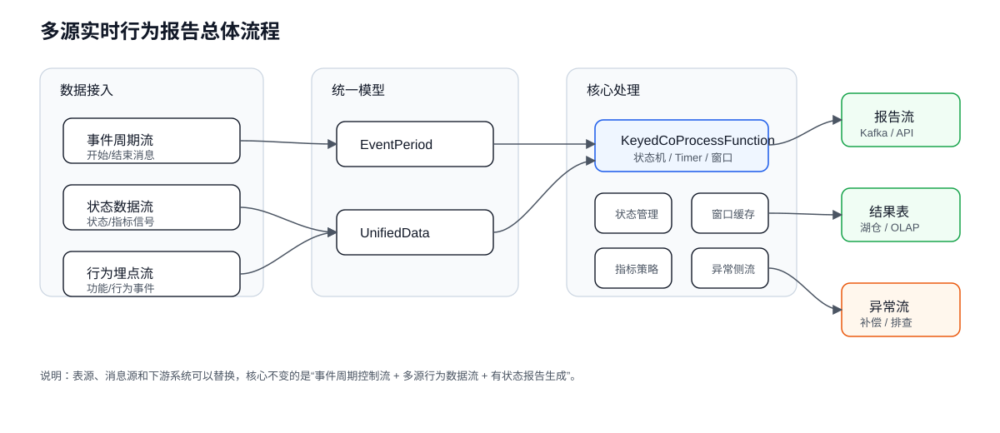
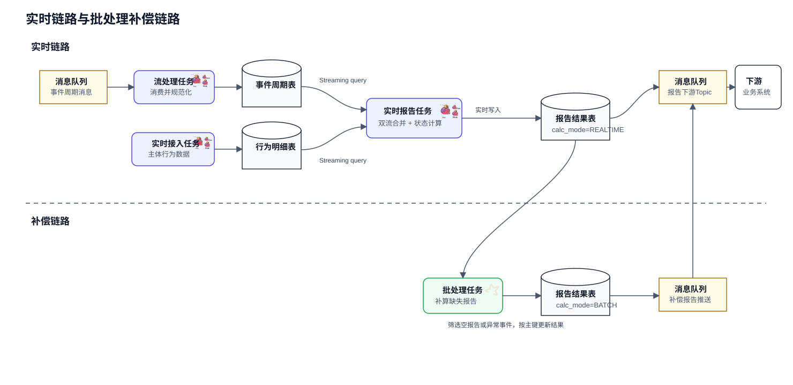
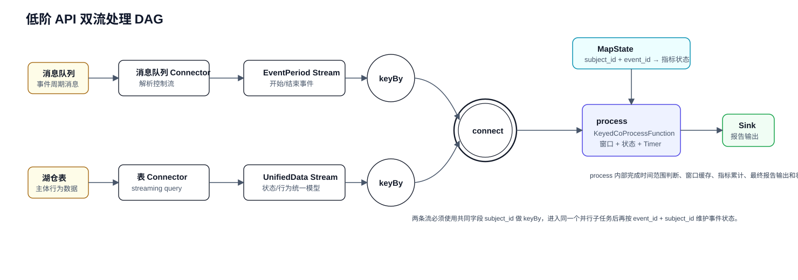
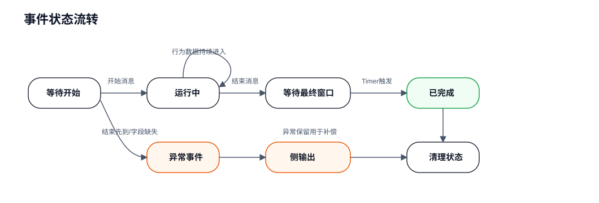
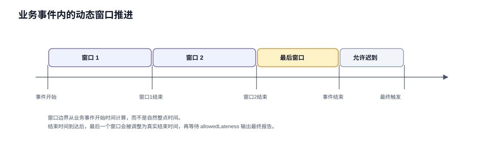
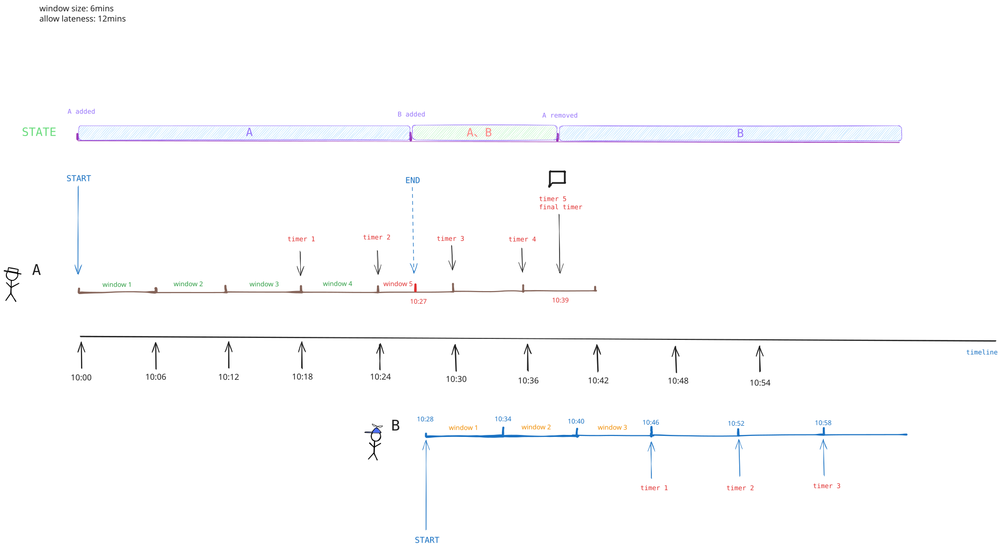
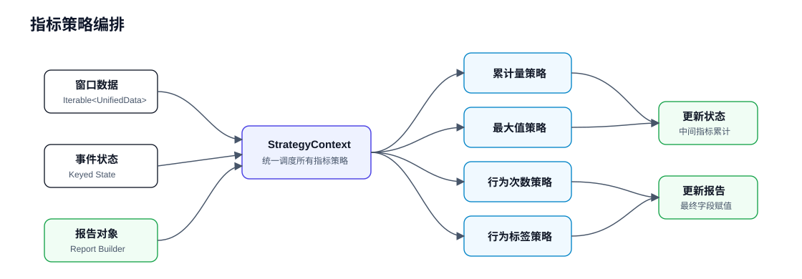

# [Flink]多源实时行为报告的设计思路

## 背景

### 概述

最近做了一个实时试驾报告类的需求，用户通过系统预约试驾，到达经销商门店进行试乘试驾，整个过程中都会有消息进入大数据系统，当用户试驾结束后会发送一份试驾报告。场景抽象之后大概是这样：

业务系统中存在一个明确的业务事件周期，比如一次服务、一次体验、一次流程、一次任务执行。**这个周期有开始，也有结束**，中间会产生很多来自不同数据源的行为数据、状态数据和埋点数据。我们希望在事件结束后，自动生成一份标准化报告。

报告里通常会包含几类信息：

1、业务事件本身的基础信息，比如事件ID、主体ID、开始时间、结束时间、操作人、所属组织等

2、事件周期内的过程指标，比如持续时长、累计量、最大值、平均值等

3、事件周期内的行为标签，比如是否触发过某个功能，某类行为发生了多少次

4、异常情况，比如只有开始没有结束、只有结束没有开始、重复开始、乱序消息等

### 难点

这类需求看上去很像一个Join问题：拿到事件周期表，再拿行为明细表，按照主体ID和时间范围关联，最后聚合输出报告。最开始我也是这么想的，但真正往下做的时候，会发现它并不是一个普通的Join问题。

它更像是一个**以业务事件生命周期为边界的多源实时状态计算问题**。

难点是：**开始消息和结束消息都是随着事件真实发生而实时进入系统，在结束消息到来时出具统计报告**。

所以这篇文章想记录一下这个设计思路：遇到实时计算需求时，先识别问题类型，再选择API。SQL、Table API、DataStream API都不是银弹，没有绝对正确的方案。必要的时候，要从Flink低阶API入手，动手定制一套适合自己的西装。

>下文经过一定的脱敏提炼，核心调研、探索和设计由我完成，博客内容的逻辑图由AI辅助生成。

## 问题抽象

我们先把业务脱敏，抽象成三个输入源。

### 事件周期流

事件周期流用于描述一个业务事件的开始和结束。在大数据侧，这些数据通常由上游系统（比如微服务）提供，实时写入消息中间件。

~~~text
event_id       业务事件ID
subject_id     业务主体ID，比如设备ID、用户ID、车辆ID、订单ID
status         事件状态，1表示开始，2表示结束
start_time     开始时间
end_time       结束时间
operator       操作人
org_id         组织ID
...
~~~

这一路数据是整个计算的控制流。开始消息到达时，需要创建事件上下文；结束消息到达时，需要关闭事件上下文，并准备生成最终报告。

### 状态数据流

状态数据流用于描述业务主体在事件周期内不断变化的状态。

~~~text
subject_id
event_time
signals: {
    metric_a,
    metric_b,
    metric_c,
    ...
}
~~~

比如设备状态、传感器数据、系统运行状态、业务过程状态等。

### 行为埋点流

行为埋点流用于描述业务主体或用户在事件周期内发生过的行为。

~~~text
subject_id
event_time
behavior_id
behavior_value
...
~~~

比如某个按钮是否被点击、某个功能是否被使用、某个行为发生了几次。

最终我们要输出一份报告。

~~~text
event_id
subject_id
start_time
end_time
duration
metric_result_a
metric_result_b
behavior_tag_a
behavior_count_b
report_json
calc_mode
create_time
update_time
~~~

## 为什么不是普通Join

如果事件周期表里已经有完整的开始时间和结束时间，行为数据也是离线明细，那么用SQL写一个范围Join再聚合当然是最简单的。

~~~sql
SELECT
    p.event_id,
    p.subject_id,
    COUNT(b.behavior_id) AS behavior_count
FROM event_period p
JOIN behavior_detail b
  ON p.subject_id = b.subject_id
 AND b.event_time >= p.start_time
 AND b.event_time <  p.end_time
GROUP BY p.event_id, p.subject_id;
~~~

但实时场景里的难点在于，事件周期本身也是流。

事件开始消息来了，结束消息可能还没来。在结束之前，状态数据和行为数据已经源源不断到达。如果等结束消息来了再去查历史明细，会遇到回查、补算、成本和一致性问题。如果每条状态数据都先Join一次事件周期表，又会遇到事件周期不完整、乱序消息、迟到消息和状态清理的问题。

在这个场景里，我们真正需要解决的是：

1、如何在开始消息到达时创建一个业务事件上下文

2、如何把多源行为数据分配到正确的事件周期内

3、如何在事件未结束时持续累计中间状态

4、如何在结束消息到达后等待一定迟到时间，再生成最终报告

5、如何处理乱序、重复、缺失和异常数据

6、如何让新增指标时不大改主流程

这些问题加在一起，已经不是简单的“数据关联”了，而是一个“状态机 + 窗口推进 + 策略化指标计算”的问题。

## 方案对比

### Flink SQL Join

Flink SQL Join的优势是表达能力直观，代码少，维护SQL比维护复杂算子轻松。对于维度补充、两条流之间的简单时间区间关联、离线批处理口径验证，SQL是非常好的选择。

#### 方案模拟

SQL关联后进行GROUP BY聚合

~~~sql
   select a.subject_id as subject_id,
          a.startTime as startTime,
          a.endTime as endTime,
          a.message_id as message_id,
          max(event_time) as row_time,
          max(case when json_value(signals, 'signalName') = '4' then 1 else 0 end) as sport_mode,
          count(1) as cnt
     from trip_periods as a
left join behavior_data /*+ OPTIONS('table.exec.state.ttl'='86400000') */ as b
       on a.subject_id = b.subject_id
      and b.event_time BETWEEN a.startTime AND a.endTime
 group by a.message_id,
          a.subject_id,
          a.startTime,
          a.endTime
~~~

由于进行JOIN关联后，结合了GROUP BY去进行聚合计算，此时，该查询只能输出changelogStream，对于结果的输出，是更新的，即每匹配到一条数据就触发计算，输出的结果类似于

~~~sql
2> +I[SUBJECT_001, 1752737974001, 1752737975009, 10032, 1752737975003, 0, 1]
2> -U[SUBJECT_001, 1752737974001, 1752737975009, 10032, 1752737975003, 0, 1]
2> +U[SUBJECT_001, 1752737974001, 1752737975009, 10032, 1752737975007, 0, 2]
~~~

对于最终报告的输出，必须是单条的，且一次性触发计算完将结果发出，所以需要对该撤回流结果进行聚合，在此定义了一个全局窗口，一次性收集这些撤回流数据，统一运行一个聚合函数，将结果统一成一条，数据到下游系统

~~~java
DataStream<Row> dataStream = stEnv.toChangelogStream(table);
dataStream
        .keyBy(row -> row.getField("subject_id"))
        .window(GlobalWindows.create())
        .trigger(new TripEndTrigger())
        .reduce(new ReduceFunction<Row>() {
            @Override
            public Row reduce(Row value1, Row value2) throws Exception {
                return Long.valueOf(value1.getField("row_time").toString()) >= Long.valueOf(value2.getField("row_time").toString()) ?
                        value1 : value2;
            }
        })
        .print()
;
~~~

**与普通窗口所不同的是，全局窗口必须自定义触发器，否则窗口不会执行，这里自定义窗口触发器**

~~~java

import org.apache.flink.api.common.functions.ReduceFunction;
import org.apache.flink.api.common.state.ReducingState;
import org.apache.flink.api.common.state.ReducingStateDescriptor;
import org.apache.flink.api.common.typeutils.base.LongSerializer;
import org.apache.flink.streaming.api.windowing.triggers.Trigger;
import org.apache.flink.streaming.api.windowing.triggers.TriggerResult;
import org.apache.flink.streaming.api.windowing.windows.GlobalWindow;
import org.apache.flink.types.Row;

public class TripEndTrigger extends Trigger<Row, GlobalWindow> {

    private static final long serialVersionUID = 1L;

    private final ReducingStateDescriptor<Long> stateDesc =
            new ReducingStateDescriptor<>("max", new Max(), LongSerializer.INSTANCE);

    @Override
    public TriggerResult onElement(Row element, long timestamp, GlobalWindow window, TriggerContext ctx) throws Exception {
        ReducingState<Long> max = ctx.getPartitionedState(stateDesc);
        Long rowTime = element.getField("row_time") == null ? 0L : Long.valueOf(element.getField("row_time").toString());
        Long endTime = Long.valueOf(element.getField("endTime").toString());
        max.add(rowTime);

        if (max.get() >= endTime) {
            return TriggerResult.FIRE;
        }

        return TriggerResult.CONTINUE;
    }

    @Override
    public TriggerResult onProcessingTime(long time, GlobalWindow window, TriggerContext ctx) throws Exception {
        return TriggerResult.CONTINUE;
    }

    @Override
    public TriggerResult onEventTime(long time, GlobalWindow window, TriggerContext ctx) throws Exception {
        return TriggerResult.CONTINUE;
    }

    @Override
    public void clear(GlobalWindow window, TriggerContext ctx) throws Exception {
        ctx.getPartitionedState(stateDesc).clear();
    }

    private static class Max implements ReduceFunction<Long> {
        private static final long serialVersionUID = 1L;

        @Override
        public Long reduce(Long value1, Long value2) throws Exception {
            return value1 >= value2 ? value1 : value2;
        }
    }
}
~~~

其核心目的是，在事件周期结束消息到来且结果聚合完成后，将报告发出。

上述结果最终输出的是撤回流，撤回流的数据每一条对于下游算子都是可见的，所以需要一个聚合算子将结果聚合成一条再最终输出，暂定考虑使用：

1、使用ReduceFunction聚合结果

2、运用一个算子，前面的算子中计算每条结果数据完成时间，在当前算子中缓存完成时间，当检测到时间与当前水位线时间已经过去了8分钟(or 10分钟)即触发结果的最终输出

但在这个场景里，SQL Join会比较吃力：

1、事件周期的结束时间可能后到，Join条件一开始并不完整

2、同一个主体可能存在多个事件周期，需要维护会话级别状态

3、最终不是每条明细输出一次，而是事件结束后输出一份报告

4、需要处理重复开始、结束先到、异常事件侧输出等业务分支

5、每个指标的计算逻辑差异较大，全部堆在SQL里会变得很长

所以SQL Join可以作为辅助，但不适合作为核心流程。

### Lookup Join

Lookup Join适合做维表查询。比如行为流来了之后，根据主体ID去查主体配置、组织信息、类型信息等。

~~~sql
SELECT
    s.*,
    d.attr
FROM signal_stream s
JOIN dim_table FOR SYSTEM_TIME AS OF s.proctime AS d
  ON s.subject_id = d.subject_id;
~~~

但它解决的是“查一份相对静态或外部存储中的数据”，不是“维护一个业务事件生命周期”。

在我们的场景中，可以转换一下思路，<u>当试驾开始和结束消息都到达时，把车辆信号数据表作为一个维度表</u>，但是这个违背了lookup join的设计原则，且信号表是大数据量级的表，容易引起内存灾难。

#### 方案模拟

以类似以下的SQL提交Flink处理任务

~~~sql
SELECT d.subject_id                                 as subject_id,
       MAX(b.event_time) as event_time
FROM subject_events AS d
         JOIN behavior_data FOR SYSTEM_TIME AS OF d.ts AS b
              ON d.carId = b.vin -- 主键字段必须出现在JOIN条件中，且是等值连接
                  AND TO_TIMESTAMP_LTZ(b.event_time, 3)  BETWEEN TO_TIMESTAMP_LTZ(d.startTime, 3) AND TO_TIMESTAMP_LTZ(d.endTime, 3)
GROUP BY d.subject_id
~~~

但是以上的SQL其实是有问题的，

~~~shell
Flink SQL> SELECT d.subject_id                        as subject_id,
>        MAX(b.event_time) as event_time
> FROM subject_events AS d
>          JOIN behavior_data FOR SYSTEM_TIME AS OF d.ts AS b
>               ON d.carId = b.vin -- 主键字段必须出现在JOIN条件中，且等值连接
>                   AND TO_TIMESTAMP_LTZ(b.event_time, 3)  BETWEEN TO_TIMESTAMP_LTZ(d.startTime, 3) AND TO_TIMESTAMP_LTZ(d.endTime, 3)
> GROUP BY d.subject_id
> ;2025-07-24 05:07:34,460 WARN  org.apache.hadoop.metrics2.impl.MetricsConfig                [] - Cannot locate configuration: tried hadoop-metrics2-s3a-file-system.properties,hadoop-metrics2.properties
2025-07-24 05:07:34,470 INFO  org.apache.hadoop.metrics2.impl.MetricsSystemImpl            [] - Scheduled Metric snapshot period at 10 second(s).
2025-07-24 05:07:34,471 INFO  org.apache.hadoop.metrics2.impl.MetricsSystemImpl            [] - s3a-file-system metrics system started
 
[ERROR] Could not execute SQL statement. Reason:
org.apache.flink.table.api.ValidationException: Temporal Table Join requires primary key in versioned table, but no primary key can be found. The physical plan is:
FlinkLogicalJoin(condition=[AND(=($0, $4), >=(TO_TIMESTAMP_LTZ(+($5, $6), 3), TO_TIMESTAMP_LTZ($1, 3)), <=(TO_TIMESTAMP_LTZ(+($5, $6), 3), TO_TIMESTAMP_LTZ($2, 3)), __INITIAL_TEMPORAL_JOIN_CONDITION($3, $8, __TEMPORAL_JOIN_LEFT_KEY($0), __TEMPORAL_JOIN_RIGHT_KEY($4)))], joinType=[inner])
  FlinkLogicalCalc(select=[subject_id, startTime, endTime, Reinterpret(CAST(ts AS TIMESTAMP_LTZ(3) *ROWTIME*)) AS ts])
    FlinkLogicalTableSourceScan(table=[[default_catalog, default_database, drive_events, watermark=[CAST(ts AS TIMESTAMP_LTZ(3) *ROWTIME*)], watermarkEmitStrategy=[on-periodic]]], fields=[subject_id, message_id, startTime, endTime, ts])
  FlinkLogicalSnapshot(period=[$cor0.ts])
    FlinkLogicalCalc(select=[vin, collect_unix_timestamp_millis, relative_millis, message_receive_unix_timestamp_millis, Reinterpret(TO_TIMESTAMP_LTZ(+(collect_unix_timestamp_millis, relative_millis), 3)) AS ts])
      FlinkLogicalTableSourceScan(table=[[default_catalog, default_database, behavior_data, project=[vin, collect_unix_timestamp_millis, relative_millis, message_receive_unix_timestamp_millis], watermark=[TO_TIMESTAMP_LTZ(+(collect_unix_timestamp_millis, relative_millis), 3)], watermarkEmitStrategy=[on-periodic]]], fields=[vin, event_time])
 
Flink SQL>
~~~

对于本文讨论的场景，Lookup Join的问题是：

1、它不负责创建和关闭事件上下文

2、它不适合表达动态的事件时间范围归属

3、它不会替你累计一个事件周期内的状态

4、结束消息迟到后，之前到达的行为数据如何回补仍然要自己设计

所以Lookup Join更适合放在外围做维度补充，而不是替代核心状态计算。

### Interval Join

Interval Join可以表达两条流之间基于事件时间的区间关联。

如果需求是“流A的一条数据和流B在前后几分钟内的数据匹配”，Interval Join非常合适。

但本文场景的区间不是一个固定的前后偏移，而是由业务事件的开始和结束动态决定。并且我们不是要输出两条流匹配后的明细，而是要围绕一个事件周期不断累计，最后生成一份报告。

Interval Join依旧不能很好地承担事件状态机的职责。

### 异步查询Async I/O

在流处理中访问外部存储（如数据库、Key-Value 存储、RPC 服务）时，传统同步请求带来的严重性能瓶颈问题。同步请求会阻塞算子任务线程，导致资源利用率低下和吞吐量受限。Flink的Async I/O(**`AsyncFunction`**)在发送I/O 请求时**不阻塞** Flink 算子任务的线程，算子线程可以立即处理下一个输入记录或发出另一个请求，而无需等待当前请求的响应，**一个算子任务同时处理多个并发的 I/O 请求**，极大地提高了吞吐量和资源（特别是 CPU）利用率。

在本文所述的场景中，当大量事件在同一时间段发生时，由于信号或者行为数据量极大，会给程序带来极大的压力，同步计算极大概率会有性能问题，造成报告完成速度慢、延迟吿，为解决该问题，本方案使用异步查询的方式提交对paimon表的查询，以支持兼容多试驾车同时试驾，同时产出试驾报告的需求，不至于阻塞任务，带来高延迟的负面影响。

**核心逻辑是，当事件周期结束消息到来时，以开始时间和结束时间去信号或行为表中“框选”数据，统一计算指标。**

同样，异步是可以实现的，但是问题很明显，这本质也是一种跑批思维，随着数据量的增加，加工速度会变慢，而且对内存的要求较高。

### DataStream低阶API

最终比较合适的方案，是使用DataStream API中的`KeyedCoProcessFunction`。

它可以同时接入两条流：

1、事件周期流

2、统一后的行为/状态流

然后通过Keyed State保存每个业务事件的上下文，通过Timer控制窗口推进和最终输出。

这套方案代码量会更多，但换来的是足够的控制力。

### 调研路径

当时真正落方案时，并不是一上来就写低阶API，而是先按实现成本从低到高试了几条路。

第一条路是`Lookup Join`。这个方案的吸引力很明显：纯SQL，写起来快，状态管理、任务调度、内存管理都交给Flink。但问题也很明显，右表并不是小维表，而是高频写入的大事实表。为了按事件开始时间和结束时间框选数据，Join条件里不可避免会出现时间范围过滤，这会导致大量外部表数据被读入后再过滤。Lookup Join适合补维度，不适合把一张高频大表当成可随意查询的明细事实表。

第二条路是异步查询外部存储。思路是当事件周期消息到达后，拿着开始时间、结束时间和主体ID去异步查询外部明细数据，再把查到的数据聚合成报告。它的优点是查询范围可以自己控制，不必把所有明细都交给Join逻辑；缺点是代码复杂度明显上升，需要处理异步请求、并发、超时、容错、查询压力和结果回调。它更像是在Flink任务里嵌入了一套外部查询服务。

第三条路是SQL和DataStream结合。先用Flink SQL把事件周期表和行为明细表做`LEFT JOIN + GROUP BY`，得到中间聚合结果，再把结果转成DataStream处理。但这个方案会遇到撤回流问题：每匹配到新数据，聚合结果就会更新，下游看到的是`+I`、`-U`、`+U`这类changelog。业务真正想要的是事件结束后的一条最终报告，而不是一串中间更新。因此还需要再加全局窗口、自定义触发器或额外算子，把撤回流收敛成最终结果。这样一来，SQL简单性的优势被抵消了不少。

第四条路才是低阶API合并双流处理。事件周期流和行为数据流都转成DataStream，按共同主体ID进行`keyBy`，再用`connect`接到`KeyedCoProcessFunction`里。事件开始时创建状态，行为数据到达时按事件时间分配到业务窗口，窗口触发时计算局部指标，事件结束并等待允许迟到后输出最终报告。

这个方案的关键收益是：**每次只处理一段业务窗口内的数据，而不是把整段历史或整张大表压进Join状态里**。内存依赖更接近普通窗口程序，任务重启时也不会因为需要重新读入大量历史明细而把初始化阶段打爆。如果外部明细表本身支持类似消费位点的能力，实时任务恢复后还可以从上次位置或最新位置继续消费，把长时间故障产生的积压交给批处理补偿，而不是让实时任务硬扛所有历史数据。

当然，它的代价也很明确：要自己写状态机、窗口推进、异常处理和指标策略。也正因为如此，这个方案更适合那些SQL已经能表达一部分、但无法舒服表达完整业务生命周期的场景。

## 核心设计

整体流程可以抽象成下面这样。

设计上可以分为几层。

从实际系统落地角度看，完整链路通常还会包含一条补偿链路。实时链路负责及时输出报告，批处理链路负责处理缺失、严重迟到或长时间故障后的补算结果。

双流处理DAG如下：

### 数据接入层

不同来源的数据结构通常不一致，所以第一步不是马上计算，而是先把它们转成统一模型。

事件周期流转换成`EventPeriod`。

~~~java
class EventPeriod {
    Long eventId;
    String subjectId;
    Integer status;
    Long startTime;
    Long endTime;
}
~~~

状态数据和行为埋点统一成`UnifiedData`。

~~~java
class UnifiedData {
    String subjectId;
    Long eventTime;
    SourceType sourceType;
    String dataId;
    Map<String, String> fields;
}
~~~

这里有一个好处：后续主流程不需要关心数据来自哪张表、哪个Topic、哪个系统，只关心统一后的事件时间、主体ID和字段集合。

### 事件状态层

每一个业务事件都需要维护自己的状态。

常见状态包括：

~~~text
event_id
event_key
start_time
end_time
current_window_end
next_trigger_time
start_metric_value
end_metric_value
behavior_count
behavior_flag
report_object
~~~

如果同一个主体在不同时间存在多个事件周期，可以使用`event_id + subject_id`作为事件唯一Key（就好比，用户预约试驾，经销商门店的一辆试驾车可以被不同用户轮流试驾，为了全局唯一，需要把试驾消息ID和车架号组合），再在主体维度下维护当前正在处理的事件列表。

事件状态层主要负责：

1、开始消息到达时初始化状态

2、结束消息到达时补充结束时间

3、识别重复开始、结束先到、缺少关键字段等异常情况

4、最终报告输出后清理状态

状态流转可以简化成下面这样。

### 窗口推进层

为什么还需要自己做窗口推进？

因为业务事件的窗口边界不是固定自然时间，而是从事件开始时间开始计算。

比如窗口大小是5分钟，某个事件从`10:03:20`开始，那么窗口应该是：

~~~text
[10:03:20, 10:08:20)
[10:08:20, 10:13:20)
[10:13:20, 10:18:20)
...
~~~

如果事件在`10:16:00`结束，最后一个窗口还要被调整成：

~~~text
[10:13:20, 10:16:00)
~~~

这类窗口并不是简单的滚动窗口或滑动窗口，而是依附于业务事件生命周期的动态窗口。

用图表示就是：

同时，当前一个事件周期结束后，事实上，数据可能迟到，需要考虑延迟等待，计算并没有真正停止，而此时，下一个事件周期已经开始了，用图表示就是：

处理逻辑可以抽象为：

~~~java
void assignDatumToWindow(String eventKey, UnifiedData data, Long startTime, Long endTime) {
    long eventTime = data.getEventTime();

    if (startTime == null) {
        return;
    }

    if (eventTime < startTime) {
        return;
    }

    if (endTime != null && eventTime >= endTime) {
        return;
    }

    long windowSize = windowDuration.toMillis();
    long windowNumber = (eventTime - startTime) / windowSize;
    long windowEnd = startTime + (windowNumber + 1) * windowSize;

    if (endTime != null && windowEnd > endTime) {
        windowEnd = endTime;
    }

    addWindowData(eventKey, windowEnd, data);
}
~~~

然后通过Timer在`windowEnd + allowedLateness`时触发窗口计算。

~~~java
ctx.timerService().registerProcessingTimeTimer(windowEnd + allowedLateness);
~~~

这里使用处理时间还是事件时间，需要结合实际数据情况判断。事件时间语义更标准，但如果上游数据很少，水位线不推进，窗口可能迟迟不触发。处理时间Timer则更适合“即使后续没有新数据，也要按业务时间向前推进”的报告生成场景。当然，想要严格事件时间语义，也是可以做到的，此时可能会涉及到自定义`Watermark generator`，实现`WatermarkStrategy`即可，可以见我的另一个文章[Flink中自定义watermark生成器]。

### 指标计算层

报告中的指标通常会越来越多，如果全部写在主处理函数里，最后一定会变成一个很难维护的大类。

更合适的方式是把每个指标拆成独立策略。

~~~java
interface MetricStrategy {
    void process(
        Iterable<UnifiedData> windowData,
        Map<StateKey, Object> eventStates,
        Report report
    );
}
~~~

例如：

1、累计量指标：取事件周期内某个数值的开始值和结束值做差

2、最大值指标：每个窗口取最大值，再和全局最大值比较

3、行为次数指标：统计某个行为ID出现次数

4、行为标签指标：只要出现过一次，就将报告中的标记置为true

主流程只负责在窗口触发时拿到窗口数据，然后调用所有策略。

~~~java
for (MetricStrategy strategy : strategyFactory.createStrategies()) {
    strategy.process(windowData, eventStates, report);
}
~~~

这样新增指标时，只需要增加一个策略类，并注册到策略工厂中。主流程不需要大动。

策略层可以这样理解。

### 输出层

最终输出可以分为两类：

1、正常报告输出

2、异常事件输出

正常报告可以写入Kafka，供下游系统实时消费；也可以写入湖仓表、OLAP表或报表表，供查询和分析。

异常事件建议单独侧输出，保留原始事件信息，方便排查。

~~~text
main output:  Report
side output:  AbnormalEventPeriod
~~~

实时任务最怕异常数据混在主流程里悄悄影响结果。单独的异常流可以让问题暴露出来，也方便后续做补偿。

## 实现时需要注意的点

### Key的选择

行为数据通常只能拿到`subject_id`，事件周期数据则有`event_id`和`subject_id`。

这也是为什么这里必须先按`subject_id`进行`keyBy`。

如果只看事件周期流，最自然的事件唯一标识当然是`event_id`，甚至可以用`event_id + subject_id`作为Key。但是状态数据流和行为埋点流通常并不知道自己属于哪一个具体事件，它们只知道自己属于哪个主体，以及发生在什么时间。也就是说，两边数据能够共同拿出来做分区路由的字段，只有`subject_id`。

所以这里其实有两层Key：

~~~text
外层路由Key: subject_id
内部事件Key: event_id + subject_id
~~~

外层`subject_id`用于`keyBy`，目的是让同一个主体的事件周期消息、状态数据、行为埋点进入同一个并行子任务。只有这样，`KeyedCoProcessFunction`里才能在本地状态中判断某条行为数据应该落入哪个事件周期。

进入算子后，再用`event_id + subject_id`维护具体事件状态。这样既解决了行为数据没有`event_id`的问题，也可以支持同一个主体在不同时间存在多个事件周期。

这个点是整个设计里比较关键的地方：**不是因为要聚合所以`keyBy`，而是因为两条流需要先在分布式环境中按照共同字段汇合，状态机才有成立的前提。**

### 乱序消息

常见乱序包括：

1、结束消息先于开始消息到达

2、行为数据先于开始消息到达

3、结束消息很晚才到

4、重复开始或重复结束

这些情况需要在状态机里明确处理。不要假设上游一定按顺序发送，也不要假设业务系统一定只发一次。

### 状态清理

只要使用状态，就必须考虑清理。

状态清理至少有两层：

1、正常事件结束后，最终报告输出，清理事件状态和窗口缓存

2、异常事件长期没有结束，需要设置超时时间，避免状态无限膨胀

如果状态量较大，可以使用RocksDB StateBackend，并配合监控观察状态大小、Checkpoint耗时和反压情况。

### 迟到数据

迟到数据不一定都要重算。

可以根据业务接受程度决定：

1、允许一定迟到时间，在最终输出前等待

2、超过迟到时间的数据进入异常流或补偿流

3、对强一致要求较高的指标，增加离线批处理校验或T+1修正

实时报告多数时候追求的是及时可用，不一定要让流任务承担所有最终一致性的压力。

### 批处理补偿边界

实时任务不应该承担所有极端场景。

调研时有几类场景很典型，可以整理成下面这张表。

| 场景 | 可能问题 | 实时链路处理 | 补偿策略 |
| --- | --- | --- | --- |
| 只有结束消息，没有开始消息 | 不知道事件从哪里开始，无法框定行为数据范围 | 输出异常流，不生成正常报告 | 批处理按业务主键和时间范围回溯补算 |
| 只有开始消息，长期没有结束消息 | 事件周期无法自然关闭，状态可能长期占用 | 设置超时或允许延迟上限，超过后转异常 | 批处理结合业务系统最终状态补齐结束边界 |
| 开始消息严重迟到 | 事件周期内部分行为数据可能已错过实时窗口 | 在允许迟到范围内等待，超过后记录异常 | 批处理按完整周期重新计算报告 |
| 行为数据或外部明细表延迟写入 | 事件结束时行为数据尚未完全到达 | 最终输出前等待一段迟到时间 | 对空报告、低质量报告做周期性补算 |
| 程序长时间故障后恢复 | 积压历史数据过多，实时任务追赶可能导致初始化压力或下游拥塞 | 实时任务可以从最新位点恢复，避免硬扛历史积压 | 故障区间交给批处理统一补偿 |
| 任务重启后开始/结束消息被快速消费 | 控制流推进过快，行为明细还没充分进入计算窗口 | 通过处理时间Timer和允许迟到缓冲风险 | 对重启窗口期做批处理校验和修正 |
| 同一主体短时间内连续多个事件周期 | 如果状态只绑定主体，容易串事件 | 外层按`subject_id`汇合，内部用`event_id + subject_id`隔离事件状态 | 批处理校验同主体连续事件的报告完整性 |
| 跨业务日期或明显错误数据 | 分区或时间范围异常，实时处理口径不稳定 | 实时链路可直接过滤或转异常 | 批处理按修正规则统一处理 |

这些场景提醒我一件事：实时任务要定义自己的职责边界。正常链路由实时任务处理，缺失、严重迟到、长时间故障积压这类场景，可以交给批处理任务或补偿任务统一修正。实时任务恢复时也可以考虑从最新位置继续消费，把历史缺口交给补偿链路处理。

实时和批处理不是互相替代关系。对于报告类需求，更稳妥的设计往往是：

~~~text
实时任务负责及时产出
批处理任务负责兜底修正
异常流负责暴露问题
~~~

### 监控指标

这类任务建议至少监控：

1、正在处理的事件数

2、已生成报告数

3、异常事件数

4、重复消息数

5、窗口处理耗时

6、数据延迟

7、状态大小和Checkpoint耗时

没有监控的状态任务，出了问题很难判断是数据没来、状态没清、窗口没触发，还是下游写入慢。

## 作业编排服务骨架

真正落地时，除了核心`KeyedCoProcessFunction`，还需要一个服务类负责把整条Flink作业编排起来。这个类通常是任务入口之后的第一层业务服务，它不承担复杂指标计算，而是负责环境、Source、Stream转换、Connect、Sink这些外围编排。

下面是入口服务基础编排抽象：

~~~java
public class RealtimeReportService implements JobService {

    private static Duration WINDOW_DURATION = Duration.ofMinutes(5);
    private static Duration ALLOWED_LATENESS = Duration.ofMinutes(3);

    @Override
    public boolean canProcess(String qualifier) {
        return "realtime_report".equals(qualifier);
    }

    @Override
    public void process() throws Exception {
        Configuration config = loadConfiguration();

        StreamExecutionEnvironment env = createFlinkEnvironment(config);
        env.setStateBackend(new EmbeddedRocksDBStateBackend());

        StreamTableEnvironment tableEnv = StreamTableEnvironment.create(env);
        configureTableEnvironment(tableEnv, config);

        initWindowSettings(config);

        StreamStatementSet statementSet = tableEnv.createStatementSet();

        List<RowKind> acceptedKinds = Arrays.asList(
                RowKind.INSERT,
                RowKind.UPDATE_AFTER);

        // 1. 事件周期流：低频控制流，描述业务事件开始和结束。
        TableSource periodSource = new EventPeriodTableSource();
        periodSource.createTable(tableEnv, config);

        KeyedStream<EventPeriod, String> periodStream = tableEnv
                .toChangelogStream(periodSource.queryTable(tableEnv, config))
                .filter(new SourceFilterFunction(acceptedKinds, "period_time"))
                .map(new PeriodTableToEventPeriodFunction())
                .keyBy(EventPeriod::getSubjectId);

        // 2. 状态数据流：高频状态明细。
        TableSource stateSource = new SubjectStateTableSource();
        stateSource.createTable(tableEnv, config);

        SingleOutputStreamOperator<UnifiedData> stateStream = tableEnv
                .toChangelogStream(stateSource.queryTable(tableEnv, config))
                .filter(new SourceFilterFunction(acceptedKinds, "event_time"))
                .map(new StateDataToUnifiedDataFunction());

        // 3. 行为埋点流：功能使用、用户行为等事件。
        TableSource behaviorSource = new BehaviorEventTableSource();
        behaviorSource.createTable(tableEnv, config);

        SingleOutputStreamOperator<UnifiedData> behaviorStream = tableEnv
                .toChangelogStream(behaviorSource.queryTable(tableEnv, config))
                .filter(new SourceFilterFunction(acceptedKinds, "event_time"))
                .map(new BehaviorEventToUnifiedDataFunction());

        // 4. 统一行为数据流，并按共同主体ID汇合。
        KeyedStream<UnifiedData, String> unifiedStream = stateStream
                .union(behaviorStream)
                .keyBy(UnifiedData::getSubjectId);

        OutputTag<EventPeriod> abnormalTag =
                new OutputTag<EventPeriod>("abnormal-period") {};

        SessionReportProcessFunction processFunction =
                new SessionReportProcessFunctionBuilder()
                        .windowDuration(WINDOW_DURATION)
                        .allowedLateness(ALLOWED_LATENESS)
                        .sideOutputTag(abnormalTag)
                        .build();

        // 5. 双流Connect，进入核心状态机。
        SingleOutputStreamOperator<Tuple2<String, Report>> reportStream =
                periodStream
                        .connect(unifiedStream)
                        .process(processFunction)
                        .name("SessionReportProcessing");

        SideOutputDataStream<EventPeriod> abnormalStream =
                reportStream.getSideOutput(abnormalTag);

        // 6. 表Sink：正常报告和异常事件统一落表，方便查询和补偿。
        tableEnv.createTemporaryView(
                "ReportResult",
                reportStream.map(new ReportToTableRowFunction()));

        tableEnv.createTemporaryView("AbnormalPeriod", abnormalStream);

        ReportTableSink reportTableSink = new ReportTableSink();
        reportTableSink.createTable(tableEnv, config);

        statementSet.addInsertSql(buildReportInsertSql());
        statementSet.attachAsDataStream();

        // 7. 消息Sink：正常报告实时推给下游系统。
        reportStream
                .map(value -> value.f1.toJson())
                .sinkTo(createKafkaSink(config))
                .name("ReportKafkaSink");

        env.execute(config.getString("flink.application.name"));
    }
}
~~~

这个服务类的关键价值在于分层。

1、Source和Sink的表结构、连接器参数、过滤条件放在编排层

2、不同来源的数据先统一成`EventPeriod`和`UnifiedData`

3、编排层只决定数据如何进入核心状态机，不在这里写具体指标逻辑

4、正常报告和异常事件同时落表，给后续查询、排查和批处理补偿留入口

5、报告结果再写入消息队列，满足下游实时消费

这样主作业结构会比较清楚：**Service负责搭管道，ProcessFunction负责业务生命周期，Strategy负责指标计算。**

## 核心处理函数骨架

下面这段代码是核心处理函数脱敏后的骨架。它不是完整可运行代码，而是保留关键结构：`open`中初始化状态管理器、窗口处理器和策略工厂；`processElement1`处理事件周期流；`processElement2`处理行为数据流；`onTimer`推进窗口和输出最终报告。

~~~java
public class SessionReportProcessFunction
        extends KeyedCoProcessFunction<
                String,
                EventPeriod,
                UnifiedData,
                Tuple2<String, Report>> {

    private transient StateManager stateManager;
    private transient WindowProcessor windowProcessor;
    private final StrategyFactory strategyFactory;
    private transient ProcedureCaller procedureCaller;

    private final Duration windowDuration;
    private final Duration allowedLateness;
    private final OutputTag<EventPeriod> abnormalEventTag;

    public SessionReportProcessFunction(
            Duration windowDuration,
            Duration allowedLateness,
            StrategyFactory strategyFactory,
            OutputTag<EventPeriod> abnormalEventTag) {
        this.windowDuration = windowDuration;
        this.allowedLateness = allowedLateness;
        this.strategyFactory = strategyFactory;
        this.abnormalEventTag = abnormalEventTag;
    }

    @Override
    public void open(Configuration parameters) {
        this.stateManager = new StateManager(getRuntimeContext());

        if (this.strategyFactory == null) {
            this.strategyFactory = new DefaultStrategyFactory();
        }

        this.procedureCaller = new ProcedureCaller(
                stateManager,
                abnormalEventTag,
                windowDuration,
                allowedLateness);

        this.windowProcessor = new WindowProcessor(
                stateManager,
                strategyFactory,
                windowDuration,
                allowedLateness);
    }

    @Override
    public void processElement1(
            EventPeriod period,
            Context ctx,
            Collector<Tuple2<String, Report>> out) throws Exception {

        validatePeriod(period);

        String eventKey = period.getEventKey();
        stateManager.updateState(eventKey, StateKey.EVENT_KEY, eventKey);

        if (isDuplicateStart(period, eventKey)) {
            recordDuplicate(period);
            return;
        }

        Report report = stateManager.getReport(eventKey);
        stateManager.updateState(eventKey, StateKey.EVENT_ID, period.getEventId());
        stateManager.initializeDefaultStates(eventKey);

        ProcessingState processingState =
                procedureCaller.determineProcessingState(eventKey, period);

        switch (processingState) {
            case NORMAL_START:
                procedureCaller.handleNormalStart(eventKey, period, report, ctx);
                break;
            case NORMAL_END:
                procedureCaller.handleNormalEnd(eventKey, period, report);
                break;
            case OUT_OF_ORDER_END:
                procedureCaller.handleOutOfOrderEnd(eventKey, period, ctx);
                break;
            case ABNORMAL:
                procedureCaller.handleAbnormalMessage(eventKey, period, ctx);
                break;
        }

        stateManager.saveReport(eventKey, report);
    }

    @Override
    public void processElement2(
            UnifiedData data,
            Context ctx,
            Collector<Tuple2<String, Report>> out) throws Exception {

        Iterable<String> activeEventKeys = stateManager.getAllActiveEventKeys();

        for (String eventKey : activeEventKeys) {
            Long startTime = stateManager.getStateValue(eventKey, StateKey.START_TIME);
            Long endTime = stateManager.getStateValue(eventKey, StateKey.END_TIME);

            windowProcessor.assignDatumToWindow(eventKey, data, startTime, endTime);
        }
    }

    @Override
    public void onTimer(
            long timestamp,
            OnTimerContext ctx,
            Collector<Tuple2<String, Report>> out) throws Exception {

        Iterable<String> activeEventKeys = stateManager.getAllActiveEventKeys();

        for (String eventKey : activeEventKeys) {
            windowProcessor.processWindowData(eventKey, timestamp);
            windowProcessor.registerNextWindow(ctx, eventKey);

            if (windowProcessor.isFinalWindow(eventKey, timestamp)) {
                generateFinalReport(eventKey, out, ctx);
                stateManager.removeActiveEventKey(eventKey);
                stateManager.clearAllStatesByKey(eventKey);
            }

            // 同一个主体下，定时器按事件创建顺序推进。
            // 当前触发只处理最早需要推进的事件，避免新事件被提前触发。
            break;
        }
    }

    private void generateFinalReport(
            String eventKey,
            Collector<Tuple2<String, Report>> out,
            OnTimerContext ctx) throws Exception {

        Report report = stateManager.getReport(eventKey);

        Long startTime = stateManager.getStateValue(eventKey, StateKey.START_TIME);
        Long endTime = stateManager.getStateValue(eventKey, StateKey.END_TIME);

        report = new ReportBuilder(report)
                .withEventId(stateManager.getStateValue(eventKey, StateKey.EVENT_ID))
                .withDuration(startTime, endTime)
                .withMetricA(stateManager.getStateValue(eventKey, StateKey.METRIC_A))
                .withMetricB(stateManager.getStateValue(eventKey, StateKey.METRIC_B))
                .withBehaviorFlag(stateManager.getStateValue(eventKey, StateKey.BEHAVIOR_FLAG))
                .build();

        out.collect(Tuple2.of(eventKey, report));
    }
}
~~~

这段骨架里最重要的是三个分工。

1、`processElement1`只处理事件周期流，它决定事件状态是开始、结束、乱序还是异常

2、`processElement2`只处理行为数据流，它不直接算最终报告，而是把数据按事件时间放进对应窗口

3、`onTimer`才是真正推动计算的地方，它处理窗口数据、注册下一次触发，并在最终窗口到达时输出报告和清理状态

这样主处理函数就不会被具体指标逻辑淹没。指标怎么计算交给策略层，窗口怎么分配交给窗口处理器，状态怎么读写交给状态管理器，主类只保留业务生命周期的调度逻辑。

## 一个简化版流程

下面是一个简化伪代码。

~~~java
periodStream
    .keyBy(EventPeriod::getSubjectId)
    .connect(unifiedDataStream.keyBy(UnifiedData::getSubjectId))
    .process(new KeyedCoProcessFunction<String, EventPeriod, UnifiedData, Report>() {

        @Override
        public void processElement1(EventPeriod period, Context ctx, Collector<Report> out) {
            String eventKey = buildEventKey(period);

            if (period.isStart()) {
                initEventState(eventKey, period);
                registerFirstTimer(ctx, eventKey);
            }

            if (period.isEnd()) {
                updateEndTime(eventKey, period.getEndTime());
            }
        }

        @Override
        public void processElement2(UnifiedData data, Context ctx, Collector<Report> out) {
            for (String eventKey : getActiveEventKeys(data.getSubjectId())) {
                EventState state = getEventState(eventKey);
                assignDatumToWindow(eventKey, data, state.getStartTime(), state.getEndTime());
            }
        }

        @Override
        public void onTimer(long timestamp, OnTimerContext ctx, Collector<Report> out) {
            for (String eventKey : getActiveEventKeys(ctx.getCurrentKey())) {
                processWindowData(eventKey, timestamp);
                registerNextWindow(ctx, eventKey);

                if (isFinalWindow(eventKey, timestamp)) {
                    Report report = buildFinalReport(eventKey);
                    out.collect(report);
                    clearEventState(eventKey);
                }
            }
        }
    });
~~~

这段伪代码只表达核心思想，真正实现时还需要处理异常、指标、监控、状态结构和序列化。

## 方案取舍

这套方案的优点是控制力强。

1、可以完整表达业务事件生命周期

2、可以处理开始、结束、乱序、迟到、重复等复杂分支

3、可以在事件结束后只输出一份最终报告

4、指标计算可以策略化扩展

5、异常数据可以侧输出，方便排查和补偿

缺点也很明显。

1、代码量比SQL多

2、需要自己管理状态和定时器

3、对开发者理解Flink状态机制有要求

4、测试成本更高，需要覆盖乱序、迟到、重复、缺失等场景

所以这不是一个“比SQL更高级”的方案，而是一个“更适合当前问题类型”的方案。

## 总结

实时计算里经常会遇到一个误区：看到多源数据，就先想Join；看到时间字段，就先想窗口；看到维度补充，就先想Lookup Join。

这些想法都没错，但在真正选型之前，应该先识别问题本身。

如果问题是维度补充，Lookup Join很合适。

如果问题是明细关联，Interval Join或普通Join很合适。

如果问题是固定窗口聚合，Flink SQL或窗口API都很合适。

但如果问题是：

1、一个业务事件有明确生命周期

2、生命周期由实时消息驱动

3、周期内有多源行为数据持续到达

4、需要维护中间状态

5、最终只输出一份报告

6、还要处理乱序、迟到、重复和异常

那它就更像一个会话状态机问题。

这种时候，低阶API不是退而求其次，而是拿回必要的控制权。Flink SQL负责它擅长的表定义、数据读写、简单转换和结果落地；DataStream API负责核心状态机、窗口推进和策略化指标计算。

先识别问题类型，再选择API。没有绝对的方案，只有适合当下业务约束的方案。必要时，就从Flink低阶API入手，动手定制一套真正合身的西装。
