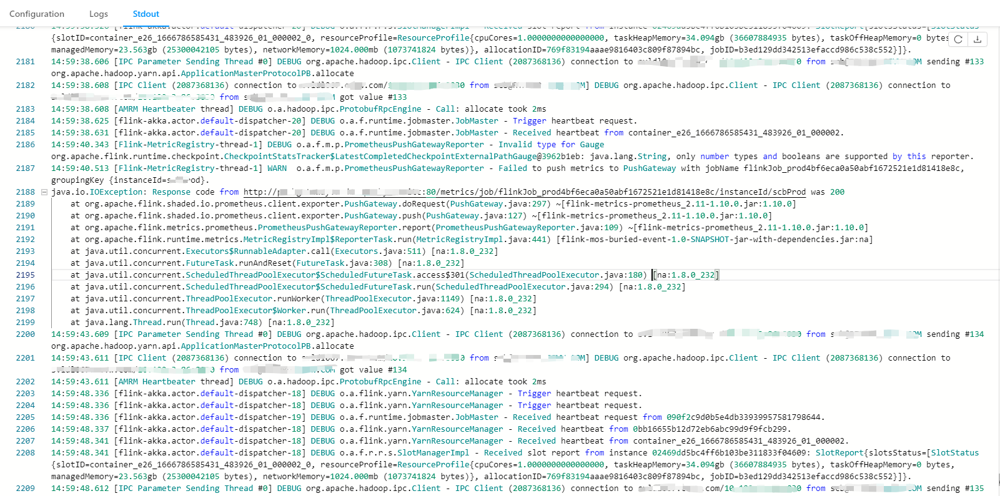
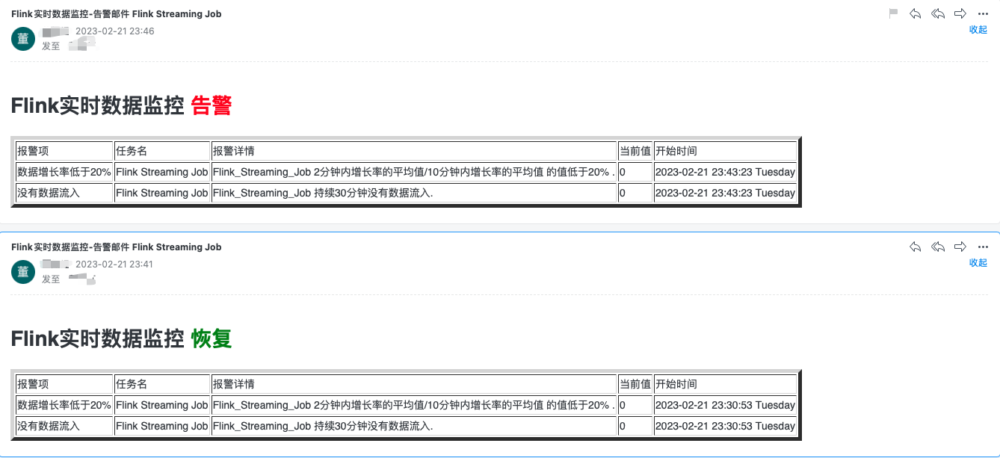
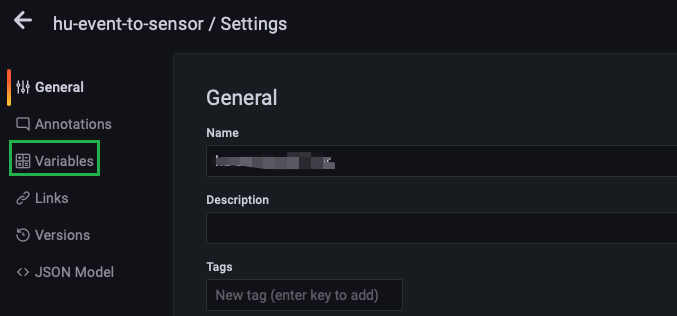
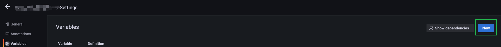
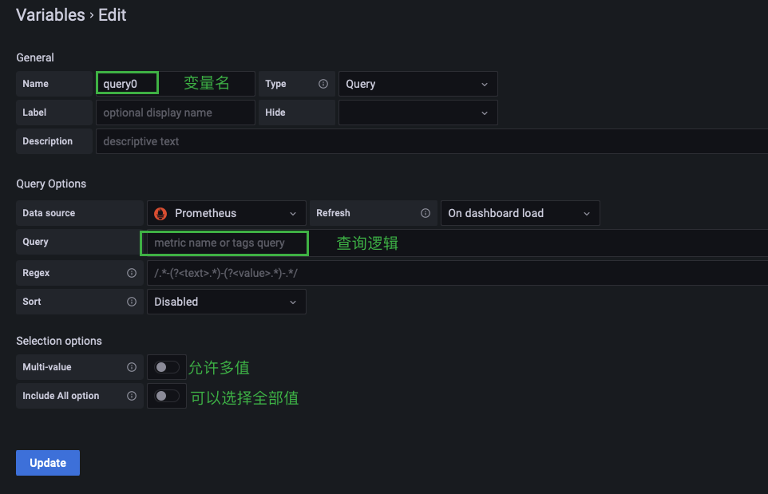
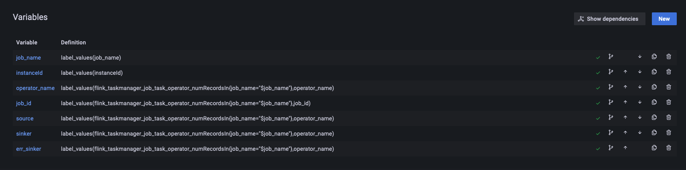
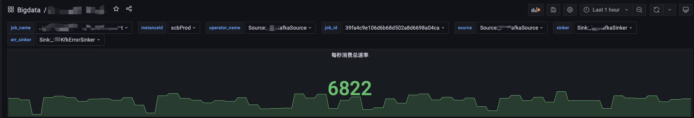

# [Flink]监控Flink Metrics

## 整体流程

## 配置Flink

### 修改flink-conf.yml

首先需要开启使用PrometheusPushGatewayReporter

~~~yaml
metrics.reporter.promgateway.class: org.apache.flink.metrics.prometheus.PrometheusPushGatewayReporter
metrics.reporter.promgateway.host: localhost
metrics.reporter.promgateway.port: 9091
metrics.reporter.promgateway.jobName: flinkJob_dev
metrics.reporter.promgateway.randomJobNameSuffix: true
metrics.reporter.promgateway.deleteOnShutdown: false
metrics.reporter.promgateway.groupingKey: instanceId=someId
metrics.reporter.promgateway.interval: 30 SECONDS
metrics.reporter.promgateway.scope.variables.excludes: task_attempt_num;task_attempt_id;tm_id   #忽略flink所push的metric中的这些字段
~~~

Fink允许使用metrics reportor将一些metrics输出到外部系统, 如果使用其他reportor(可以自定义)需要在flink的flink-conf.yml中新增配置,制定使用的reportor

→ 此处使用prometheus的pushgateway, 地址只能是http而不能是https,因为源码已经写死了.

### 准备与启动任务

写一段从Kafka消费数据并打印到控制台的Flink程序代码,打成jar包并提交到集群, 启动应用程序, Flink将会metrics信息主动暴露给pushgateway. 默认的job名称为`Flink Streaming Job`.

### 版本问题

使用Flink 1.10.x版本时, 按照道理来说应该使用flink同版本的jar, 即: flink-metrics-prometheus_2.11-1.10.0.jar , 但是,由于1.10.x版本的该jar所使用的prometheus版本太低了(0.3.0),需要使用高版本的,否则会报以下错误:

~~~java
14:59:38.608 [AMRM Heartbeater thread] DEBUG o.a.hadoop.ipc.ProtobufRpcEngine - Call: allocate took 2ms
14:59:38.625 [flink-akka.actor.default-dispatcher-20] DEBUG o.a.f.runtime.jobmaster.JobMaster - Trigger heartbeat request.
14:59:38.631 [flink-akka.actor.default-dispatcher-20] DEBUG o.a.f.runtime.jobmaster.JobMaster - Received heartbeat from container_e26_1666786585431_483926_01_000002.
14:59:40.343 [Flink-MetricRegistry-thread-1] DEBUG o.a.f.m.p.PrometheusPushGatewayReporter - Invalid type for Gauge org.apache.flink.runtime.checkpoint.CheckpointStatsTracker$LatestCompletedCheckpointExternalPathGauge@3962b1eb: java.lang.String, only number types and booleans are supported by this reporter.
14:59:40.513 [Flink-MetricRegistry-thread-1] WARN  o.a.f.m.p.PrometheusPushGatewayReporter - Failed to push metrics to PushGateway with jobName flinkJob_prod4bf6eca0a50abf1672521e1d81418e8c, groupingKey {instanceId=someId}.
java.io.IOException: Response code from http://localhost:9091/metrics/job/flinkJob_prod4bf6eca0a50abf1672521e1d81418e8c/instanceId/scbProd was 200
    at org.apache.flink.shaded.io.prometheus.client.exporter.PushGateway.doRequest(PushGateway.java:297) ~[flink-metrics-prometheus_2.11-1.10.0.jar:1.10.0]
    at org.apache.flink.shaded.io.prometheus.client.exporter.PushGateway.push(PushGateway.java:127) ~[flink-metrics-prometheus_2.11-1.10.0.jar:1.10.0]
    at org.apache.flink.metrics.prometheus.PrometheusPushGatewayReporter.report(PrometheusPushGatewayReporter.java:109) ~[flink-metrics-prometheus_2.11-1.10.0.jar:1.10.0]
    at org.apache.flink.runtime.metrics.MetricRegistryImpl$ReporterTask.run(MetricRegistryImpl.java:441) [flink-mos-buried-event-1.0-SNAPSHOT-jar-with-dependencies.jar:na]
    at java.util.concurrent.Executors$RunnableAdapter.call(Executors.java:511) [na:1.8.0_232]
    at java.util.concurrent.FutureTask.runAndReset(FutureTask.java:308) [na:1.8.0_232]
    at java.util.concurrent.ScheduledThreadPoolExecutor$ScheduledFutureTask.access$301(ScheduledThreadPoolExecutor.java:180) [na:1.8.0_232]
    at java.util.concurrent.ScheduledThreadPoolExecutor$ScheduledFutureTask.run(ScheduledThreadPoolExecutor.java:294) [na:1.8.0_232]
    at java.util.concurrent.ThreadPoolExecutor.runWorker(ThreadPoolExecutor.java:1149) [na:1.8.0_232]
    at java.util.concurrent.ThreadPoolExecutor$Worker.run(ThreadPoolExecutor.java:624) [na:1.8.0_232]
    at java.lang.Thread.run(Thread.java:748) [na:1.8.0_232]
14:59:43.609 [IPC Parameter Sending Thread #0] DEBUG org.apache.hadoop.ipc.Client - IPC Client (2087368136) connection to host067.XXX.com/localhost:8030 from xxx@XXX.COM sending #134 org.apache.hadoop.yarn.api.ApplicationMasterProtocolPB.allocate
~~~

解决该问题有两种方案,

1、降低prometheus的版本

2、升级该jar版本

很显然第一种不可行,生产的prometheus已在使用,当然选择第二种,上flink官网后发现flink-metrics-prometheus在1.16才发生了大更新,也就是在此版本之前的该jar差异都不会很大,因此将该jar使用flink1.12对应的jar(即: flink-metrics-prometheus_2.11-1.12.2.jar), 实际使用中解决该问题,**可用**

## 使用Alertmanager进行告警监控

> Prometheus本身不具备告警功能,需要结合Alertmanager才能实现告警的通知.
>
> The [Alertmanager](https://github.com/prometheus/alertmanager) handles alerts sent by client applications such as the Prometheus server. It takes care of deduplicating, grouping, and routing them to the correct receiver integration such as email, PagerDuty, or OpsGenie. It also takes care of silencing and inhibition of alerts.

以下内容不涉及告警的**分组定义**和**静默定义**, 仅关注于如何实现一个告警,在实现的过程中对整个链路涉及到的组件如何的配置.

### 配置Prometheus

首先, 配置Prometheus添加Alertmanager, 在prometheus的配置文件`prometheus.yml`下指明alertmanager的地址

~~~yml
$ prometheus-2.40.1 cat prometheus.yml
# my global config
global:
  scrape_interval: 15s # Set the scrape interval to every 15 seconds. Default is every 1 minute.
  evaluation_interval: 15s # Evaluate rules every 15 seconds. The default is every 1 minute.
  # scrape_timeout is set to the global default (10s).

# Alertmanager configuration
alerting:
  alertmanagers:
    - static_configs:
        - targets: ["127.0.0.1:9093"]

# Load rules once and periodically evaluate them according to the global 'evaluation_interval'.
rule_files:
  - "rules.yml"
  # - "second_rules.yml"

# A scrape configuration containing exactly one endpoint to scrape:
# Here it's Prometheus itself.
# scrape_configs:
  # The job name is added as a label `job=<job_name>` to any timeseries scraped from this config.
scrape_configs:
  - job_name: 'prometheus'
    static_configs:
    - targets: ['localhost:9090']
      labels:
        instance: prometheus

  - job_name: 'pushgateway'
    static_configs:
    - targets: ['localhost:9091']
      labels:
        instance: pushgateway
~~~

Prometheus监控的一些列规则都在`rule_files`下,该key下的文件都在prometheus部署的目录下,以下举例.Prometheus会定时轮训查询expr表达式下的逻辑,如果满足告警将会触发告警,将告警发送给alertmanager

~~~yml
groups:
  - name: 无数据流入和增长率过低监控
    rules:
      - alert: 没有数据流入
        expr: sum(increase(flink_taskmanager_job_task_operator_numRecordsIn{job_name="Flink_Streaming_Job",operator_name="Sink:_Print_to_Std__Out"}[2m])) by(job_name,operator_name) == 0
        for: 1m
        labels:
          bigDataDataSource: CDC
          job_name: Flink Streaming Job
          operator_name: Map
          instance: "{{ $labels.instance }}"
        annotations:
          summary: "Job {{ $labels.job_name }} 没有数据流入"
          description: "{{ $labels.job_name }} 持续30分钟没有数据流入."
          value: "{{ $value }}"
~~~

添加完上述rules.yml配置, 调用prometeus的接口重载配置 `curl -X POST http://127.0.0.1:9090/-/reload*`

### 配置Alertmanager

在Alertmanager中需要配置接收告警组,接受人以及配置邮件基础信息.

~~~yml
global:
  resolve_timeout: 5m #解析超时时间，也就是报警恢复不是立马发送的，而是在一个时间范围内不在触发报警，才能发送恢复报警，默认为5分钟
  # smtp配置
  smtp_from: "xxx@template.com" #收件人的邮箱地址
  smtp_smarthost: 'smtp.qiye.163.com:25' #邮箱提供商的smtp地址
  smtp_auth_username: "xxx@template.com" #收件人的邮箱账号
  smtp_auth_password: "xxx" #邮箱授权码
  smtp_hello: "template.com"
  smtp_require_tls: true #是否需要tls协议，默认是true
# 路由分组,所有报警信息进入后的根路由,用来设置报警的分发策略
route:
  group_by: ['job_name'] #  根据标签进行分组，alertname就是告警规则的名称，多个标签可以以逗号隔开
  group_wait: 40s # 发送告警等待时间，也就是一个时间范围内，如果同一组中有其他报警则一并发送 
  group_interval: 5m # 当触发了一组告警后，下一组报警触发的间隔        
  repeat_interval: 6h # 如果一个报警信息已经发送成功了，等待6h时间来重新发送
  receiver: 'test_alert' #默认的receiver,如果一个报警没有被route匹配，则发送给默认的接收器
  routes:
    - receiver: 'test_alert'
      group_wait: 40s
      match:
        bigDataDataSource: ODP
templates:
  - 'path/to/bigdata-warn.tmpl'        
receivers:
  - name: 'test_alert'
    email_configs: 
      - to: "roohom@qq.com"
        send_resolved: true #是否发送解决的通知邮件
        html: '{{ template "bigdata-warn-email.html" . }}' #实用自定义的邮件模板
~~~

由于默认的邮件样式不太清晰, 我们在配置中添加自定义的告警模板, 告警模板放在alertmanager的目录下,并在`alertmanager.yml`文件中指定:

~~~yaml
templates:
  - 'path/to/bigdata-warn.tmpl'
~~~

在接收人的配置上制定使用自定义的模板:

~~~yaml
email_configs: 
  - to: "roohom@qq.com"
    html: '{{ template "bigdata-warn-email.html" . }}' #实用自定义的邮件模板
~~~

告警邮件模板(Go template)如下:

~~~go
{{ define "bigdata-warning-email.html" }}
 
{{- if gt (len .Alerts.Firing) 0 -}}
<h1>Flink实时数据监控 告警</h1>
<table border="5">
    <tr>
        <td>报警项</td>
        <td>任务名</td>
        <td>报警详情</td>
        <td>当前值</td>
        <td>开始时间</td>
    </tr>
    {{ range $i, $alert := .Alerts }}
        <tr><td>{{ index $alert.Labels "alertname" }}</td>
            <td>{{ index $alert.Labels "job_name" }}</td>
            <td>{{ index $alert.Annotations "description" }}</td>
            <td>{{ index $alert.Annotations "value" }}</td>
            <td>{{ ($alert.StartsAt.Add 28800e9).Format "2006-01-02 15:04:05 Monday" }}</td>
        </tr>
    {{ end }}
</table>
{{ end }}
{{- if gt (len .Alerts.Resolved) 0 -}}
<h1>Flink实时数据监控 恢复</h1>
<table border="5">
    <tr>
        <td>报警项</td>
        <td>任务名</td>
        <td>报警详情</td>
        <td>当前值</td>
        <td>开始时间</td>
    </tr>
    {{ range $i, $alert := .Alerts }}
        <tr>
            <td>{{ index $alert.Labels "alertname" }}</td>
            <td>{{ index $alert.Labels "job_name" }}</td>
            <td>{{ index $alert.Annotations "description" }}</td>
            <td>{{ index $alert.Annotations "value" }}</td>
            {{/* 时区问题 给时间加上8小时, 如果无时区问题则不需要加 直接使用$alert.StartsAt.Format */}}
            <td>{{ ($alert.StartsAt.Add 28800e9).Format "2006-01-02 15:04:05 Monday" }}</td>
        </tr>
    {{ end }}
</table>
{{ end }}{{- end }}
 
{{/* 发送邮件的主题 */}}
{{ define "__subject" }}Flink实时数据监控-告警邮件 {{ .GroupLabels.SortedPairs.Values | join " " }} {{ if gt (len .CommonLabels) (len .GroupLabels) }}{{ end }}{{ end }}
~~~

配置完成之后通过 `curl -X POST http:*//127.0.0.1:9093/-/reload` 重新加载配置文件

当触发告警后会收到邮件通知

## 配置Grafana

##### 添加变量

有时候为了创建一个面板, 但是面板上包含很多**重复的项目**, 同时创建多个会异常繁琐, 此时考虑将我们的PromQL查询语句写成**模板**,在其中**嵌入变量,** 只要随便选择变量填入实际值就可以生成面板供查看.

为此我们需要将PromQL语句写成下面的样子:

1、PromQL准备

~~~SQL
sum(flink_taskmanager_job_task_operator_KafkaConsumer_records_consumed_rate{instanceId="$instanceId",job_id="$job_id",job_name="$job_name"})
~~~

其中`$instancceId`、`$job_id`、`$job_name`都是变量, 允许我们选择合适的值填入其中, 生成一个实际的查询语句.

2、变量配置

step1、进入自己所配置的面板中,点击小齿轮图标

step2、点击Variables

step3、点击右侧NEW新建一个

说明:

我们需要为变量定一个名称,默认query0,在Query中填入实际查询公式. 举例如下:

job_name的查询公式为label_values(job_name), 它的原理是: **查询所有的metrics信息(实际是一系列json), 获取并解析这些信息json, 提取其中所有的json键为job_name的值,得到一个列表供选择.**

高级查询如operator_name, 它的查询方式为**级联查询**, 也就是**先由公式查询得到job_name, 再根据`flink_taskmanager_job_task_operator_numRecordsIn{job_name="$job_name"}`的查询得到一系列的metrics信息(实际为json),再在这些json信息中提取所有的operator_name得到一个列表并返回.**

如此操作之后就可以在面板中得到以下的效果,如果需要查看不同的任务的信息,但是PromQL相同,就可以下拉选择.省去很多的面板配置.

