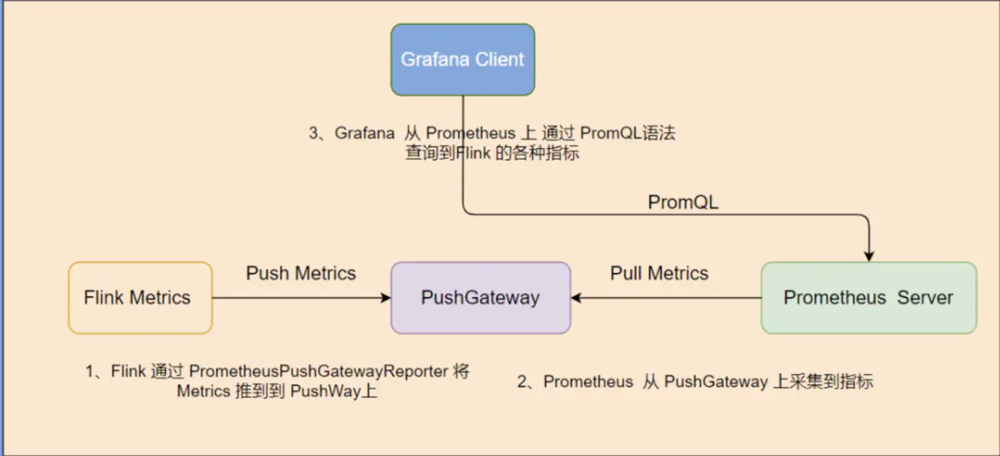
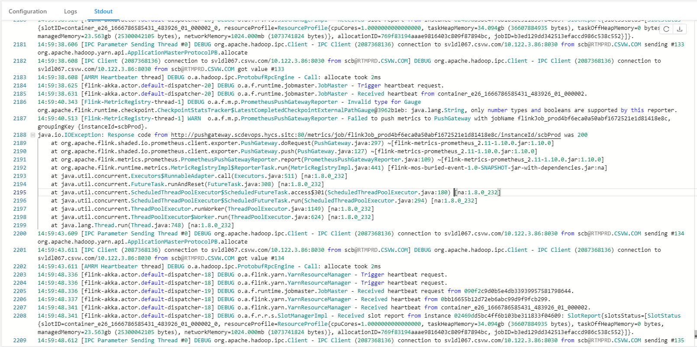

# [Flink]监控Flink Metrics

## 整体流程

## 配置Flink

首先需要开启使用PrometheusPushGatewayReporter

~~~yaml
metrics.reporter.promgateway.class: org.apache.flink.metrics.prometheus.PrometheusPushGatewayReporter
metrics.reporter.promgateway.host: localhost
metrics.reporter.promgateway.port: 9091
metrics.reporter.promgateway.jobName: flinkJob_dev
metrics.reporter.promgateway.randomJobNameSuffix: true
metrics.reporter.promgateway.deleteOnShutdown: false
metrics.reporter.promgateway.groupingKey: instanceId=someId
metrics.reporter.promgateway.interval: 30 SECONDS
metrics.reporter.promgateway.scope.variables.excludes: task_attempt_num;task_attempt_id;tm_id   #忽略flink所push的metric中的这些字段
~~~

Fink允许使用metrics reportor将一些metrics输出到外部系统, 如果使用其他reportor(可以自定义)需要在flink的flink-conf.yml中新增配置,制定使用的reportor

→ 此处使用prometheus的pushgateway, 地址只能是http而不能是https,因为源码已经写死了.

### 版本问题

使用Flink 1.10.x版本时, 按照道理来说应该使用flink同版本的jar, 即: flink-metrics-prometheus_2.11-1.10.0.jar , 但是,由于1.10.x版本的该jar所使用的prometheus版本太低了(0.3.0),需要使用高版本的,否则会报以下错误:

~~~java
14:59:38.608 [AMRM Heartbeater thread] DEBUG o.a.hadoop.ipc.ProtobufRpcEngine - Call: allocate took 2ms
14:59:38.625 [flink-akka.actor.default-dispatcher-20] DEBUG o.a.f.runtime.jobmaster.JobMaster - Trigger heartbeat request.
14:59:38.631 [flink-akka.actor.default-dispatcher-20] DEBUG o.a.f.runtime.jobmaster.JobMaster - Received heartbeat from container_e26_1666786585431_483926_01_000002.
14:59:40.343 [Flink-MetricRegistry-thread-1] DEBUG o.a.f.m.p.PrometheusPushGatewayReporter - Invalid type for Gauge org.apache.flink.runtime.checkpoint.CheckpointStatsTracker$LatestCompletedCheckpointExternalPathGauge@3962b1eb: java.lang.String, only number types and booleans are supported by this reporter.
14:59:40.513 [Flink-MetricRegistry-thread-1] WARN  o.a.f.m.p.PrometheusPushGatewayReporter - Failed to push metrics to PushGateway with jobName flinkJob_prod4bf6eca0a50abf1672521e1d81418e8c, groupingKey {instanceId=scbProd}.
java.io.IOException: Response code from http://pushgateway.scdevops.hycs.sitc:80/metrics/job/flinkJob_prod4bf6eca0a50abf1672521e1d81418e8c/instanceId/scbProd was 200
    at org.apache.flink.shaded.io.prometheus.client.exporter.PushGateway.doRequest(PushGateway.java:297) ~[flink-metrics-prometheus_2.11-1.10.0.jar:1.10.0]
    at org.apache.flink.shaded.io.prometheus.client.exporter.PushGateway.push(PushGateway.java:127) ~[flink-metrics-prometheus_2.11-1.10.0.jar:1.10.0]
    at org.apache.flink.metrics.prometheus.PrometheusPushGatewayReporter.report(PrometheusPushGatewayReporter.java:109) ~[flink-metrics-prometheus_2.11-1.10.0.jar:1.10.0]
    at org.apache.flink.runtime.metrics.MetricRegistryImpl$ReporterTask.run(MetricRegistryImpl.java:441) [flink-mos-buried-event-1.0-SNAPSHOT-jar-with-dependencies.jar:na]
    at java.util.concurrent.Executors$RunnableAdapter.call(Executors.java:511) [na:1.8.0_232]
    at java.util.concurrent.FutureTask.runAndReset(FutureTask.java:308) [na:1.8.0_232]
    at java.util.concurrent.ScheduledThreadPoolExecutor$ScheduledFutureTask.access$301(ScheduledThreadPoolExecutor.java:180) [na:1.8.0_232]
    at java.util.concurrent.ScheduledThreadPoolExecutor$ScheduledFutureTask.run(ScheduledThreadPoolExecutor.java:294) [na:1.8.0_232]
    at java.util.concurrent.ThreadPoolExecutor.runWorker(ThreadPoolExecutor.java:1149) [na:1.8.0_232]
    at java.util.concurrent.ThreadPoolExecutor$Worker.run(ThreadPoolExecutor.java:624) [na:1.8.0_232]
    at java.lang.Thread.run(Thread.java:748) [na:1.8.0_232]
14:59:43.609 [IPC Parameter Sending Thread #0] DEBUG org.apache.hadoop.ipc.Client - IPC Client (2087368136) connection to svldl067.csvw.com/10.122.3.86:8030 from scb@RTMPRD.CSVW.COM sending #134 org.apache.hadoop.yarn.api.ApplicationMasterProtocolPB.allocate
14:59:43.611 [IPC Client (2087368136) connection to svldl067.csvw.com/10.122.3.86:8030 from scb@RTMPRD.CSVW.COM] DEBUG org.apache.hadoop.ipc.Client - IPC Client (2087368136) connection to svldl067.csvw.com/10.122.3.86:8030 from scb@RTMPRD.CSVW.COM got value #134
~~~

解决该问题有两种方案,

1、降低prometheus的版本

2、升级该jar版本

很显然第一种不可行,生产的prometheus已在使用,当然选择第二种,上flink官网后发现flink-metrics-prometheus在1.16才发生了大更新,也就是在此版本之前的该jar差异都不会很大,因此将该jar使用flink1.12对应的jar(即: flink-metrics-prometheus_2.11-1.12.2.jar), 实际使用中解决该问题,**可用**

## 配置Grafana

待补充