# [Flink源码]YarnApplication模式的任务启动

## 前瞻

上一回从源码层面简单分析了一个Flink任务是如何解析命令行参数，从而以ACTION RUN形式启动一个flink任务的。从flink run脚本接收到参数后，初始化一系列参数，调用`parseAndRun(String[] args)`方法，通过解析命令行传入的ACTION参数，以此来运行不同的模式(session模式、application模式)，下文将会接着从源码层面尝试分析一个applicantion模式的应用是如何启动的。

> 下文引用的Flink源码基于Flink 1.17版本


## parseAndRun

我们通常通过以下方式启动提交一个flink on yarn application的任务

~~~shell
./bin/flink run-application -t yarn-application ./examples/streaming/TopSpeedWindowing.jar
~~~

对应源码在`org.apache.flink.client.cli.CliFrontend#parseAndRun`

~~~java
public int parseAndRun(String[] args) {

    // check for action
    if (args.length < 1) {
        CliFrontendParser.printHelp(customCommandLines);
        System.out.println("Please specify an action.");
        return 1;
    }

    // get action
    String action = args[0];

    // remove action from parameters
    final String[] params = Arrays.copyOfRange(args, 1, args.length);

    try {
        // do action
        switch (action) {
            case ACTION_RUN:
                run(params);
                return 0;
            case ACTION_RUN_APPLICATION:
                runApplication(params);
                return 0;
            case ACTION_LIST:
                list(params);
                return 0;
            case ACTION_INFO:
                info(params);
                return 0;
            case ACTION_CANCEL:
                cancel(params);
                return 0;
            case ACTION_STOP:
                stop(params);
                return 0;
            case ACTION_SAVEPOINT:
                savepoint(params);
                return 0;
            case "-h":
            case "--help":
                CliFrontendParser.printHelp(customCommandLines);
                return 0;
            case "-v":
            case "--version":
                ...
                return 1;
        }
    } catch (Exeception ce) {
        ......
    }
}
~~~

直接进入runApplication(String[] args)，老样子，前面是一系列的参数校验和初始化，核心代码是：

~~~java
......
final ApplicationDeployer deployer =
                new ApplicationClusterDeployer(clusterClientServiceLoader);
......
deployer.run(effectiveConfiguration, applicationConfiguration);
~~~

那么我们看下`deployer.run`在被调用的时候都干了什么，戳进run进去可以看到调用的是接口ApplicationDeployer的run方法，使用ctrl+H找到该接口的实现类，发现只有一个`org.apache.flink.client.deployment.application.cli.ApplicationClusterDeployer`,那么它的run方法如下：

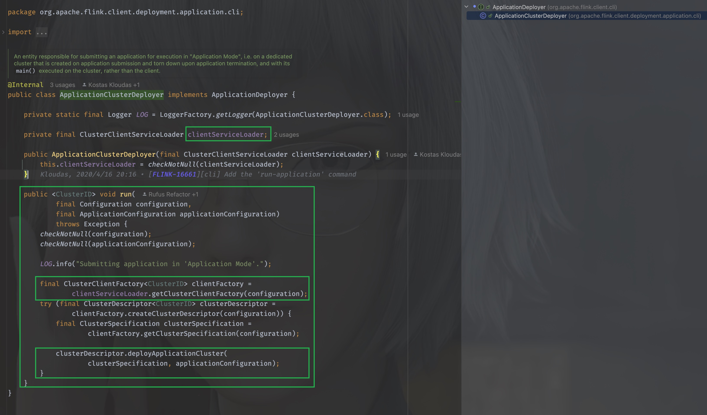


在run方法里，使用了clientServiceLoader进行类加载，当看到ServiceLoader的时候，DNA动了，这是JAVA的SPI机制，OK，那么我们看下这个clientServiceLoader是如何初始化的，就是要找到，它在什么时候创建并且被传入的。

我们找到clusterClientServiceLoader被初始化的地方，返回到CliFrontend，

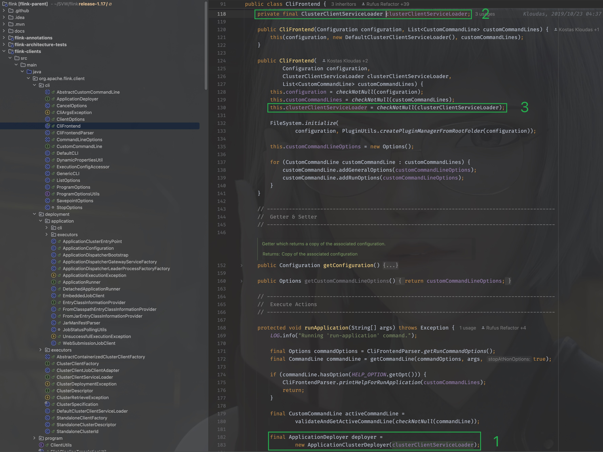

可以看到是在CliFrontend被构造的时候传入的，那么就找到它的构造方法：

~~~java
public CliFrontend(Configuration configuration, List<CustomCommandLine> customCommandLines) {
    this(configuration, new DefaultClusterClientServiceLoader(), customCommandLines);
}
~~~

其实就在上图中，可以看到传入的是`org.apache.flink.client.deployment.DefaultClusterClientServiceLoader,` 那么，当`clientServiceLoader.getClusterClientFactory(configuration)`在执行时，其实调用的是`org.apache.flink.client.deployment.DefaultClusterClientServiceLoader#getClusterClientFactory`方法。

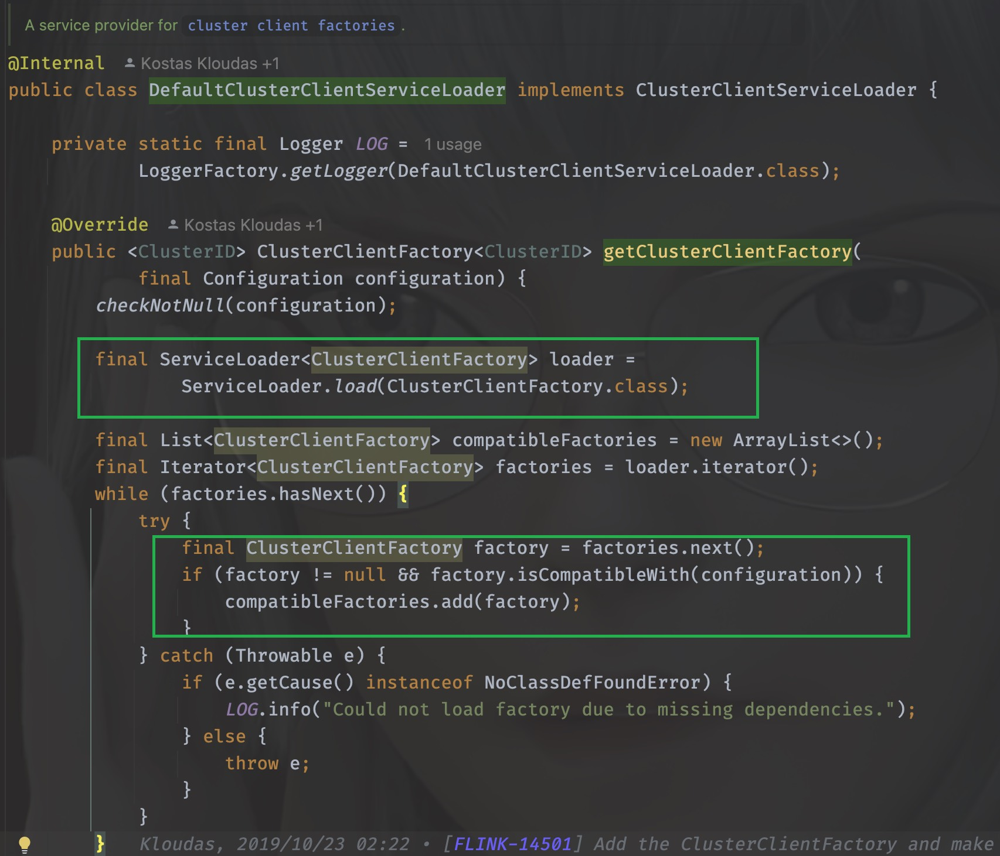

可以看到，它千辛万苦寻找的其实就是`org.apache.flink.client.deployment.ClusterClientFactory`的实现类，打开它的实现类可以发现一共有好几个

~~~java
org.apache.flink.kubernetes.KubernetesClusterClientFactory
org.apache.flink.yarn.YarnClusterClientFactory
org.apache.flink.client.deployment.StandaloneClientFactory
~~~

用脚指头想都知道肯定是`org.apache.flink.yarn.YarnClusterClientFactory`,为什么呢？

因为他们的实现类都需要实现isCompatibleWith方法，只有YarnClusterClientFactory的方法里这个方法返回true，它解析的其实就是命令行传入的`-t`参数，当时我们传入的是`yarn-application`

~~~shell
./bin/flink run-application -t yarn-application ./examples/streaming/TopSpeedWindowing.jar
~~~

这个时候我们需要再回到`org.apache.flink.client.deployment.application.cli.ApplicationClusterDeployer`里，千万不要忘了来时的路，虽然很容易迷路。


同样的思路，我们很快能够定位到clusterDescriptor其实是`org.apache.flink.yarn.YarnClusterDescriptor`, 那么

```java
clusterDescriptor.deployApplicationCluster(
        clusterSpecification, applicationConfiguration)
```

执行的其实就是`org.apache.flink.yarn.YarnClusterDescriptor#deployApplicationCluster`


## deployApplicationCluster

同样的，进入这个方法可以看到前面很多参数的校验以及初始化，忽略这些，我们直接进入关键代码

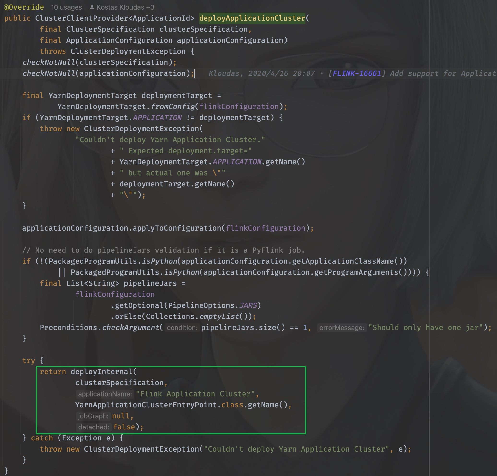

方法有详细的说明

> ```
>  This method will block until the ApplicationMaster/JobManager have been deployed on YARN.
> 
>  @param clusterSpecification Initial cluster specification for the Flink cluster to be deployed
>  @param applicationName name of the Yarn application to start
>  @param yarnClusterEntrypoint Class name of the Yarn cluster entry point.
>  @param jobGraph A job graph which is deployed with the Flink cluster, {@code null} if none
>  @param detached True if the cluster should be started in detached mode
> ```

注意到这个"Flink Application Cluster"没，当我们的任务不指定job name的时候，打开web ui的时候看到的默认就是它，除此之外，最核心的一个参数其实是(String yarnClusterEntrypoint), 这里传入的是`YarnApplicationClusterEntryPoint.class.getName()`, 其实这个deployInternal里面干的事儿就是启动ApplicationMaster/JobManager，当AM启动之后需要执行的入口类就是YarnApplicationClusterEntryPoint，不妨进入YarnApplicationClusterEntryPoint里看看都有些什么：


太好了！是main()方法，我们有救了！

同样地，配置参数配置及初始化我们都暂时忽略，直戳要害看重点，在main方法的最后：

```java
YarnApplicationClusterEntryPoint yarnApplicationClusterEntrypoint =
        new YarnApplicationClusterEntryPoint(configuration, program);

ClusterEntrypoint.runClusterEntrypoint(yarnApplicationClusterEntrypoint);
```

new了一下自己，并调用`ClusterEntrypoint.runClusterEntrypoint`，进入这个方法：

~~~java
public static void runClusterEntrypoint(ClusterEntrypoint clusterEntrypoint) {

    final String clusterEntrypointName = clusterEntrypoint.getClass().getSimpleName();
    try {
        clusterEntrypoint.startCluster();
    } catch (ClusterEntrypointException e) {
        LOG.error(
            String.format("Could not start cluster entrypoint %s.", clusterEntrypointName),
            e);
        System.exit(STARTUP_FAILURE_RETURN_CODE);
    }

    int returnCode;
    Throwable throwable = null;

    try {
        returnCode = clusterEntrypoint.getTerminationFuture().get().processExitCode();
    } catch (Throwable e) {
        throwable = ExceptionUtils.stripExecutionException(e);
        returnCode = RUNTIME_FAILURE_RETURN_CODE;
    }

    LOG.info(
        "Terminating cluster entrypoint process {} with exit code {}.",
        clusterEntrypointName,
        returnCode,
        throwable);
    System.exit(returnCode);
}
~~~

核心方法是：`clusterEntrypoint.startCluster(); `, 直接进入，我已经迫不及待看见它开始的地方了

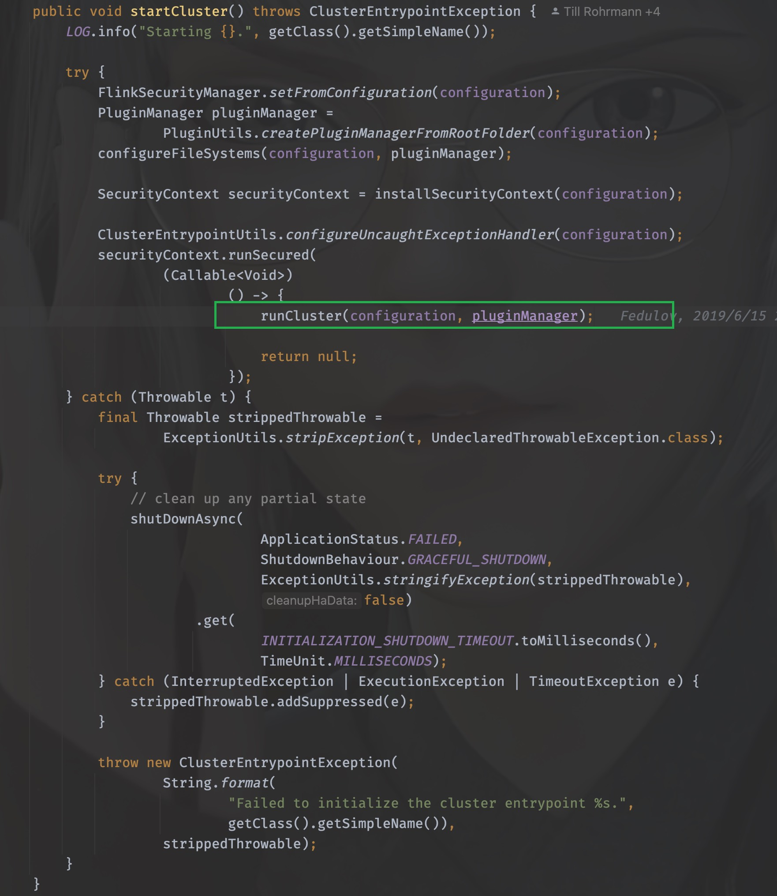


同样地，进入runCluster这个方法，接下来，就是有点迷惑人的地方了，迷宫开始了。


## runCluster

runCluster没有返回值，所以该做的事情，在这个方法里就做完了，所以究竟做了哪些事情呢？


通过工厂类的命名可以猜到，需要创建dispatcher和resourceManager这两个组件，其实这两个组件也就是JobManager的核心组件，进入到这个工厂中，详细看看是如何创建的

### DispatcherResourceManagerComponent

同样，戳进create方法，进入的是`org.apache.flink.runtime.entrypoint.component.DispatcherResourceManagerComponentFactory`这个工厂接口

它只有一个实现类就是`org.apache.flink.runtime.entrypoint.component.DefaultDispatcherResourceManagerComponentFactory`, 所以就看它的create方法即可

这个方法的方法体很长，同样，非核心的代码去掉暂时不看

什么？你哪知道哪些核心不核心？

这不好说呀，只能根据经验和方法命名来猜，如果你没猜错的话一定是猜对了。

~~~java
@Override
public DispatcherResourceManagerComponent create(
    Configuration configuration,
    ResourceID resourceId,
    Executor ioExecutor,
    RpcService rpcService,
    HighAvailabilityServices highAvailabilityServices,
    BlobServer blobServer,
    HeartbeatServices heartbeatServices,
    DelegationTokenManager delegationTokenManager,
    MetricRegistry metricRegistry,
    ExecutionGraphInfoStore executionGraphInfoStore,
    MetricQueryServiceRetriever metricQueryServiceRetriever,
    FatalErrorHandler fatalErrorHandler)
    throws Exception {

    LeaderRetrievalService dispatcherLeaderRetrievalService = null;
    LeaderRetrievalService resourceManagerRetrievalService = null;
    WebMonitorEndpoint<?> webMonitorEndpoint = null;
    ResourceManagerService resourceManagerService = null;
    DispatcherRunner dispatcherRunner = null;

    try {
        dispatcherLeaderRetrievalService =
            highAvailabilityServices.getDispatcherLeaderRetriever();

        resourceManagerRetrievalService =
            highAvailabilityServices.getResourceManagerLeaderRetriever();

        final LeaderGatewayRetriever<DispatcherGateway> dispatcherGatewayRetriever =
            new RpcGatewayRetriever<>(
            rpcService,
            DispatcherGateway.class,
            DispatcherId::fromUuid,
            new ExponentialBackoffRetryStrategy(
                12, Duration.ofMillis(10), Duration.ofMillis(50)));

        final LeaderGatewayRetriever<ResourceManagerGateway> resourceManagerGatewayRetriever =
            new RpcGatewayRetriever<>(
            rpcService,
            ResourceManagerGateway.class,
            ResourceManagerId::fromUuid,
            new ExponentialBackoffRetryStrategy(
                12, Duration.ofMillis(10), Duration.ofMillis(50)));

        final ScheduledExecutorService executor =
            WebMonitorEndpoint.createExecutorService(
            configuration.getInteger(RestOptions.SERVER_NUM_THREADS),
            configuration.getInteger(RestOptions.SERVER_THREAD_PRIORITY),
            "DispatcherRestEndpoint");

        final long updateInterval =
            configuration.getLong(MetricOptions.METRIC_FETCHER_UPDATE_INTERVAL);
        final MetricFetcher metricFetcher =
            updateInterval == 0
            ? VoidMetricFetcher.INSTANCE
            : MetricFetcherImpl.fromConfiguration(
                configuration,
                metricQueryServiceRetriever,
                dispatcherGatewayRetriever,
                executor);

        webMonitorEndpoint =
            restEndpointFactory.createRestEndpoint(
            configuration,
            dispatcherGatewayRetriever,
            resourceManagerGatewayRetriever,
            blobServer,
            executor,
            metricFetcher,
            highAvailabilityServices.getClusterRestEndpointLeaderElectionService(),
            fatalErrorHandler);

        log.debug("Starting Dispatcher REST endpoint.");
        webMonitorEndpoint.start();

        final String hostname = RpcUtils.getHostname(rpcService);

        resourceManagerService =
            ResourceManagerServiceImpl.create(
            resourceManagerFactory,
            configuration,
            resourceId,
            rpcService,
            highAvailabilityServices,
            heartbeatServices,
            delegationTokenManager,
            fatalErrorHandler,
            new ClusterInformation(hostname, blobServer.getPort()),
            webMonitorEndpoint.getRestBaseUrl(),
            metricRegistry,
            hostname,
            ioExecutor);

        final HistoryServerArchivist historyServerArchivist =
            HistoryServerArchivist.createHistoryServerArchivist(
            configuration, webMonitorEndpoint, ioExecutor);

        final DispatcherOperationCaches dispatcherOperationCaches =
            new DispatcherOperationCaches(
            configuration.get(RestOptions.ASYNC_OPERATION_STORE_DURATION));

        final PartialDispatcherServices partialDispatcherServices =
            new PartialDispatcherServices(
            configuration,
            highAvailabilityServices,
            resourceManagerGatewayRetriever,
            blobServer,
            heartbeatServices,
            () ->
            JobManagerMetricGroup.createJobManagerMetricGroup(
                metricRegistry, hostname),
            executionGraphInfoStore,
            fatalErrorHandler,
            historyServerArchivist,
            metricRegistry.getMetricQueryServiceGatewayRpcAddress(),
            ioExecutor,
            dispatcherOperationCaches);

        log.debug("Starting Dispatcher.");
        dispatcherRunner =
            dispatcherRunnerFactory.createDispatcherRunner(
            highAvailabilityServices.getDispatcherLeaderElectionService(),
            fatalErrorHandler,
            new HaServicesJobPersistenceComponentFactory(highAvailabilityServices),
            ioExecutor,
            rpcService,
            partialDispatcherServices);

        log.debug("Starting ResourceManagerService.");
        resourceManagerService.start();

        resourceManagerRetrievalService.start(resourceManagerGatewayRetriever);
        dispatcherLeaderRetrievalService.start(dispatcherGatewayRetriever);

        return new DispatcherResourceManagerComponent(
            dispatcherRunner,
            resourceManagerService,
            dispatcherLeaderRetrievalService,
            resourceManagerRetrievalService,
            webMonitorEndpoint,
            fatalErrorHandler,
            dispatcherOperationCaches);

    } catch (Exception exception) {
        // clean up all started components
        if (dispatcherLeaderRetrievalService != null) {
            try {
                dispatcherLeaderRetrievalService.stop();
            } catch (Exception e) {
                exception = ExceptionUtils.firstOrSuppressed(e, exception);
            }
        }

        if (resourceManagerRetrievalService != null) {
            try {
                resourceManagerRetrievalService.stop();
            } catch (Exception e) {
                exception = ExceptionUtils.firstOrSuppressed(e, exception);
            }
        }

        final Collection<CompletableFuture<Void>> terminationFutures = new ArrayList<>(3);

        ......
    }
~~~

从上往下看，可以知道，在一系列组件被创建之后就一并执行了，这里创建了webMonitorEndpoint、resourceManagerService、resourceManagerRetrievalService、dispatcherLeaderRetrievalService，并且返回了一个DispatcherResourceManagerComponent


### resourceManagerService

来看看resourceManagerService是如何创建的，它的创建通过调用ResourceManagerServiceImpl的create方法进行创建，

~~~java
resourceManagerService =
        ResourceManagerServiceImpl.create(
                resourceManagerFactory,
                configuration,
                resourceId,
                rpcService,
                highAvailabilityServices,
                heartbeatServices,
                delegationTokenManager,
                fatalErrorHandler,
                new ClusterInformation(hostname, blobServer.getPort()),
                webMonitorEndpoint.getRestBaseUrl(),
                metricRegistry,
                hostname,
                ioExecutor);
~~~

戳进去，会发现就是它自己，之后调用了start()方法进行启动


### dispatcherRunner

dispatcherRunner和resourceManagerService的创建在同一个地方

~~~java
dispatcherRunner =
        dispatcherRunnerFactory.createDispatcherRunner(
                highAvailabilityServices.getDispatcherLeaderElectionService(),
                fatalErrorHandler,
                new HaServicesJobPersistenceComponentFactory(highAvailabilityServices),
                ioExecutor,
                rpcService,
                partialDispatcherServices);
~~~

进入createDispatcherRunner方法，发现来到了`org.apache.flink.runtime.dispatcher.runner.DispatcherRunnerFactory`这个接口中，找一下他的实现类，发现只有一个实现类：`org.apache.flink.runtime.dispatcher.runner.DefaultDispatcherRunnerFactory`

找到它的createDispatcherRunner方法：

~~~java
@Override
public DispatcherRunner createDispatcherRunner(
        LeaderElectionService leaderElectionService,
        FatalErrorHandler fatalErrorHandler,
        JobPersistenceComponentFactory jobPersistenceComponentFactory,
        Executor ioExecutor,
        RpcService rpcService,
        PartialDispatcherServices partialDispatcherServices)
        throws Exception {

    final DispatcherLeaderProcessFactory dispatcherLeaderProcessFactory =
            dispatcherLeaderProcessFactoryFactory.createFactory(
                    jobPersistenceComponentFactory,
                    ioExecutor,
                    rpcService,
                    partialDispatcherServices,
                    fatalErrorHandler);

    return DefaultDispatcherRunner.create(
            leaderElectionService, fatalErrorHandler, dispatcherLeaderProcessFactory);
}
~~~

可以看到最后一行调用create来创建dispatcherRunner，它接收三个参数

- leaderElectionService
- fatalErrorHandler
- dispatcherLeaderProcessFactory

根据参数名，自然可以想到，核心的参数是第一个和第三个，在继续深入之前，我们来看下这个leaderElectionService和dispatcherLeaderProcessFactory都是在什么时候创建和初始化的

#### leaderElectionService

OK，我们一路逆着往上，回到开始的地方，注意，从现在开始，和之前不同的是，我们需要一路回退。

如果把之前的动作比作是剥洋葱，一边剥一边流泪，那么现在的步骤就好似是包洋葱。

在create之前，这个leaderElectionService是由createDispatcherRunner的调用者传入的，也就是在刚刚看到的dispatcherRunner在创建的地方

~~~java
dispatcherRunner =
        dispatcherRunnerFactory.createDispatcherRunner(
                highAvailabilityServices.getDispatcherLeaderElectionService(),
                fatalErrorHandler,
                new HaServicesJobPersistenceComponentFactory(highAvailabilityServices),
                ioExecutor,
                rpcService,
                partialDispatcherServices);
~~~

这里传入了`highAvailabilityServices.getDispatcherLeaderElectionService()`

那么这个highAvailabilityServices又是什么呢？继续回退，找到它被初始化和传入的地方，它经过`org.apache.flink.runtime.entrypoint.component.DefaultDispatcherResourceManagerComponentFactory#create`方法被传入，这个create方法在两个地方被调用

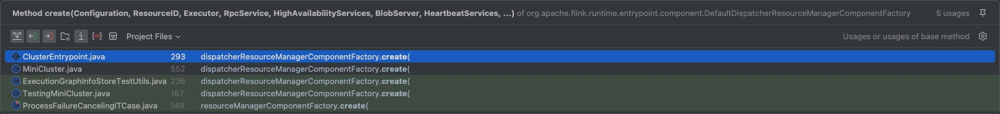

我们一开始是从ClusterEntrypoint过来的，所以得回到这里面去

~~~java
clusterComponent =
        dispatcherResourceManagerComponentFactory.create(
                configuration,
                resourceId.unwrap(),
                ioExecutor,
                commonRpcService,
                haServices,
                blobServer,
                heartbeatServices,
                delegationTokenManager,
                metricRegistry,
                executionGraphInfoStore,
                new RpcMetricQueryServiceRetriever(
                        metricRegistry.getMetricQueryServiceRpcService()),
                this);
~~~

第5个参数就是我们要找到的highAvailabilityServices，继续找到它被初始化的地方，可以看到它在`initializeServices(Configuration configuration, PluginManager pluginManager)`方法中被创建

~~~java
haServices = createHaServices(configuration, ioExecutor, rpcSystem);
~~~

initializeServices的调用也就在runCluster方法中，作用是在启动集群之前，初始化一系列参数配置

进入createHaServices(`org.apache.flink.runtime.entrypoint.ClusterEntrypoint#createHaServices`)方法，它调用了`HighAvailabilityServicesUtils.createHighAvailabilityServices`方法进行创建高可用服务

~~~java
public static HighAvailabilityServices createHighAvailabilityServices(
        Configuration configuration,
        Executor executor,
        AddressResolution addressResolution,
        RpcSystemUtils rpcSystemUtils,
        FatalErrorHandler fatalErrorHandler)
        throws Exception {

    HighAvailabilityMode highAvailabilityMode = HighAvailabilityMode.fromConfig(configuration);

    switch (highAvailabilityMode) {
        case NONE:
            final Tuple2<String, Integer> hostnamePort = getJobManagerAddress(configuration);

            final String resourceManagerRpcUrl =
                    rpcSystemUtils.getRpcUrl(
                            hostnamePort.f0,
                            hostnamePort.f1,
                            RpcServiceUtils.createWildcardName(
                                    ResourceManager.RESOURCE_MANAGER_NAME),
                            addressResolution,
                            configuration);
            final String dispatcherRpcUrl =
                    rpcSystemUtils.getRpcUrl(
                            hostnamePort.f0,
                            hostnamePort.f1,
                            RpcServiceUtils.createWildcardName(Dispatcher.DISPATCHER_NAME),
                            addressResolution,
                            configuration);
            final String webMonitorAddress =
                    getWebMonitorAddress(configuration, addressResolution);

            return new StandaloneHaServices(
                    resourceManagerRpcUrl, dispatcherRpcUrl, webMonitorAddress);
        case ZOOKEEPER:
            return createZooKeeperHaServices(configuration, executor, fatalErrorHandler);
        case KUBERNETES:
            return createCustomHAServices(
                    "org.apache.flink.kubernetes.highavailability.KubernetesHaServicesFactory",
                    configuration,
                    executor);

        case FACTORY_CLASS:
            return createCustomHAServices(configuration, executor);

        default:
            throw new Exception("Recovery mode " + highAvailabilityMode + " is not supported.");
    }
}
~~~

这里分模式创建不同的Service，模式的区分由`HighAvailabilityMode.fromConfig(configuration);`解析得到，它解析的是flink-conf.yaml文件中的`high-availability.type`或者是`high-availability`,如果不作特别配置，默认是`NONE`

那么，这里得到的是`org.apache.flink.runtime.highavailability.nonha.standalone.StandaloneHaServices`


#### dispatcherLeaderProcessFactory

再来看看dispatcherLeaderProcessFactory是在什么地方被初始化和传入的，包洋葱🧅开始

首先来到了它的创建：

~~~java
final DispatcherLeaderProcessFactory dispatcherLeaderProcessFactory =
        dispatcherLeaderProcessFactoryFactory.createFactory(
                jobPersistenceComponentFactory,
                ioExecutor,
                rpcService,
                partialDispatcherServices,
                fatalErrorHandler);
~~~

它由一个工厂的工厂进行创建，dispatcherLeaderProcessFactoryFactory是一个创建工厂的工厂类，那么找到它的赋值的地方，继续往上发现它是DefaultDispatcherRunnerFactory的构造参数,它的调用有三个地方，后两者都是在自己内部，第一个才是我们要找的

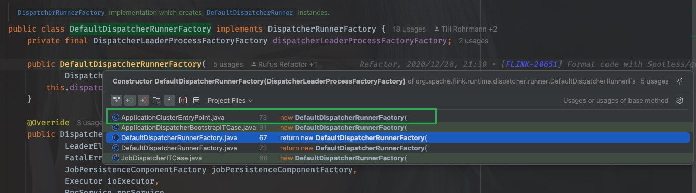


~~~java
@Override
protected DispatcherResourceManagerComponentFactory
        createDispatcherResourceManagerComponentFactory(final Configuration configuration) {
    return new DefaultDispatcherResourceManagerComponentFactory(
            new DefaultDispatcherRunnerFactory(
                    ApplicationDispatcherLeaderProcessFactoryFactory.create(
                            configuration, SessionDispatcherFactory.INSTANCE, program)),
            resourceManagerFactory,
            JobRestEndpointFactory.INSTANCE);
}
~~~

这里可以看到调用了ApplicationDispatcherLeaderProcessFactoryFactory的create方法进行创建，

~~~java
ApplicationDispatcherLeaderProcessFactoryFactory.create(
                            configuration, SessionDispatcherFactory.INSTANCE, program))
~~~

第二个参数传入的是一个`SessionDispatcherFactory`

进入create方法，其实就是创建了一个自己：ApplicationDispatcherLeaderProcessFactoryFactory

传入的dispatcherFactory是刚刚得到的SessionDispatcherFactory，到这里，差不多工作都做好了，我们都只是得到了一些列工厂的接口，并没有调用它们的方法，那么一定有一个地方进行抽象地调用。

我们再到`createDispatcherResourceManagerComponentFactory`这个方法被调用的地方，只有一个调用的地方

在ClusterEntryPoint里

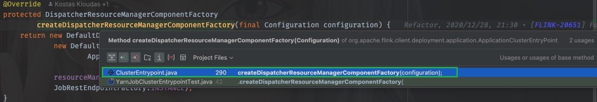

发现，又回到了我们之前去过的runCluster方法中

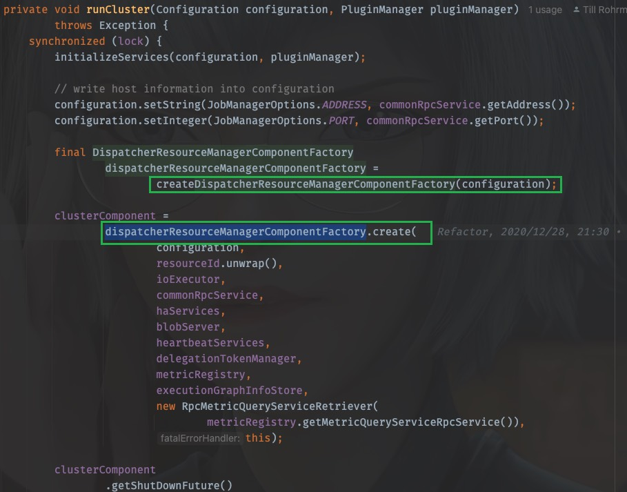

工厂在上面被创建，在下面被调用

同样的，进入create方法，实际执行是DefaultDispatcherResourceManagerComponentFactory.create，先前看到的dispatcherRunnerFactory其实就是

~~~java
new DefaultDispatcherRunnerFactory(
                        ApplicationDispatcherLeaderProcessFactoryFactory.create(
                                configuration, SessionDispatcherFactory.INSTANCE, program))
~~~

当调用`dispatcherRunnerFactory.createDispatcherRunner`时，

~~~java
dispatcherRunner =
        dispatcherRunnerFactory.createDispatcherRunner(
                highAvailabilityServices.getDispatcherLeaderElectionService(),
                fatalErrorHandler,
                new HaServicesJobPersistenceComponentFactory(highAvailabilityServices),
                ioExecutor,
                rpcService,
                partialDispatcherServices);
~~~

我们应该去看DefaultDispatcherRunnerFactory的createDispatcherRunner方法

~~~java
@Override
public DispatcherRunner createDispatcherRunner(
        LeaderElectionService leaderElectionService,
        FatalErrorHandler fatalErrorHandler,
        JobPersistenceComponentFactory jobPersistenceComponentFactory,
        Executor ioExecutor,
        RpcService rpcService,
        PartialDispatcherServices partialDispatcherServices)
        throws Exception {

    final DispatcherLeaderProcessFactory dispatcherLeaderProcessFactory =
            dispatcherLeaderProcessFactoryFactory.createFactory(
                    jobPersistenceComponentFactory,
                    ioExecutor,
                    rpcService,
                    partialDispatcherServices,
                    fatalErrorHandler);

    return DefaultDispatcherRunner.create(
            leaderElectionService, fatalErrorHandler, dispatcherLeaderProcessFactory);
}
~~~

好家伙！回到了开头，此时已经知道了dispatcherLeaderProcessFactoryFactory是什么。

就是刚才看到的ApplicationDispatcherLeaderProcessFactoryFactory，

那么当调用createFactory的时候就是调用`org.apache.flink.client.deployment.application.ApplicationDispatcherLeaderProcessFactoryFactory#createFactory`

最后创建了一个SessionDispatcherLeaderProcessFactory

~~~java
@Override
public DispatcherLeaderProcessFactory createFactory(
        JobPersistenceComponentFactory jobPersistenceComponentFactory,
        Executor ioExecutor,
        RpcService rpcService,
        PartialDispatcherServices partialDispatcherServices,
        FatalErrorHandler fatalErrorHandler) {

    final ApplicationDispatcherGatewayServiceFactory dispatcherServiceFactory =
            new ApplicationDispatcherGatewayServiceFactory(
                    configuration,
                    dispatcherFactory,
                    program,
                    rpcService,
                    partialDispatcherServices);

    return new SessionDispatcherLeaderProcessFactory(
            dispatcherServiceFactory,
            jobPersistenceComponentFactory,
            ioExecutor,
            fatalErrorHandler);
}
~~~

还记得吗？new ApplicationDispatcherGatewayServiceFactory传入的dispatcherFactory就是`SessionDispatcherFactory.INSTANCE`

那么，dispatcherLeaderProcessFactory其实就是SessionDispatcherLeaderProcessFactory


至此，创建dispatcherRunner需要的leaderElectionService和dispatcherLeaderProcessFactory都知道了，包洋葱结束。

再总结一下：

dispatcherRunnerFactory.createDispatcherRunner

- leaderElectionService
  - StandaloneHaServices
- dispatcherLeaderProcessFactory
  - SessionDispatcherLeaderProcessFactory


#### createAndStart

需要的都准备好了，我们进入create方法

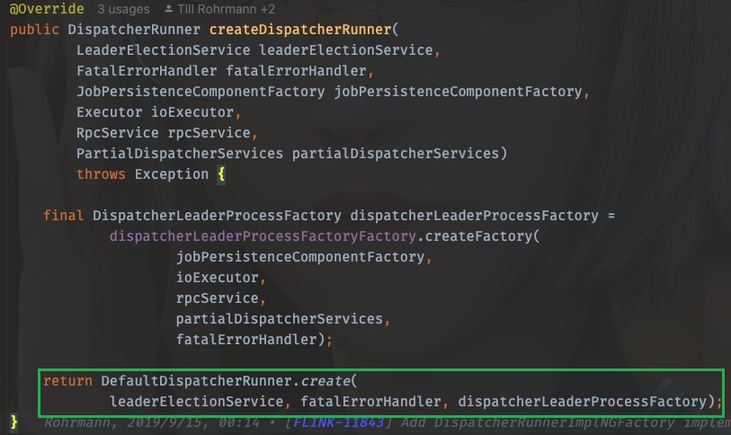


进入这个方法：

~~~java
public static DispatcherRunner create(
        LeaderElectionService leaderElectionService,
        FatalErrorHandler fatalErrorHandler,
        DispatcherLeaderProcessFactory dispatcherLeaderProcessFactory)
        throws Exception {
    final DefaultDispatcherRunner dispatcherRunner =
            new DefaultDispatcherRunner(
                    leaderElectionService, fatalErrorHandler, dispatcherLeaderProcessFactory);
    dispatcherRunner.start();
    return dispatcherRunner;
}
~~~

可以看到，dispatcherRunner在这里创建也在这里启动

终于！

OHHHHHHHHHHHHHHHHH！（表情包）

### 深入dispatcherRunner的启动

进入dispatcherRunner的start方法，

~~~java
void start() throws Exception {
    leaderElectionService.start(this);
}
~~~

这个leaderElectionService刚才我们已经知道了是StandaloneHaServices，那就去StandaloneHaServices中看看start()都做了啥

~~~java
@Override
public void start(LeaderContender newContender) throws Exception {
    if (contender != null) {
        // Service was already started
        throw new IllegalArgumentException(
                "Leader election service cannot be started multiple times.");
    }

    contender = Preconditions.checkNotNull(newContender);

    // directly grant leadership to the given contender
    contender.grantLeadership(HighAvailabilityServices.DEFAULT_LEADER_ID);
}
~~~

这个contender就是刚才的DefaultDispatcherRunner，上面是参数校验，直接看最后一样，这里调用了grantLeadership()，那么应该看DefaultDispatcherRunner的grantLeadership方法，OK，我们回去，又要开始剥洋葱了

~~~java
@Override
public void grantLeadership(UUID leaderSessionID) {
    runActionIfRunning(
            () -> {
                LOG.info(
                        "{} was granted leadership with leader id {}. Creating new {}.",
                        getClass().getSimpleName(),
                        leaderSessionID,
                        DispatcherLeaderProcess.class.getSimpleName());
                startNewDispatcherLeaderProcess(leaderSessionID);
            });
}
~~~

这里使用lambda表达式调用了，startNewDispatcherLeaderProcess(leaderSessionID)，直接进入

~~~java
private void startNewDispatcherLeaderProcess(UUID leaderSessionID) {
    stopDispatcherLeaderProcess();

    dispatcherLeaderProcess = createNewDispatcherLeaderProcess(leaderSessionID);

    final DispatcherLeaderProcess newDispatcherLeaderProcess = dispatcherLeaderProcess;
    FutureUtils.assertNoException(
            previousDispatcherLeaderProcessTerminationFuture.thenRun(
                    newDispatcherLeaderProcess::start));
}
~~~

这里是1、先创建(`createNewDispatcherLeaderProcess(leaderSessionID)`)2、再执行(`newDispatcherLeaderProcess::start`)

那就先看创建

~~~java
private DispatcherLeaderProcess createNewDispatcherLeaderProcess(UUID leaderSessionID) {
    final DispatcherLeaderProcess newDispatcherLeaderProcess =
            dispatcherLeaderProcessFactory.create(leaderSessionID);

    forwardShutDownFuture(newDispatcherLeaderProcess);
    forwardConfirmLeaderSessionFuture(leaderSessionID, newDispatcherLeaderProcess);

    return newDispatcherLeaderProcess;
}
~~~

这里调用了dispatcherLeaderProcessFactory的create方法，在前文已经知道，这个dispatcherLeaderProcessFactory由DefaultDispatcherRunner的构造方法传入，其实就是SessionDispatcherLeaderProcessFactory

那么我们直接看SessionDispatcherLeaderProcessFactory的create方法

从这里戳create方法进入接口类，ctrl+H找到实现类，戳SessionDispatcherLeaderProcessFactory进入

~~~java
@Override
public DispatcherLeaderProcess create(UUID leaderSessionID) {
    return SessionDispatcherLeaderProcess.create(
            leaderSessionID,
            dispatcherGatewayServiceFactory,
            jobPersistenceComponentFactory.createJobGraphStore(),
            jobPersistenceComponentFactory.createJobResultStore(),
            ioExecutor,
            fatalErrorHandler);
}
~~~

这里还需要传入一个dispatcherGatewayServiceFactory，由前文已经知道，它就是ApplicationDispatcherGatewayServiceFactory，而创建ApplicationDispatcherGatewayServiceFactory也需要一个dispatcherFactory，即是`SessionDispatcherFactory.INSTANCE`

继续进入SessionDispatcherLeaderProcess.create

~~~java
public static SessionDispatcherLeaderProcess create(
        UUID leaderSessionId,
        DispatcherGatewayServiceFactory dispatcherFactory,
        JobGraphStore jobGraphStore,
        JobResultStore jobResultStore,
        Executor ioExecutor,
        FatalErrorHandler fatalErrorHandler) {
    return new SessionDispatcherLeaderProcess(
            leaderSessionId,
            dispatcherFactory,
            jobGraphStore,
            jobResultStore,
            ioExecutor,
            fatalErrorHandler);
}
~~~

发现其实就是创建了一个自己：SessionDispatcherLeaderProcess，现在回去，现在只是分析了第一步”创建“，下一步是”执行“，回到

`org.apache.flink.runtime.dispatcher.runner.DefaultDispatcherRunner#startNewDispatcherLeaderProcess`方法中，目光聚焦于：`newDispatcherLeaderProcess::start`

戳start进入，发现是DispatcherLeaderProcess接口类

~~~java
interface DispatcherLeaderProcess extends AutoCloseableAsync {

    void start();

    UUID getLeaderSessionId();

    CompletableFuture<DispatcherGateway> getDispatcherGateway();

    CompletableFuture<String> getLeaderAddressFuture();

    CompletableFuture<ApplicationStatus> getShutDownFuture();
}
~~~

那么我们应该去实现类`org.apache.flink.runtime.dispatcher.runner.SessionDispatcherLeaderProcess`中一探究竟：

找到它的start()方法，发现没有，只能去它的父类中找start()方法，父类是AbstractDispatcherLeaderProcess

~~~java
@Override
public final void start() {
    runIfStateIs(State.CREATED, this::startInternal);
}
~~~

又是一个lambda表达式调用，进入startInternal

~~~java
private void startInternal() {
    log.info("Start {}.", getClass().getSimpleName());
    state = State.RUNNING;
    onStart();
}
~~~

进入onStart();发现是一个抽象方法

~~~java
protected abstract void onStart();
~~~

那这个时候就要去看子类了，回到SessionDispatcherLeaderProcess中找到`onStart()`方法

~~~java
@Override
protected void onStart() {
    startServices();

    onGoingRecoveryOperation =
            createDispatcherBasedOnRecoveredJobGraphsAndRecoveredDirtyJobResults();
}
~~~

两个方法，一个一个看，先看startServices();

~~~java
private void startServices() {
    try {
        jobGraphStore.start(this);
    } catch (Exception e) {
        throw new FlinkRuntimeException(
                String.format(
                        "Could not start %s when trying to start the %s.",
                        jobGraphStore.getClass().getSimpleName(), getClass().getSimpleName()),
                e);
    }
}
~~~

这一看，和jobGraph有关，先忽略

再看`createDispatcherBasedOnRecoveredJobGraphsAndRecoveredDirtyJobResults()`

~~~java
private CompletableFuture<Void>
        createDispatcherBasedOnRecoveredJobGraphsAndRecoveredDirtyJobResults() {
    final CompletableFuture<Collection<JobResult>> dirtyJobsFuture =
            CompletableFuture.supplyAsync(this::getDirtyJobResultsIfRunning, ioExecutor);

    return dirtyJobsFuture
            .thenApplyAsync(
                    dirtyJobs ->
                            this.recoverJobsIfRunning(
                                    dirtyJobs.stream()
                                            .map(JobResult::getJobId)
                                            .collect(Collectors.toSet())),
                    ioExecutor)
            .thenAcceptBoth(dirtyJobsFuture, this::createDispatcherIfRunning)
            .handle(this::onErrorIfRunning);
}
~~~

又是lambda调用，进入`this::createDispatcherIfRunning`

~~~java
private void createDispatcherIfRunning(
        Collection<JobGraph> jobGraphs, Collection<JobResult> recoveredDirtyJobResults) {
    runIfStateIs(State.RUNNING, () -> createDispatcher(jobGraphs, recoveredDirtyJobResults));
}
~~~

同lambda，进入`createDispatcher(jobGraphs, recoveredDirtyJobResults)`

~~~java
private void createDispatcher(
        Collection<JobGraph> jobGraphs, Collection<JobResult> recoveredDirtyJobResults) {

    final DispatcherGatewayService dispatcherService =
            dispatcherGatewayServiceFactory.create(
                    DispatcherId.fromUuid(getLeaderSessionId()),
                    jobGraphs,
                    recoveredDirtyJobResults,
                    jobGraphStore,
                    jobResultStore);

    completeDispatcherSetup(dispatcherService);
}
~~~

终于，在这里调用了dispatcherGatewayServiceFactory的create方法，这个dispatcherGatewayServiceFactory就是前文已经探究过的ApplicationDispatcherGatewayServiceFactory，

我们戳create进入，发现来到的是抽象类`org.apache.flink.runtime.dispatcher.runner.AbstractDispatcherLeaderProcess`中，来到了一个内部接口

~~~java
public interface DispatcherGatewayServiceFactory {
    DispatcherGatewayService create(
            DispatcherId dispatcherId,
            Collection<JobGraph> recoveredJobs,
            Collection<JobResult> recoveredDirtyJobResults,
            JobGraphWriter jobGraphWriter,
            JobResultStore jobResultStore);
}
~~~

ctrl+H找到实现类，找到create方法

~~~java
@Override
public AbstractDispatcherLeaderProcess.DispatcherGatewayService create(
        DispatcherId fencingToken,
        Collection<JobGraph> recoveredJobs,
        Collection<JobResult> recoveredDirtyJobResults,
        JobGraphWriter jobGraphWriter,
        JobResultStore jobResultStore) {

    final List<JobID> recoveredJobIds = getRecoveredJobIds(recoveredJobs);

    final Dispatcher dispatcher;
    try {
        dispatcher =
                dispatcherFactory.createDispatcher(
                        rpcService,
                        fencingToken,
                        recoveredJobs,
                        recoveredDirtyJobResults,
                        (dispatcherGateway, scheduledExecutor, errorHandler) ->
                                new ApplicationDispatcherBootstrap(
                                        application,
                                        recoveredJobIds,
                                        configuration,
                                        dispatcherGateway,
                                        scheduledExecutor,
                                        errorHandler),
                        PartialDispatcherServicesWithJobPersistenceComponents.from(
                                partialDispatcherServices, jobGraphWriter, jobResultStore));
    } catch (Exception e) {
        throw new FlinkRuntimeException("Could not create the Dispatcher rpc endpoint.", e);
    }

    dispatcher.start();

    return DefaultDispatcherGatewayService.from(dispatcher);
}
~~~

这里调用了dispatcherFactory.createDispatcher()来创建dispatcher，那么需要弄清楚这个dispatcherFactory是什么

一路按照调用链返回，先是来到了ApplicationDispatcherLeaderProcessFactoryFactory中

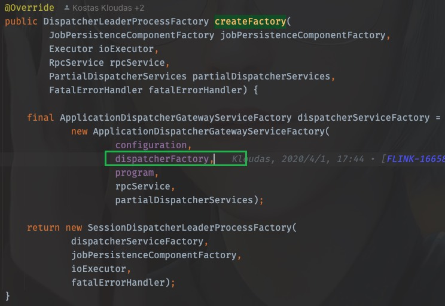


前文已经探究过，这里的dispatcherFactory就是`SessionDispatcherFactory.INSTANCE`

所以，这里dispatcherFactory.createDispatcher的调用，应该看SessionDispatcherFactory.INSTANCE中的createDispatcher方法，同样的，戳createDispatcher进去，ctrl+H也能找到实现类，从而找到createDispatcher方法

~~~java
@Override
public StandaloneDispatcher createDispatcher(
        RpcService rpcService,
        DispatcherId fencingToken,
        Collection<JobGraph> recoveredJobs,
        Collection<JobResult> recoveredDirtyJobResults,
        DispatcherBootstrapFactory dispatcherBootstrapFactory,
        PartialDispatcherServicesWithJobPersistenceComponents
                partialDispatcherServicesWithJobPersistenceComponents)
        throws Exception {
    // create the default dispatcher
    return new StandaloneDispatcher(
            rpcService,
            fencingToken,
            recoveredJobs,
            recoveredDirtyJobResults,
            dispatcherBootstrapFactory,
            DispatcherServices.from(
                    partialDispatcherServicesWithJobPersistenceComponents,
                    JobMasterServiceLeadershipRunnerFactory.INSTANCE,
                    CheckpointResourcesCleanupRunnerFactory.INSTANCE));
}
~~~

进入StandaloneDispatcher，发现继承自`org.apache.flink.runtime.dispatcher.Dispatcher`

到这里已经知道dispatcherFactory.createDispatcher创建的dispatcher即是StandaloneDispatcher

当调用dispatcher.start()时，运行的即是StandaloneDispatcher的start方法，而StandaloneDispatcher并没有这个方法体，所以方法来自于父类`org.apache.flink.runtime.dispatcher.Dispatcher`,

OK，戳一下dispatcher.start()，发现来到的是`org.apache.flink.runtime.rpc.RpcEndpoint`，并不是Dispatcher，

#### 启动JobMaster

**其实这里使用的是RPC调用，应该去看Dispatcher的onStart()方法**

~~~java
@Override
public void onStart() throws Exception {
    try {
        startDispatcherServices();
    } catch (Throwable t) {
        final DispatcherException exception =
                new DispatcherException(
                        String.format("Could not start the Dispatcher %s", getAddress()), t);
        onFatalError(exception);
        throw exception;
    }

    startCleanupRetries();
    startRecoveredJobs();

    this.dispatcherBootstrap =
            this.dispatcherBootstrapFactory.create(
                    getSelfGateway(DispatcherGateway.class),
                    this.getRpcService().getScheduledExecutor(),
                    this::onFatalError);
}
~~~

一个一个看之后，

1. startDispatcherServices()这个方法进行metrics的注册
2. startCleanupRetries()进行metrics的清理
3. startRecoveredJobs()运行job

~~~java
private void startRecoveredJobs() {
    for (JobGraph recoveredJob : recoveredJobs) {
        runRecoveredJob(recoveredJob);
    }
    recoveredJobs.clear();
}
~~~

runRecoveredJob

~~~java
private void runRecoveredJob(final JobGraph recoveredJob) {
    checkNotNull(recoveredJob);

    initJobClientExpiredTime(recoveredJob);

    try {
        runJob(createJobMasterRunner(recoveredJob), ExecutionType.RECOVERY);
    } catch (Throwable throwable) {
        onFatalError(
                new DispatcherException(
                        String.format(
                                "Could not start recovered job %s.", recoveredJob.getJobID()),
                        throwable));
    }
}
~~~

这里开始运行job

~~~java
runJob(createJobMasterRunner(recoveredJob), ExecutionType.RECOVERY);
~~~

先进入createJobMasterRunner(recoveredJob)

~~~java
private JobManagerRunner createJobMasterRunner(JobGraph jobGraph) throws Exception {
    Preconditions.checkState(!jobManagerRunnerRegistry.isRegistered(jobGraph.getJobID()));
    return jobManagerRunnerFactory.createJobManagerRunner(
            jobGraph,
            configuration,
            getRpcService(),
            highAvailabilityServices,
            heartbeatServices,
            jobManagerSharedServices,
            new DefaultJobManagerJobMetricGroupFactory(jobManagerMetricGroup),
            fatalErrorHandler,
            System.currentTimeMillis());
}
~~~

这里的jobManagerRunnerFactory是什么呢？有两种办法可以弄清楚，一是顺着调用链路一步一步回退，找到它被创建是赋值的地方，还可以是直接进入createJobManagerRunner，找到实现类，根据类名称进行判断

这里直接进入createJobManagerRunner，找到实现类，发现只有`org.apache.flink.runtime.dispatcher.JobMasterServiceLeadershipRunnerFactory`

这个时候可以看到它返回了一个`JobMasterServiceLeadershipRunner`


再回到runJob方法中，第一步就是启动的刚才得到的JobMasterServiceLeadershipRunner


至此，JobManager启动了！

进入start()方法，找到实现类的start()

~~~java
@Override
public void start() throws Exception {
    LOG.debug("Start leadership runner for job {}.", getJobID());
    leaderElectionService.start(this);
}
~~~

事情变得熟悉起来，再进leaderElectionService.start(this)，其实就是需要找Contender并分析grantLeadership方法的执行

那么直接找到LeaderContender的实现类，刚才得到的JobMasterServiceLeadershipRunner也是它的实现类，那么找到grantLeadership方法，注意这里的runIfStateRunning运行的是一个线程

~~~java
@Override
public void grantLeadership(UUID leaderSessionID) {
    runIfStateRunning(
            () -> startJobMasterServiceProcessAsync(leaderSessionID),
            "starting a new JobMasterServiceProcess");
}
~~~

进入startJobMasterServiceProcessAsync(leaderSessionID)

~~~java
@GuardedBy("lock")
private void startJobMasterServiceProcessAsync(UUID leaderSessionId) {
    sequentialOperation =
            sequentialOperation.thenRun(
                    () ->
                            runIfValidLeader(
                                    leaderSessionId,
                                    ThrowingRunnable.unchecked(
                                            () ->
                                                    verifyJobSchedulingStatusAndCreateJobMasterServiceProcess(
                                                            leaderSessionId)),
                                    "verify job scheduling status and create JobMasterServiceProcess"));

    handleAsyncOperationError(sequentialOperation, "Could not start the job manager.");
}
~~~

进入verifyJobSchedulingStatusAndCreateJobMasterServiceProcess(leaderSessionId)，

~~~java
@GuardedBy("lock")
private void verifyJobSchedulingStatusAndCreateJobMasterServiceProcess(UUID leaderSessionId)
        throws FlinkException {
    try {
        if (jobResultStore.hasJobResultEntry(getJobID())) {
            jobAlreadyDone(leaderSessionId);
        } else {
            createNewJobMasterServiceProcess(leaderSessionId);
        }
    } catch (IOException e) {
        throw new FlinkException(
                String.format(
                        "Could not retrieve the job scheduling status for job %s.", getJobID()),
                e);
    }
}
~~~

进入createNewJobMasterServiceProcess(leaderSessionId)

~~~java
@GuardedBy("lock")
private void createNewJobMasterServiceProcess(UUID leaderSessionId) throws FlinkException {
    Preconditions.checkState(jobMasterServiceProcess.closeAsync().isDone());

    LOG.info(
            "{} for job {} was granted leadership with leader id {}. Creating new {}.",
            getClass().getSimpleName(),
            getJobID(),
            leaderSessionId,
            JobMasterServiceProcess.class.getSimpleName());

    jobMasterServiceProcess = jobMasterServiceProcessFactory.create(leaderSessionId);

    forwardIfValidLeader(
            leaderSessionId,
            jobMasterServiceProcess.getJobMasterGatewayFuture(),
            jobMasterGatewayFuture,
            "JobMasterGatewayFuture from JobMasterServiceProcess");
    forwardResultFuture(leaderSessionId, jobMasterServiceProcess.getResultFuture());
    confirmLeadership(leaderSessionId, jobMasterServiceProcess.getLeaderAddressFuture());
}
~~~

进入jobMasterServiceProcessFactory.create(leaderSessionId)，找到实现类，就一个`org.apache.flink.runtime.jobmaster.factories.DefaultJobMasterServiceProcessFactory`

找到create方法

~~~java
@Override
public JobMasterServiceProcess create(UUID leaderSessionId) {
    return new DefaultJobMasterServiceProcess(
            jobId,
            leaderSessionId,
            jobMasterServiceFactory,
            cause -> createArchivedExecutionGraph(JobStatus.FAILED, cause));
}
~~~

进入DefaultJobMasterServiceProcess，

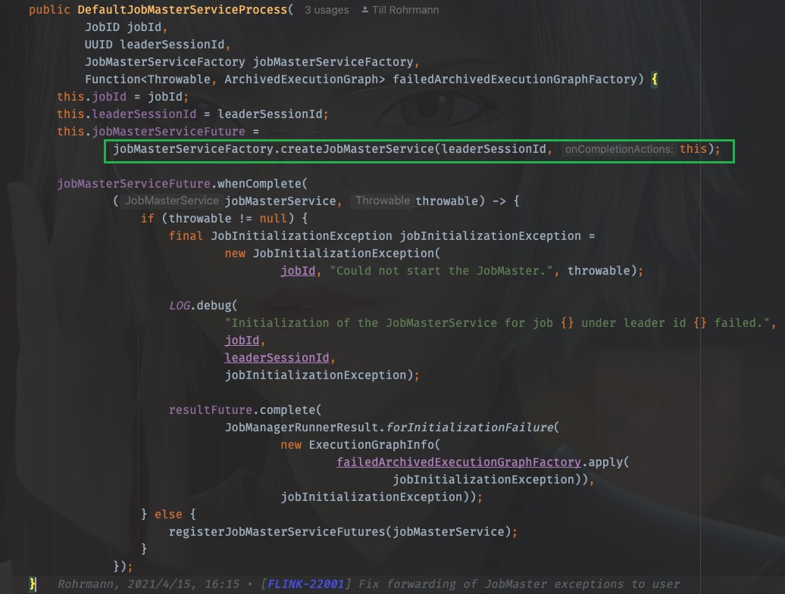

这里藏得比较隐蔽，我们需要看jobMasterServiceFactory.createJobMasterService(leaderSessionId, this)

戳进去同样是来到了接口类，我们找到实现类，就一个`org.apache.flink.runtime.jobmaster.factories.DefaultJobMasterServiceFactory`

找到createJobMasterService方法：

~~~java
@Override
public CompletableFuture<JobMasterService> createJobMasterService(
        UUID leaderSessionId, OnCompletionActions onCompletionActions) {

    return CompletableFuture.supplyAsync(
            FunctionUtils.uncheckedSupplier(
                    () -> internalCreateJobMasterService(leaderSessionId, onCompletionActions)),
            executor);
}
~~~

同样是lambda表达式调用，进入`internalCreateJobMasterService(leaderSessionId, onCompletionActions)`

~~~java
private JobMasterService internalCreateJobMasterService(
        UUID leaderSessionId, OnCompletionActions onCompletionActions) throws Exception {

    final JobMaster jobMaster =
            new JobMaster(
                    rpcService,
                    JobMasterId.fromUuidOrNull(leaderSessionId),
                    jobMasterConfiguration,
                    ResourceID.generate(),
                    jobGraph,
                    haServices,
                    slotPoolServiceSchedulerFactory,
                    jobManagerSharedServices,
                    heartbeatServices,
                    jobManagerJobMetricGroupFactory,
                    onCompletionActions,
                    fatalErrorHandler,
                    userCodeClassloader,
                    shuffleMaster,
                    lookup ->
                            new JobMasterPartitionTrackerImpl(
                                    jobGraph.getJobID(), shuffleMaster, lookup),
                    new DefaultExecutionDeploymentTracker(),
                    DefaultExecutionDeploymentReconciler::new,
                    BlocklistUtils.loadBlocklistHandlerFactory(
                            jobMasterConfiguration.getConfiguration()),
                    initializationTimestamp);

    jobMaster.start();

    return jobMaster;
}
~~~

OHHHHHHHHHH!

这里找到了JobMaster！创建JobMaster并启动它！


TODO: 后续TM的启动运行