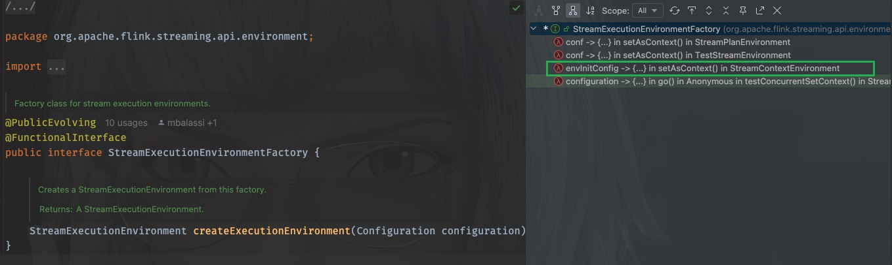

# [Flink源码]流式工厂模式与配置的延迟绑定

## 前言

在flink的源码中大量使用了设计模式，工厂模式当然不例外，下文从flink源码一处有意思的写法的代码块入手，分析设计模式中工厂模式与函数式方法结合的妙用，以回答我在之前的一篇文章([*Flink源码]Flink任务是如何启动的*)中提出的问题

为什么要有流式工厂，以及有什么好处

## Flink中的运行环境工厂

在flink中有有一个StreamExecutionEnvironmentFactory工厂类，负责生产StreamExecutionEnvironment，代码是这样的：

~~~java
/** Factory class for stream execution environments. */
@PublicEvolving
@FunctionalInterface
public interface StreamExecutionEnvironmentFactory {

    /**
     * Creates a StreamExecutionEnvironment from this factory.
     *
     * @return A StreamExecutionEnvironment.
     */
    StreamExecutionEnvironment createExecutionEnvironment(Configuration configuration);
}
~~~

它只有一个方法，并且该类使用了`@FunctionalInterface`注解标记，所以该接口实际上是一个函数式接口

它的调用发生在`org.apache.flink.streaming.api.environment.StreamExecutionEnvironment`这个类中，

~~~java
public static StreamExecutionEnvironment getExecutionEnvironment(Configuration configuration) {
        return Utils.resolveFactory(threadLocalContextEnvironmentFactory, contextEnvironmentFactory)
                .map(factory -> factory.createExecutionEnvironment(configuration))
                .orElseGet(() -> StreamExecutionEnvironment.createLocalEnvironment(configuration));
    }
~~~

> Creates an execution environment that represents the context in which the program is
> currently executed. If the program is invoked standalone, this method returns a local
> execution environment, as returned by {@link #createLocalEnvironment(Configuration)}.

这里是从threadLocalContextEnvironmentFactory和contextEnvironmentFactory解析出一个合适的工厂类，使用这个工厂创建一个StreamExecutionEnvironment对象，如果没有合适的工厂没能创建一个合适的StreamExecutionEnvironment对象，则调用createLocalEnvironment方法创建一个LocalStreamEnvironment

进入这个工厂的内部，看看实现类都有哪些，由于是函数式接口，那么实现类自然就是lambda方法，这里主要关注与StreamContextEnvironment，它也是生产环境代码主要执行的类

进入方法内部，工厂是这样被调用的：

~~~java
final StreamExecutionEnvironmentFactory factory =
        envInitConfig -> {
            final boolean programConfigEnabled =
                    clusterConfiguration.get(DeploymentOptions.PROGRAM_CONFIG_ENABLED);
            final List<String> programConfigWildcards =
                    clusterConfiguration.get(DeploymentOptions.PROGRAM_CONFIG_WILDCARDS);
            final Configuration mergedEnvConfig = new Configuration();
            mergedEnvConfig.addAll(clusterConfiguration);
            mergedEnvConfig.addAll(envInitConfig);
            return new StreamContextEnvironment(
                    executorServiceLoader,
                    clusterConfiguration,
                    mergedEnvConfig,
                    userCodeClassLoader,
                    enforceSingleJobExecution,
                    suppressSysout,
                    programConfigEnabled,
                    programConfigWildcards);
        };
initializeContextEnvironment(factory);
~~~

这里使用了lambda表达式`envInitConfig -> {}`,此表达式即调用了工厂的`createExecutionEnvironment(Configuration configuration)`方法，但此时，实际上得到的其实只是一个工厂StreamExecutionEnvironmentFactory，而不是我们需要的StreamExecutionEnvironment

## 细说延迟绑定

为什么说流式工厂做到了延迟绑定能，延迟绑定又是什么意思呢？我不这样写不也可以达到同样的目的吗？

问得好！

延迟绑定的意思是，代码的实际执行被推迟到代码的调用时，而不是在代码被定义时就确定。

可以看到，上面的工厂方法里需要的唯一一个参数是Configuration，当实际执行的时候根据上下文环境得到的Configuration来创建StreamExecutionEnvironment，而不需要在定义时就明确得到了Configuration，这里的Configuration允许在运行时动态更新。

如果不使用这样的方法，想要达到同样的目的的话，需要这样写（一个假想例子）：

传统工厂模式

~~~java
class ClassicFactory implements StreamExecutionEnvironmentFactory {
    private final Configuration baseConfig;
    private final ExecutorServiceLoader loader;

    // 必须在构造时固定所有依赖
    public ClassicFactory(Configuration config, ExecutorServiceLoader loader) {
        this.baseConfig = config;
        this.loader = loader;
    }

    @Override
    public StreamExecutionEnvironment create(Configuration runtimeConfig) {
        // 合并配置的逻辑仍然需要在这里实现
        Configuration merged = merge(baseConfig, runtimeConfig);
        return new StreamContextEnvironment(loader, merged);
    }
}

// 使用时：
Configuration initialConfig = loadInitialConfig();
ExecutorServiceLoader loader = getLoader();
StreamExecutionEnvironmentFactory factory = new ClassicFactory(initialConfig, loader);

// 稍后在业务代码中：
StreamExecutionEnvironment env = factory.create(userConfig);

~~~

Lambda工厂

~~~java
// 直接捕获当前上下文中的 configuration 和 executorServiceLoader
StreamExecutionEnvironmentFactory factory = conf -> {
    Configuration merged = new Configuration();
    merged.addAll(configuration); // 直接访问外部变量
    merged.addAll(conf);
    return new StreamContextEnvironment(
        executorServiceLoader, // 直接访问外部依赖
        merged
    );
};

~~~

在普通工厂中，一些配置和以来运行时状态的变量(如ExecutorServiceLoader)需要预先显示地指定，由构造参数传递进入类内部进行存储，而lambda工厂则不需要这样，直接在调用时即可以补货上下文环境中的配置变量，这其实说的是lambda工厂的**动态上下文环境捕获能力**

## 避免工厂子类的冗余

使用普通工厂，需要预先new好工厂的子类实现，必须有localEnv、remoteEnv、clusterEnv等，需要由工厂预先创建好，而使用lambda工厂则不需要这样，lambda工厂只是暂留了生成子类的逻辑，当需要时调用这个逻辑即可快速生成需要的子类，无需预先生成好

## 我的实际应用

在我的业务应用中有这样一段逻辑，需要根据不同的配置，选择不同的执行器去执行包含业务逻辑的代码

~~~java
public interface Executor {
    void execute(SparkSession sparkSession);
}
~~~

~~~java
private static Configuration configuration = null;

public static void main(String[] args) throws Exception {

    initSystem(args);

    for (String id : configId.split(",")) {
        initConfig(Long.parseLong(id));
        switch (app) {
            case "ck":
                Executor checkExecutor = new CheckExecutor(configuration);
                checkExecutor.execute(spark);
                break;
            case "hi":
                Executor pipelineExecutor = new ProcessExecutor(configuration);
                pipelineExecutor.execute(spark);
                break;
            case "wi":
                Executor flattenExecutor = new FlattenExecutor(configuration);
                flattenExecutor.execute(spark);
                break;
            default:
                throw new RuntimeException("You must specify one app name to run this program.");
        }
    }
}

void initConfig(){
    configuration = xxx; //更新configuration的功能模块
}
~~~

根据类命名可以联想，在实际传入不同的启动参数时，会进入不同分支，选择不同的executor执行用户代码，但是实际上，由于都是Executor的子类，上面的代码其实可以优化为

~~~java
public static void main(String[] args) throws Exception {

        initSystem(args);

        /* initialize executors */
        ArrayList<Executor> executors = Lists.newArrayList(
                new CheckExecutor(configuration),
                new ProcessExecutor(configuration),
                new FlattenExecutor(configuration)
        );

        for (String id : configId.split(",")) {
            initConfig(Long.parseLong(id));

            executors.forEach(executor -> {
                if (executor.accept(app)) executor.execute(spark);
            });
        }

        spark.stop();
        }
}
~~~

这样看起来清爽了很多，但是在实际运行过程中问题出现了：

由于Executor的子类在对象创建的时候，构造方法中会引用configuration进行一些配置参数的校验和赋值，而initConfig放在在for循环内部，也就是说configuration的更新要晚于对象的创建，所以运行时会报空指针或者其他参数校验错误的异常。

那么如何解决这个问题呢？

下面引入Lambda工厂，有请我们的ExecutorFactory

~~~java
@FunctionalInterface
public interface ExecutorFactory {
    Executor createExecutor(Configuration configuration);
}

~~~

这里使用`@FunctionalInterface`注解进行标记，表明该类是一个函数式接口，并且只有一个抽象方法，接收一个配置参数，之前提到过，Lambda工厂的创建只是暂留了创建子类的逻辑，在使用时按需生成子类，下面是优化后的版本

~~~java
public static void main(String[] args) throws Exception {

        initSystem(args);

        /* initialize executors, factory for lazy initialization */
        List<ExecutorFactory> executorFactories = Arrays.asList(
                CheckExecutor::new,
                ProcessExecutor::new,
                FlattenExecutor::new
        );

        for (String id : configId.split(",")) {
            initConfig(Long.parseLong(id));

            executorFactories.stream()
                    .map(factory -> factory.createExecutor(configuration))
                    .filter(executor -> executor.accept(app))
                    .forEach(executor -> executor.execute(spark));
        }

        spark.stop();
    }

~~~

以上代码中，预先构建了生成所有子类所需要的工厂，此时并没有生成子类对象，在for循环，也就是业务逻辑执行的代码块内部，随着configuration配置的动态更新完成，此时调用工厂的create方法创建子类对象，调用子类的accept方法，满足的子类则会被选择以执行业务逻辑。
