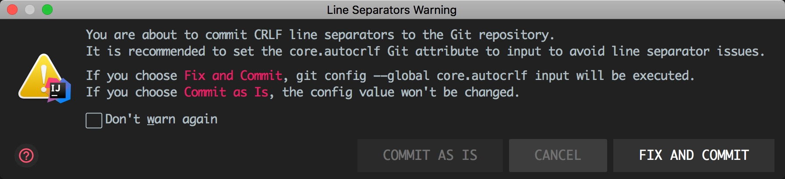

# [Git]Git问题

> 如题所述，下面的问题可能真的是git(*傻瓜*)问题

0、`git pull` 和`git clone`有什么区别？

- 从远程服务器克隆一个一模一样的版本库到本地,复制的是整个版本库，叫做clone.（clone是将一个库复制到你的本地，是一个本地从无到有的过程）
  - 使用该命令，会将远程的所有版本和分支都clone到本地。
- 从远程服务器获取到一个branch分支的更新到本地，并更新本地库，叫做pull.（pull是指同步一个在你本地有版本的库内容更新的部分到你的本地库）
  - 使用该命令，相当于做了`git fetch`和`git merge`的操作，也就是先拉取代码再合并到本地
  - 如果是刚介入项目，也就是你想参与项目并在某个分支上创建你自己的分支，你使用`git pull`是不行的，你<u>得使用`git clone`克隆一个完整的和远程仓库一样的版本库到本地</u>

1、git提交代码报“You are about to commit CRLF ...”错误

- 当我在把Windows写好的代码文件直接拷贝到macOS下面，进行提交代码的时候(在macOS上提交代码)，会报此错误

  

- 上面已经提示了点击Fix and commit可以解决
- 当然需要知道为什么了，去这里[一探究竟](https://www.bestgcc.cn/20191024110838.html)

