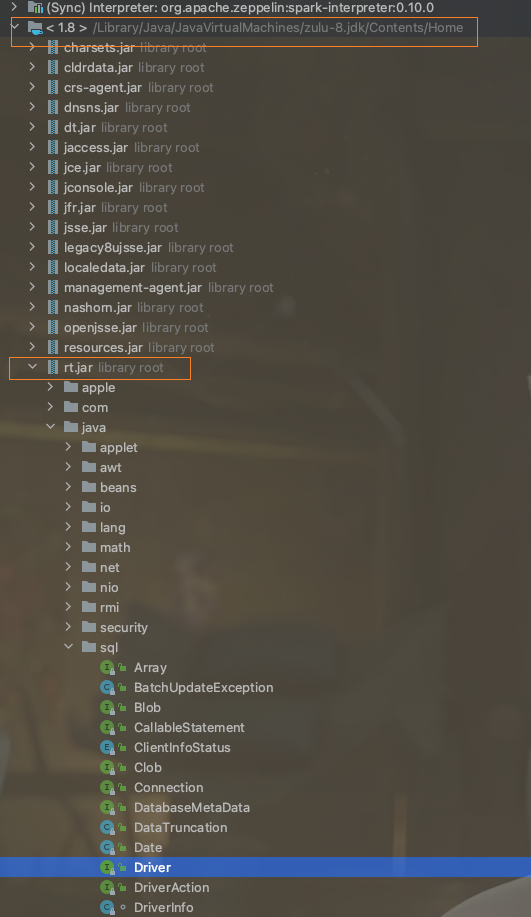
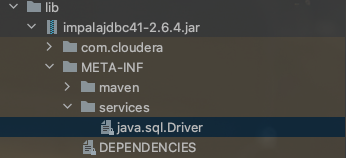

# [Java]SPI和责任链模式

## 什么是SPI？

> SPI即*Service Provider Interface*，服务提供者接口。`ServiceLoader`是它的核心类。

下面先通过一个代码案例来讲解`ServiceLoader`如何使用，再讲解一下它的应用之处。

1、这里先准备一个接口，接收一个参数表名动作调用者，接口的功能是打招呼。

~~~java
public interface Greet {
    //谁说话
    void say(String who);
}
~~~

2、好了，有了接口，接下来再来两个实现类，

~~~java
//Hello
public class HelloGreet implements Greet {
    @Override
    public void say(String who) {
        System.out.println(who + ": Hello sir!");
    }
}
//Morning
public class MorningGreet implements Greet {
    @Override
    public void say(String who) {
        System.out.println(who + ": Morning sir!");
    }
}
~~~

3、我们在项目的resources目录下新建一个文件夹为`META-INF/services`,里面加入一个文件，名为Greet接口的**全限定类名**，内容为实现了该接口的类的**全限定类名**，一行一个

~~~java
me.roohom.inter.impl.HelloGreet
me.roohom.inter.impl.MorningGreet
~~~

好了，准备完毕，上主程序调用一下：

~~~java
public static void main(String[] args) {
    ServiceLoader<Greet> greets = ServiceLoader.load(Greet.class);
    for (Greet greet : greets) {
        greet.say("A boy");
    }
}
~~~

结果：

~~~java
A boy: Hello sir!
A boy: Morning sir!
~~~

上面就是一个使用了SPI的小案例，SPI的使用场景很多，JDBC就是一个典型的应用，总结规律有如下：

- 1、需要定义一个接口。
- 2、接口提供商需要实现第1步中的接口。
- 3、接口提供商在META-INF/services目录下建立一个文本文件，文件名是第1步中定义的接口的全限定类名，文本内容是接口的实现类的全限定类名，每个不同的实现占独立的一行。
- 4、使用者将第3步中接口提供商提供好的jar引入，使用ServiceLoader加载接口类，获取接口的实现的实例迭代器。

## JDBC的SPI应用

### 一 MySQL的案例

我们在一个项目的pom中引入mysql的依赖

~~~xml
<dependency>
    <groupId>mysql</groupId>
    <artifactId>mysql-connector-java</artifactId>
    <version>8.0.28</version>
</dependency>
~~~

随后我们就可以在项目的依赖中看到`mysql-connector-java`的jar，进入该jar的代码中，进去`META-INF/services`文件夹中可以看到一个文件名为`java.sql.Driver`的文件，内容为

~~~ini
com.mysql.cj.jdbc.Driver
~~~

再戳到该类中可以看到它的代码如下:

~~~java
public class Driver extends NonRegisteringDriver implements java.sql.Driver {
    //
    // Register ourselves with the DriverManager
    //
    static {
        try {
            java.sql.DriverManager.registerDriver(new Driver());
        } catch (SQLException E) {
            throw new RuntimeException("Can't register driver!");
        }
    }

    /**
     * Construct a new driver and register it with DriverManager
     * 
     * @throws SQLException
     *             if a database error occurs.
     */
    public Driver() throws SQLException {
        // Required for Class.forName().newInstance()
    }
}
~~~

发现它实现了`java.sql.Driver`这个接口，而这个接口来自于java核心类库`rt.jar`

### 二 ImpalaJDBC的案例

同样地，我们引入impalajdbc的依赖，这个包不好找，如果找不到直接去下载它的jar然后引入到项目中，这里只做分析

可以看到一个和MySQL jdbc的jar包一样的东西，进去看看内容：

~~~ini
com.cloudera.impala.jdbc41.Driver
~~~

定位到该类，发现它继承自`JDBC41AbstractDriver`,再往上追溯，可以看到`com.cloudera.impala.jdbc.jdbc41.JDBC41AbstractDriver`继承自`com.cloudera.impala.jdbc.common.AbstractDriver`，`AbstractDriver`又继承自`com.cloudera.impala.jdbc.common.BaseConnectionFactory`并实现了`java.sql.Driver`，而这个driver就是Java核心类库的rt.jar中的那个Driver。

通过以上可以看到，如果我们想要定义一个自己的JDBC方式，那我们应该按照先前说的规律，

- 先去实现`java.sql.Driver`这个接口，实现自己业务逻辑
- 将我们的实现类打包成一个jar，并且jar中需要包含一个`META-INF/services`文件夹，里面包含一个我们所实现的接口的全限定类名，该文件的内容为我们所自定义的实现类的全限定类名
- 将上一步打好的jar，提供给使用者

## 巧用ServceLoader实现责任链模式

先看一段同本文开头部分相似的代码。

有一个接口用来负责定义处理请求的方法，accept用来判断该实现类是否能够处理请求，process用来做实际的处理

~~~java
public interface IProcess {
    //判断是否能处理
    boolean accept(String p);
    void process();
}

//实现类：

public class AProcess implements IProcess {
    @Override
    public boolean accept(String p) {
        return p.equals("A");
    }

    @Override
    public void process() {
        System.out.println("Process A: Minus 100");
    }
}

public class BProcess implements IProcess {
    @Override
    public boolean accept(String p) {
        return p.equals("B");
    }

    @Override
    public void process() {
        System.out.println("B Process: add 99");
    }
}
~~~

假设现在我们的条件为B，上我们的main调用一下看看

~~~java
public static void main(String[] args) {
    ServiceLoader<IProcess> processors = ServiceLoader.load(IProcess.class);
    for (IProcess processor : processors) {
        if (processor.accept("B"))
            processor.process();
    }
}
~~~

得到的结果

~~~ini
B Process: add 99

Process finished with exit code 0
~~~

以上就是类责任链模式，它是用ServiceLoader实现的，同样我们需要在resources目录下指定谁实现了IProcess这个接口

> 责任链模式是一种[设计模式](https://baike.baidu.com/item/设计模式/1212549)。在责任链模式里，很多对象由每一个对象对其下家的引用而连接起来形成一条链。请求在这个链上传递，直到链上的某一个对象决定处理此请求。发出这个请求的客户端并不知道链上的哪一个对象最终处理这个请求，这使得系统可以在不影响客户端的情况下动态地重新组织和分配责任。

那么，看到这些，就要有一个灵魂发问了，**搞这玩意儿有啥用呢？**

有用！试想一下我们有这样一种业务场景，用户发出A B C D等等不同的业务处理请求，我们需要针对不同的请求去做不同的响应处理，如果是采用“人工智能”的写法，应该是以下这种：

~~~java
if (conndition.equales("A")) {
    doSomeThing1();
}
if (conndition.equales("B")) {
    doSomeThing2();
}
if (conndition.equales("C")) {
    doSomeThing3();
}
if (conndition.equales("D")) {
    doSomeThing4();
}
if (conndition.equales("E")) {
    doSomeThing5();
}
...
~~~

只要能预料到用户的请求，并做相应的处理，这样写也OK，未尝不可，可是随着业务越来越丰富，代码量也就随之越来越大，并且随着业务逻辑复杂性的提高，if条件里面可能还会嵌套条件，甚至可能三重嵌套多重嵌套，那么这种写法将不便于人的维护，责任链模式就派上用场了。

让我们再去看看一些`java.sql.Driver`的源码片段

~~~java
public interface Driver {

    /**
     * ...
     */
    Connection connect(String url, java.util.Properties info)
        throws SQLException;

    /**
     * Retrieves whether the driver thinks that it can open a connection
     * to the given URL.  Typically drivers will return <code>true</code> if they
     * understand the sub-protocol specified in the URL and <code>false</code> if
     * they do not.
     *
     * @param url the URL of the database
     * @return <code>true</code> if this driver understands the given URL;
     *         <code>false</code> otherwise
     * @exception SQLException if a database access error occurs or the url is
     * {@code null}
     */
    boolean acceptsURL(String url) throws SQLException;
}    
~~~

上面有一个acceptsURL方法用来处理接收到的URL是否能被该实现类所处理，看到这个，再对比我们定义的IProcess接口也有一个accept方法用来处理实现类是否能处理接收到的请求，这其实是类似的。

