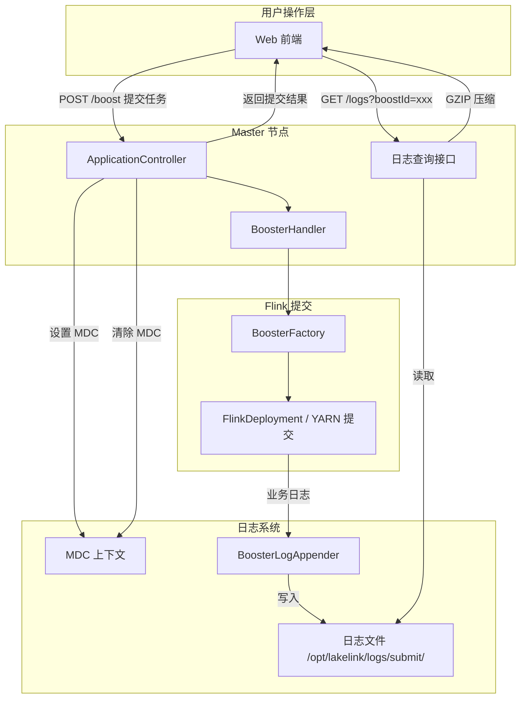
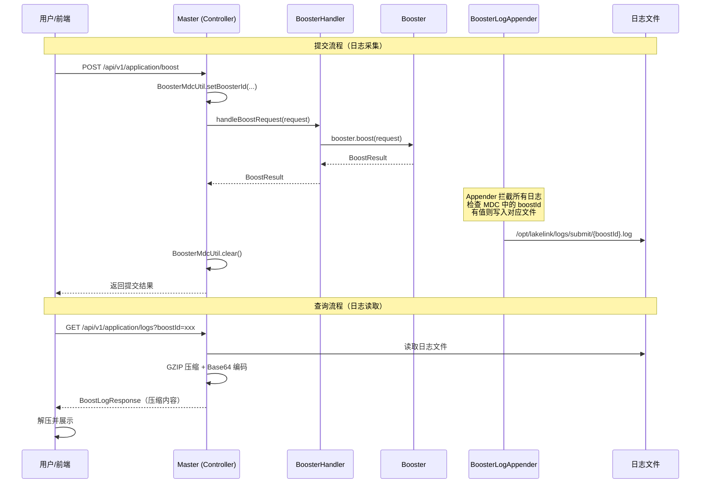

# [Logback]特定业务日志重定向

## 1. 背景

### 1.1 问题描述

最近在开发公司内部一个跨数据湖的数据传输平台，平台基于flink，使用flink的多数据源读取能力，采用 Master-Worker 架构。用户通过 Web UI 提交 Flink 任务，请求链路为：

```
前端 → Master → Worker（执行 Flink 提交）→ 返回结果 → Master → 前端
```

这条链路已经完整实现，前端能拿到最终的提交结果（成功/失败/应用ID等）。但存在一个关键问题：**Worker 在执行 Flink 提交过程中产生的中间日志（如"正在生成 CR"、"正在提交到 Operator"、提交Yarn的过程中的参数解析等），前端无法获取**。

用户遇到提交失败时只能看到最终结果，无法看到失败过程中发生了什么，给问题排查带来很大困难。


**本文仅探讨解决方案和实现思路，基于此的深入优化不深入讨论。**

### 1.2 目标

增加一条日志查看通路，让用户能够通过 Web UI 查看 Worker 在任务提交过程中产生的完整日志。

## 2. 整体架构

### 2.1 系统架构



### 2.2 请求链路



## 3. 技术原理

### 3.1 MDC（Mapped Diagnostic Context）

MDC 是 SLF4J/Logback 提供的诊断上下文机制，核心特性：

- **基于 ThreadLocal**：每个线程独立的键值对存储，天然线程隔离
- **自动传递到日志事件**：Logback 在格式化日志时可读取 MDC 中的值
- **零侵入**：业务代码无需感知 MDC 的存在，日志采集对业务完全透明

在任务提交场景中：
1. Controller 入口处设置 `MDC.put("boostId", "my-app-123")`
2. 同步调用链中的所有日志事件都携带这个 boostId
3. Controller 出口（finally 块）清除 `MDC.remove("boostId")`
4. 多任务并发提交时，不同线程的 MDC 互不干扰

### 3.2 自定义 Logback Appender

Logback 的 Appender 是日志事件的输出目标。通过自定义 Appender，可以拦截所有日志事件并按条件写入文件。

继承 `UnsynchronizedAppenderBase<ILoggingEvent>` 而非 `FileAppender`，原因是：
- `FileAppender` 内部持有长期文件句柄，不适合多文件场景
- 自定义 Appender 可以实现"每条日志 open → write → flush → close"的策略，避免文件句柄泄漏

### 3.3 GZIP 压缩传输

日志内容可能几百行，直接放在 JSON 响应中体积较大。采用 GZIP + Base64 方案：

- GZIP 压缩可将文本体积缩小 70%-90%
- Base64 编码将二进制数据转为 ASCII，安全嵌入 JSON 字段
- 前端使用 `pako` 库解压，兼容性好

## 4. 实现细节

### 4.1 MDC 工具类

**文件**: `utils/BoosterMdcUtil.java`

```java
public class BoosterMdcUtil {

    private static final String MDC_KEY = "boostId";

    public static void setBoosterId(String submissionId) {
        MDC.put(MDC_KEY, submissionId);
    }

    public static String getBoosterId() {
        return MDC.get(MDC_KEY);
    }

    public static void clear() {
        MDC.remove(MDC_KEY);
    }
}
```

### 4.2 自定义 Appender

**文件**: `admin/logs/BoosterLogAppender.java`

核心逻辑：

```java
public class BoosterLogAppender extends UnsynchronizedAppenderBase<ILoggingEvent> {

    private static final String MDC_KEY = "boostId";
    private String logDir = "/logs/";
    private String pattern = "%d{yyyy-MM-dd HH:mm:ss.SSS} [%thread] %-5level %logger{36} - %msg%n";
    private PatternLayout layout;

    @Override
    public void start() {
        // 确保日志目录存在
        Path dir = Paths.get(logDir);
        if (!Files.exists(dir)) {
            Files.createDirectories(dir);
        }
        // 初始化 PatternLayout
        layout = new PatternLayout();
        layout.setContext(getContext());
        layout.setPattern(pattern);
        layout.start();
        super.start();
    }

    @Override
    protected void append(ILoggingEvent event) {
        // 快速过滤：没有 boostId 的日志直接丢弃
        String boostId = MDC.get(MDC_KEY);
        if (boostId == null || boostId.isEmpty()) {
            return;
        }
        // 安全校验：防止路径穿越攻击
        String safeId = boostId.replaceAll("[^a-zA-Z0-9\\-_]", "_");
        Path filePath = Paths.get(logDir, safeId + ".log");
        // open → write → flush → close
        try (BufferedWriter writer = Files.newBufferedWriter(filePath,
                StandardOpenOption.CREATE, StandardOpenOption.APPEND)) {
            String line = layout.doLayout(event);
            writer.write(line);
            writer.flush();
        } catch (IOException e) {
            addError("Failed to write submission log: boostId=" + boostId, e);
        }
    }
}
```

**设计要点**：

| 设计决策 | 说明 |
|---|---|
| 继承 `UnsynchronizedAppenderBase` | 避免 `FileAppender` 的长连接机制 |
| 每条日志 open/write/close | 不持有长期文件句柄，文件内容自然固定 |
| MDC 快速过滤 | 没有 boostId 的日志直接 return，性能开销极低 |
| 路径穿越防护 | `safeId` 正则过滤，防止 `../` 攻击 |
| 目录自动创建 | `start()` 中检查并创建目录，失败则 Appender 不激活 |

### 4.3 Controller 集成

**文件**: `admin/controller/ApplicationController.java`

```java
@PostMapping("/boost")
public ResponseEntity<BoostResult<?>> boost(@RequestBody BoostRequest request) {
    // 构造 boostId: {applicationName}-{boostId}
    BoosterMdcUtil.setBoosterId(
            request.getApplicationName()
                    + "-"
                    + (request.getBoostId() == null ? "" : request.getBoostId().toString()));
    try {
        BoostResult<?> result = boosterHandler.handleBoostRequest(request);
        // ...
    } finally {
        BoosterMdcUtil.clear(); // 必须在 finally 中清除
    }
}
```

### 4.4 日志查询接口

**文件**: `admin/controller/ApplicationController.java`

```java
@GetMapping("/logs")
public ResponseEntity<BoostLogResponse> getLogs(@RequestParam String boostId) {
    // 安全校验
    String safeBoostId = boostId.replaceAll("[^a-zA-Z0-9\\-_]", "_");
    Path logFile = Paths.get(boosterLogDir, safeBoostId + ".log");

    if (!Files.exists(logFile)) {
        return ResponseEntity.ok(
                BoostLogResponse.error(boostId, "Log file not found: " + safeBoostId + ".log"));
    }

    String content = new String(Files.readAllBytes(logFile), StandardCharsets.UTF_8);
    String compressed = GzipUtils.compress(content);
    return ResponseEntity.ok(BoostLogResponse.success(boostId, compressed));
}
```

### 4.5 GZIP 压缩工具

**文件**: `utils/GzipUtils.java`

```java
public final class GzipUtils {

    public static String compress(String text) throws IOException {
        ByteArrayOutputStream byteStream = new ByteArrayOutputStream();
        try (GZIPOutputStream gzipStream = new GZIPOutputStream(byteStream)) {
            gzipStream.write(text.getBytes(StandardCharsets.UTF_8));
        }
        return Base64.getEncoder().encodeToString(byteStream.toByteArray());
    }

    public static String decompress(String compressed) throws IOException {
        byte[] decoded = Base64.getDecoder().decode(compressed);
        ByteArrayInputStream byteStream = new ByteArrayInputStream(decoded);
        try (GZIPInputStream gzipStream = new GZIPInputStream(byteStream);
             ByteArrayOutputStream output = new ByteArrayOutputStream()) {
            byte[] buffer = new byte[256];
            int len;
            while ((len = gzipStream.read(buffer)) != -1) {
                output.write(buffer, 0, len);
            }
            return output.toString(StandardCharsets.UTF_8.name());
        }
    }
}
```

## 5. 配置说明

### 5.1 logback-spring.xml

在 logback 配置中注册自定义 Appender：

```xml
<!-- 提交日志目录，可通过 application.properties 覆盖 -->
<springProperty scope="context" name="BOOSTER_LOG_DIR"
                source="booster.log.dir" defaultValue="/opt/lakelink/logs/submit"/>

<!-- 注册自定义 Appender -->
<appender name="BOOSTER_LOG"
          class="com.unicdata.lakelink.admin.logs.BoosterLogAppender">
    <logDir>${BOOSTER_LOG_DIR}</logDir>
    <pattern>%d{yyyy-MM-dd HH:mm:ss.SSS} [%thread] %-5level %-60logger{60} - %msg%n</pattern>
</appender>

<!-- 挂载到 root logger -->
<root level="info">
    <appender-ref ref="STDOUT"/>
    <appender-ref ref="pclog"/>
    <appender-ref ref="BOOSTER_LOG"/>
</root>
```

### 5.2 application.properties

```properties
# 日志文件存储目录（与 logback-spring.xml 中的 defaultValue 保持一致）
booster.log.dir=/path/to/logs/submit
```

同样也可以使用yaml配置，

~~~yaml
booster:
  log:
    dir: /opt/lakelink/logs/submit
~~~

注意，我们已经在logback-spring.xml中定义了

~~~xml
<!-- 提交日志目录，可通过 application.properties 覆盖 -->
<springProperty scope="context" name="BOOSTER_LOG_DIR"
                source="booster.log.dir" defaultValue="/opt/lakelink/logs/submit"/>
~~~

这样logback的配置就会读取Spring的配置

### 5.3 目录权限

容器内需要确保日志目录可写：

```dockerfile
RUN mkdir -p /opt/lakelink/logs/submit && \
    chown -R flink:flink /opt/lakelink/logs
```


### 6. 总结

以上探讨了基于logback将特定逻辑代码段的业务日志重定向到特定文件的方案，对于原本业务逻辑0侵入，无危害，并且方案可以推广，如果需要查询增量日志还可以将日志重定向到其他系统，比如redis等，常见的就是重定向到kafka等中间件，或者是ES可供搜索分析查询。


AI发展势头太猛，用得好，效率大大提升！选个好的模型，多用为妙呀~
