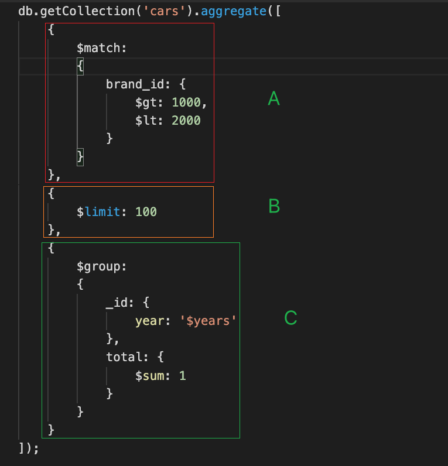
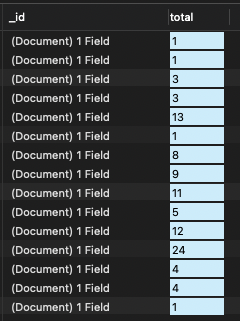

# [MongoDB]MongoDB基本查询

## 说在前面

> 与初学不同，下面着重将aggregate查询操作，实现简单的noSQL查询。

MongoDB为一个被广泛使用非结构化数据库，查询速度快效率高，由于是非结构化，就不能使用SQL去自由查询，需要学习MongoDB特有的查询语法。

## 操练起来

### 简单查询

TODO: 待补充

### 高级查询

为了学习MongoDB的基本查询语法，带着疑问学习，下面从基础开始一步一步得到一条类似于SQL中：

~~~SQL
SELECT year,COUNT(1) AS total
FROM (
SELECT *
FROM cars
WHERE brand_id > 1000 AND brand_id < 2000
LIMIT 100
) AS a
GROUP BY year
~~~

上面在SQL中为一个较为简单却复杂(哟，这句话带一点哲理在里面)的聚合查询，需要使用MongoDB的aggregate去聚合查询。

Aggregate操作将MongoDB的文档经一个管道处理完之后数据输出到下一个管道，再由下一个管道进行处理

想要实现上述SQL实现的功能的MongoDB的查询语句为:

~~~sql
db.getCollection('cars').aggregate([
    {
        $match: 
        {
            brand_id: {
                $gt: 1000,
                $lt: 2000
            }
        }
    },
    {
        $limit: 100
    },
    {
        $group: 
        {
            _id: {
                year: '$years'
            },
            total: {
                $sum: 1
            }
        }
    }
]);

~~~

如下图，我们将该语句拆开来看

上面的`db.getCollection('cars').aggregate()`为固定写法，内含有三个管道A、B、C,在执行时，A处理完的数据输出到B被B执行，B执行完得到的数据输出到C被C处理。

- 1、在管道A中，匹配`brand_id`大于1000并且小于2000的所有数据，对应于SQL语句`WHERE brand_id > 1000 AND brand_id < 2000`

- 2、经1得到数据输出到管道B，将数据随机筛选得到100条
- 3、经2得到的数据进入管道C，在C中，数据被根据字段`years`分组，并且命别名为`year`，每取到一个值就被加1，得到的累计数值被命别名为`total`。(`$years`为取字段`years`的值，目的为了分组，`$sum`为求和操作)

以上输出的结果为：

实际形式为：

~~~ini
// 1
{
    "_id": {
        "year": "2007"
    },
    "total": 1
}

// 2
{
    "_id": {
        "year": "2005"
    },
    "total": 1
}

// 3
{
    "_id": {
        "year": "2018"
    },
    "total": 3
}

// 4
{
    "_id": {
        "year": "2008"
    },
    "total": 3
}

// 5
{
    "_id": {
        "year": "2014"
    },
    "total": 13
}

// 6
{
    "_id": {
        "year": "2009"
    },
    "total": 1
}

// 7
{
    "_id": {
        "year": "2016"
    },
    "total": 8
}

// 8
{
    "_id": {
        "year": "2012"
    },
    "total": 9
}

// 9
{
    "_id": {
        "year": "2017"
    },
    "total": 11
}

// 10
{
    "_id": {
        "year": "2004"
    },
    "total": 5
}

// 11
{
    "_id": {
        "year": "2015"
    },
    "total": 12
}

// 12
{
    "_id": {
        "year": "2013"
    },
    "total": 24
}

// 13
{
    "_id": {
        "year": "2011"
    },
    "total": 4
}

// 14
{
    "_id": {
        "year": "2019"
    },
    "total": 4
}

// 15
{
    "_id": {
        "year": "2010"
    },
    "total": 1
}

~~~

