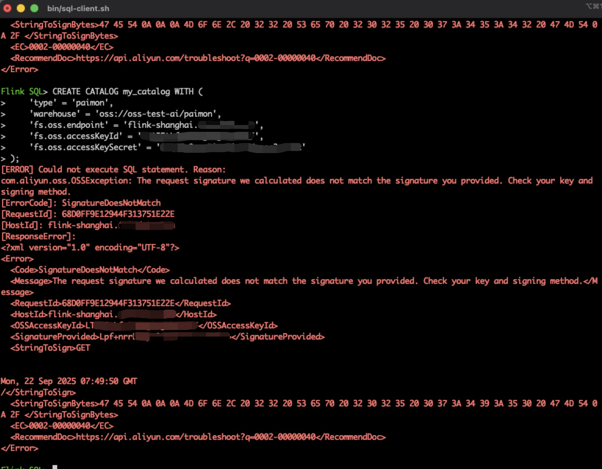

# [Paimon]Flink读写Nginx代理的OSS上的Paimon表

## 概要

有这样一种场景，在阿里云环境中有一个EMR集群，其存储采用OSS，其上构建了Paimon表，而在公司OA环境有另一套集群，如果想要OA环境的Flink直接读写阿里云环境的Paimon表，需要涉及到网络环境的打通，还可能需要打通防火墙，并且，如果EMR集群动态扩容，还可能涉及到网络策略的更新，较为复杂，维护成本也高。于是，我们内部提出了使用Nginx去代理OSS，即在一台机器上部署Nginx，来自Flink的请求将会被转发到对应的OSS上，只需要开通一台机器的网络和防火墙，维护较为简单。

经过实际测试，此方案可行。

## 部署与配置Nginx

Nginx的配置是本方案的核心。

~~~conf
user nginx;
worker_processes auto;
error_log /var/log/nginx/error.log;
pid /run/nginx.pid;

# Load dynamic modules. See /usr/share/doc/nginx/README.dynamic.
include /usr/share/nginx/modules/*.conf;

events {
    worker_connections 1024;
}

http {
    log_format  main  '$remote_addr - $remote_user [$time_local] "$request" '
                      '$status $body_bytes_sent "$http_referer" '
                      '"$http_user_agent" "$http_x_forwarded_for"';

    access_log  /var/log/nginx/access.log  main;

    sendfile            on;
    tcp_nopush          on;
    tcp_nodelay         on;
    keepalive_timeout   65;
    types_hash_max_size 4096;

    include             /etc/nginx/mime.types;
    default_type        application/octet-stream;

    server {
        listen       80;
        server_name  flink-shanghai.company.com;
        location / {
              proxy_pass https://oss-test-ai.oss-cn-shanghai-internal.aliyuncs.com; 
              proxy_set_header Authorization $http_authorization;
              proxy_pass_request_headers on;
              proxy_set_header X-Real-IP $remote_addr;
              proxy_set_header X-Forwarded-For $proxy_add_x_forwarded_for;
              proxy_connect_timeout 1000s;
              proxy_send_timeout 300s;
              proxy_read_timeout 300s;
        }

    }

}
~~~

在上述配置中，`proxy_set_header Authorization $http_authorization;`表示将请求头原封不动转发至服务端，没有声明该配置时，我们遇到了如下错误：

验签失败，打开上面最后给到的地址定位原因

> 使用API接口或者SDK访问OSS时，客户端需要携带签名信息以供OSS服务端进行身份认证。如果服务器返回如上所示的响应，说明您在请求中提供的签名与服务端计算的不一致，导致请求被拒绝。
>
> 如果业务场景允许，推荐您使用SDK访问OSS，免去手动计算签名的过程。具体步骤，请参见[使用阿里云SDK发起请求](https://help.aliyun.com/document_detail/386432.html)。

这里提到用SDK访问，可是我们目前就是使用SDK的，怎么还会验签失败？

这里推测，如果不使用SDK，需要自己根据特定方法生成前面，包含在请求头中，一并提交请求，如果使用SDK则会自动计算这个签名。那么还是不行的原因，一定是nginx没有转发过去，所以在上述的nginx配置中加入了`proxy_set_header Authorization $http_authorization;`，随后在本地环境成功提交了FlinkSQL

## Flink环境配置

### 依赖引入

对于flink如果想要成功读取oss，则需要提供以下lib

~~~shell
-rw-r--r--@ 1 roohom  staff   192K 12月 20  2023 flink-cep-1.18.1.jar
-rw-r--r--@ 1 roohom  staff   541K 12月 20  2023 flink-connector-files-1.18.1.jar
-rw-r--r--@ 1 roohom  staff   100K 12月 20  2023 flink-csv-1.18.1.jar
-rw-r--r--@ 1 roohom  staff   121M 12月 20  2023 flink-dist-1.18.1.jar
-rw-r--r--@ 1 roohom  staff   198K 12月 20  2023 flink-json-1.18.1.jar
-rw-r--r--@ 1 roohom  staff    20M 12月 20  2023 flink-scala_2.12-1.18.1.jar
-rw-r--r--@ 1 roohom  staff    41M  9月 19 16:39 flink-shaded-hadoop-2-uber-2.8.3-10.0.jar
-rw-r--r--@ 1 roohom  staff    15M 12月 20  2023 flink-table-api-java-uber-1.18.1.jar
-rw-r--r--@ 1 roohom  staff    36M 12月 20  2023 flink-table-planner-loader-1.18.1.jar
-rw-r--r--@ 1 roohom  staff   3.3M 12月 20  2023 flink-table-runtime-1.18.1.jar
-rw-r--r--@ 1 roohom  staff   4.3M  9月 19 16:37 hadoop-common-3.3.4.jar
-rw-r--r--@ 1 roohom  staff    16M  1月 18  2024 jindo-core-macos-11_0-aarch64-6.2.0.jar
-rw-r--r--@ 1 roohom  staff    18M  1月 18  2024 jindo-flink-6.2.0-full.jar
-rw-r--r--@ 1 roohom  staff   4.2M  1月 18  2024 jindo-sdk-6.2.0.jar
-rw-r--r--@ 1 roohom  staff   203K  9月 23  2022 log4j-1.2-api-2.17.1.jar
-rw-r--r--@ 1 roohom  staff   295K  9月 23  2022 log4j-api-2.17.1.jar
-rw-r--r--@ 1 roohom  staff   1.7M  9月 23  2022 log4j-core-2.17.1.jar
-rw-r--r--@ 1 roohom  staff    24K  9月 23  2022 log4j-slf4j-impl-2.17.1.jar
-rw-r--r--@ 1 roohom  staff    44M  9月 19 16:37 paimon-flink-1.18-0.8.2.jar
-rw-r--r--@ 1 roohom  staff    11K  9月 19 16:38 paimon-flink-action-0.8.2.jar
-rw-r--r--@ 1 roohom  staff    28M  9月 22 10:54 paimon-oss-0.8.2.jar
~~~

核心的有：

~~~shell
jindo-core-macos-11_0-aarch64-6.2.0.jar
jindo-flink-6.2.0-full.jar
jindo-sdk-6.2.0.jar
~~~

这些都与jindosdk有关

### 创建catalog

读取部分，可以使用如下SQL，创建catalog

~~~sql
CREATE CATALOG my_catalog WITH (
    'type' = 'paimon',
    'warehouse' = 'oss://oss-test-ai/paimon',
    'fs.oss.endpoint' = 'flink-shanghai.your-company.com',
    'fs.oss.accessKeyId' = 'LTAI********************',
    'fs.oss.accessKeySecret' = '********************'
);
~~~

注意上述的endpoint部分，需要是Nginx代理配置中的地址，并且是一个三级域名(如果不是，将会报错)

