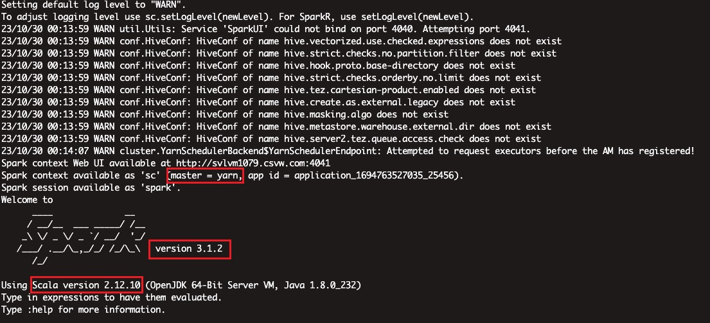

# [SPARK]CDP上安装其他版本SPARK(SPARK3)

## 背景

算法部门要求使用3.x版本的SPARK进行模型训练，但是目前我们使用的CDP上默认的SPARK版本是Spark2.4.7.7.1.7.1041-1，这不符合要求，就需要装一个高版本的SPARK了

不过难点是，CDP集群对于使用者只开放了一个gateway节点，其他节点并不能使用，也就是不能登上去执行shell操作，也没有用户名密码，所以安装spark就不能配置master和worker了。而需要在一台节点上安装配置，能够达到提交任务运行在yarn上(deploy-mode支持client和cluster)

## 操作步骤

### 下载

这里不再赘述，上spark官网，找到下载页面，已经预先编译好了很多版本的spark，这里选择下载spark-3.1.2-bin-hadoop3.2

## 安装

1、解压即安装

2、配置

2.1、进入conf目录下，首先修改`spark-env.sh`

这里面主要修改

~~~shell
SPARK_CONF_DIR=/your/spark/path/conf #SPARK的conf目录位置
HADOOP_CONF_DIR=/etc/hadoop/conf
YARN_CONF_DIR=/etc/hadoop/conf
~~~

接下来修改`spark-defaults.conf`

~~~conf
#
# Licensed to the Apache Software Foundation (ASF) under one or more
# contributor license agreements.  See the NOTICE file distributed with
# this work for additional information regarding copyright ownership.
# The ASF licenses this file to You under the Apache License, Version 2.0
# (the "License"); you may not use this file except in compliance with
# the License.  You may obtain a copy of the License at
#
#    http://www.apache.org/licenses/LICENSE-2.0
#
# Unless required by applicable law or agreed to in writing, software
# distributed under the License is distributed on an "AS IS" BASIS,
# WITHOUT WARRANTIES OR CONDITIONS OF ANY KIND, either express or implied.
# See the License for the specific language governing permissions and
# limitations under the License.
#

# Default system properties included when running spark-submit.
# This is useful for setting default environmental settings.

# Example:
# spark.master                     spark://master:7077
# spark.eventLog.enabled           true
# spark.eventLog.dir               hdfs://namenode:8021/directory
# spark.serializer                 org.apache.spark.serializer.KryoSerializer
# spark.driver.memory              5g
# spark.executor.extraJavaOptions  -XX:+PrintGCDetails -Dkey=value -Dnumbers="one two three"

spark.eventLog.dir=hdfs://nameservice1/user/spark/applicationHistory
spark.yarn.historyServer.address=http://xxxx068.host.com:18088
spark.eventLog.enabled=true
spark.driver.log.dfsDir=/user/spark/driverLogs
spark.driver.log.persistToDfs.enabled=true
spark.dynamicAllocation.enabled=true
spark.dynamicAllocation.executorIdleTimeout=60
spark.dynamicAllocation.minExecutors=0
spark.dynamicAllocation.schedulerBacklogTimeout=1
#spark.yarn.jars=hdfs://nameservice1/tmp/spark3.1.2/yarn/jars/*:
spark.yarn.archive=hdfs://nameservice1/tmp/spark3.1.2/yarn/archives/spark_jars.zip
spark.network.crypto.enabled=false
spark.serializer=org.apache.spark.serializer.KryoSerializer
spark.shuffle.service.enabled=true
spark.shuffle.service.port=7337
spark.ui.enabled=true
spark.ui.killEnabled=true
spark.master=yarn
spark.submit.deployMode=client
spark.driver.extraLibraryPath=/opt/cloudera/parcels/CDH-7.1.7-1.cdh7.1.7.p1041.29602476/lib/hadoop/lib/native
spark.executor.extraLibraryPath=/opt/cloudera/parcels/CDH-7.1.7-1.cdh7.1.7.p1041.29602476/lib/hadoop/lib/native
spark.yarn.am.extraLibraryPath=/opt/cloudera/parcels/CDH-7.1.7-1.cdh7.1.7.p1041.29602476/lib/hadoop/lib/native
spark.yarn.historyServer.allowTracking=true
spark.yarn.appMasterEnv.MKL_NUM_THREADS=1
spark.executorEnv.MKL_NUM_THREADS=1
spark.yarn.appMasterEnv.OPENBLAS_NUM_THREADS=1
spark.executorEnv.OPENBLAS_NUM_THREADS=1
spark.sql.sources.commitProtocolClass=org.apache.spark.internal.io.cloud.PathOutputCommitProtocol
spark.sql.parquet.output.committer.class=org.apache.spark.internal.io.cloud.BindingParquetOutputCommitter
~~~

这里面有两个注意的点，这里注释掉了`spark.yarn.jars`，而是使用了`spark.yarn.archive`

`spark_jars.zip`也即是spark安装目录下的/jars/内的所有jar包

## 使用

### 常规SPARK任务

因为集群的环境变量中默认的`SPARK_HOME`是SPARK2版本的，所以我们在使用时还需要切换SPARK目录

~~~shell
[root@svlvm1079 ~]# echo $SPARK_HOME
/opt/cloudera/parcels/CDH/lib/spark
~~~

手动声明SPARK目录

~~~shell
export SPARK_HOME=/app/scb/service/spark/spark-3.1.2
~~~

启动一个spark-shell，提交一个sparksql查询看看

~~~shell
bin/spark-shell --master yarn --deploy-mode client --driver-memory 5G --driver-cores 10 --num-executors 5 --executor-cores 10 --executor-memory 10G
~~~

如果查询一个稍微大的表会报错，详情见**意外情况**

### PYSPARK任务

集群上没有python3环境，所以需要创建一个python3环境，这里详情见之前那个pyspark on yarn的文章，使用anaconda打包一个虚拟环境上传到集群即可，这里不再赘述

在使用前同样生命环境变量

~~~shell
SPARK_HOME=/app/scb/service/spark/spark-3.1.2
PYSPARK_PYTHON=/app/scb/service/spark/pysparker/bin/python
PYSPARK_DRIVER_PYTHON=/app/scb/service/spark/pysparker/bin/python
~~~

### SPARK-SUBMIT

#### 提交jar包任务

~~~shell
#注意声明SPARK_HOME
./bin/spark-submit --class org.apache.spark.examples.SparkPi \
    --master yarn \
    --deploy-mode cluster \
    --driver-memory 4g \
    --executor-memory 2g \
    --executor-cores 1 \
    --queue thequeue \
    examples/jars/spark-examples*.jar \
    10
~~~

#### 提交PYSPARK任务

~~~shell
#注意声明SPARK_HOME
spark-submit \
--master yarn \
--deploy-mode cluster \
--driver-memory 1g \
--driver-cores 2 \
--num-executors 3 \
--executor-memory 5G \
--conf spark.executor.pyspark.memory=2G \
--executor-cores 4 \
--conf spark.yarn.maxAppAttempts=1 \
--conf spark.driver.maxResultSize=2G \
--conf spark.dynamicAllocation.enabled=false \
--archives hdfs://nameservice1/tmp/spark3.1.2/pyspark/pysparker.zip#PyEnv \
--conf spark.yarn.appMasterEnv.PYSPARK_PYTHON=PyEnv/bin/python \
--conf spark.yarn.appMasterEnv.PYSPARK_DRIVER_PYTHON=PyEnv/bin/python \
--conf spark.executorEnv.PYSPARK_PYTHON=PyEnv/bin/python \
--conf spark.executorEnv.PYSPARK_DRIVER_PYTHON=PyEnv/bin/python \
/app/scb/scripts/spark/pyspark/start.py 
~~~

## 意外情况

### hive表找不到

#### 解决

将hive-site.xml文件复制到spark的conf目录下

### shullfle异常

启动一个常规spark-shell

~~~shell
bin/spark-shell --master yarn --deploy-mode client --driver-memory 5G --driver-cores 10 --num-executors 5 --executor-cores 10 --executor-memory 10G
~~~

查询一个大表

~~~scala
spark.sql("select count(1) from xxxx_db.dim_vehicle_df ").show()
~~~

会抛出异常：

~~~java
org.apache.spark.shuffle.FetchFailedException: java.lang.IllegalArgumentException: Unknown message type: 9
org.apache.spark.shuffle.FetchFailedException: java.lang.IllegalArgumentException: Unknown message type: 9
	at org.apache.spark.network.shuffle.protocol.BlockTransferMessage$Decoder.fromByteBuffer(BlockTransferMessage.java:71)
	at org.apache.spark.network.shuffle.ExternalShuffleBlockHandler.receive(ExternalShuffleBlockHandler.java:81)
	at org.apache.spark.network.server.TransportRequestHandler.processRpcRequest(TransportRequestHandler.java:159)
	at org.apache.spark.network.server.TransportRequestHandler.handle(TransportRequestHandler.java:109)
	at org.apache.spark.network.server.TransportChannelHandler.channelRead0(TransportChannelHandler.java:140)
	at org.apache.spark.network.server.TransportChannelHandler.channelRead0(TransportChannelHandler.java:53)
	at org.spark_project.io.netty.channel.SimpleChannelInboundHandler.channelRead(SimpleChannelInboundHandler.java:99)
	at org.spark_project.io.netty.channel.AbstractChannelHandlerContext.invokeChannelRead(AbstractChannelHandlerContext.java:379)
	at org.spark_project.io.netty.channel.AbstractChannelHandlerContext.invokeChannelRead(AbstractChannelHandlerContext.java:365)
	at org.spark_project.io.netty.channel.AbstractChannelHandlerContext.fireChannelRead(AbstractChannelHandlerContext.java:357)
	at org.spark_project.io.netty.handler.timeout.IdleStateHandler.channelRead(IdleStateHandler.java:286)
	at org.spark_project.io.netty.channel.AbstractChannelHandlerContext.invokeChannelRead(AbstractChannelHandlerContext.java:379)
	at org.spark_project.io.netty.channel.AbstractChannelHandlerContext.invokeChannelRead(AbstractChannelHandlerContext.java:365)
	at org.spark_project.io.netty.channel.AbstractChannelHandlerContext.fireChannelRead(AbstractChannelHandlerContext.java:357)
	at org.spark_project.io.netty.handler.codec.MessageToMessageDecoder.channelRead(MessageToMessageDecoder.java:103)
	at org.spark_project.io.netty.channel.AbstractChannelHandlerContext.invokeChannelRead(AbstractChannelHandlerContext.java:379)
	at org.spark_project.io.netty.channel.AbstractChannelHandlerContext.invokeChannelRead(AbstractChannelHandlerContext.java:365)
	at org.spark_project.io.netty.channel.AbstractChannelHandlerContext.fireChannelRead(AbstractChannelHandlerContext.java:357)
	at org.apache.spark.network.util.TransportFrameDecoder.channelRead(TransportFrameDecoder.java:85)
	at org.spark_project.io.netty.channel.AbstractChannelHandlerContext.invokeChannelRead(AbstractChannelHandlerContext.java:379)
	at org.spark_project.io.netty.channel.AbstractChannelHandlerContext.invokeChannelRead(AbstractChannelHandlerContext.java:365)
	at org.spark_project.io.netty.channel.AbstractChannelHandlerContext.fireChannelRead(AbstractChannelHandlerContext.java:357)
	at org.spark_project.io.netty.channel.DefaultChannelPipeline$HeadContext.channelRead(DefaultChannelPipeline.java:1410)
	at org.spark_project.io.netty.channel.AbstractChannelHandlerContext.invokeChannelRead(AbstractChannelHandlerContext.java:379)
	at org.spark_project.io.netty.channel.AbstractChannelHandlerContext.invokeChannelRead(AbstractChannelHandlerContext.java:365)
	at org.spark_project.io.netty.channel.DefaultChannelPipeline.fireChannelRead(DefaultChannelPipeline.java:919)
	at org.spark_project.io.netty.channel.nio.AbstractNioByteChannel$NioByteUnsafe.read(AbstractNioByteChannel.java:166)
	at org.spark_project.io.netty.channel.nio.NioEventLoop.processSelectedKey(NioEventLoop.java:719)
	at org.spark_project.io.netty.channel.nio.NioEventLoop.processSelectedKeysOptimized(NioEventLoop.java:655)
	at org.spark_project.io.netty.channel.nio.NioEventLoop.processSelectedKeys(NioEventLoop.java:581)
	at org.spark_project.io.netty.channel.nio.NioEventLoop.run(NioEventLoop.java:493)
	at org.spark_project.io.netty.util.concurrent.SingleThreadEventExecutor$4.run(SingleThreadEventExecutor.java:986)
	at org.spark_project.io.netty.util.internal.ThreadExecutorMap$2.run(ThreadExecutorMap.java:74)
	at org.spark_project.io.netty.util.concurrent.FastThreadLocalRunnable.run(FastThreadLocalRunnable.java:30)
	at java.lang.Thread.run(Thread.java:748)

	at org.apache.spark.storage.ShuffleBlockFetcherIterator.throwFetchFailedException(ShuffleBlockFetcherIterator.scala:770)
	at org.apache.spark.storage.ShuffleBlockFetcherIterator.next(ShuffleBlockFetcherIterator.scala:685)
	at org.apache.spark.storage.ShuffleBlockFetcherIterator.next(ShuffleBlockFetcherIterator.scala:70)
	at org.apache.spark.util.CompletionIterator.next(CompletionIterator.scala:29)
	at scala.collection.Iterator$$anon$11.nextCur(Iterator.scala:484)
	at scala.collection.Iterator$$anon$11.hasNext(Iterator.scala:490)
	at scala.collection.Iterator$$anon$10.hasNext(Iterator.scala:458)
	at org.apache.spark.util.CompletionIterator.hasNext(CompletionIterator.scala:31)
	at org.apache.spark.InterruptibleIterator.hasNext(InterruptibleIterator.scala:37)
	at scala.collection.Iterator$$anon$10.hasNext(Iterator.scala:458)
	at org.apache.spark.sql.catalyst.expressions.GeneratedClass$GeneratedIteratorForCodegenStage2.agg_doAggregateWithoutKey_0$(Unknown Source)
	at org.apache.spark.sql.catalyst.expressions.GeneratedClass$GeneratedIteratorForCodegenStage2.processNext(Unknown Source)
	at org.apache.spark.sql.execution.BufferedRowIterator.hasNext(BufferedRowIterator.java:43)
	at org.apache.spark.sql.execution.WholeStageCodegenExec$$anon$1.hasNext(WholeStageCodegenExec.scala:755)
	at org.apache.spark.sql.execution.SparkPlan.$anonfun$getByteArrayRdd$1(SparkPlan.scala:345)
	at org.apache.spark.rdd.RDD.$anonfun$mapPartitionsInternal$2(RDD.scala:898)
	at org.apache.spark.rdd.RDD.$anonfun$mapPartitionsInternal$2$adapted(RDD.scala:898)
	at org.apache.spark.rdd.MapPartitionsRDD.compute(MapPartitionsRDD.scala:52)
	at org.apache.spark.rdd.RDD.computeOrReadCheckpoint(RDD.scala:373)
	at org.apache.spark.rdd.RDD.iterator(RDD.scala:337)
	at org.apache.spark.scheduler.ResultTask.runTask(ResultTask.scala:90)
	at org.apache.spark.scheduler.Task.run(Task.scala:131)
	at org.apache.spark.executor.Executor$TaskRunner.$anonfun$run$3(Executor.scala:497)
	at org.apache.spark.util.Utils$.tryWithSafeFinally(Utils.scala:1439)
	at org.apache.spark.executor.Executor$TaskRunner.run(Executor.scala:500)
	at java.util.concurrent.ThreadPoolExecutor.runWorker(ThreadPoolExecutor.java:1149)
	at java.util.concurrent.ThreadPoolExecutor$Worker.run(ThreadPoolExecutor.java:624)
	at java.lang.Thread.run(Thread.java:748)
Caused by: java.lang.RuntimeException: java.lang.IllegalArgumentException: Unknown message type: 9
	at org.apache.spark.network.shuffle.protocol.BlockTransferMessage$Decoder.fromByteBuffer(BlockTransferMessage.java:71)
	at
 .......   io.netty.channel.AbstractChannelHandlerContext.invokeChannelRead(AbstractChannelHandlerContext.java:365)
	at io.netty.channel.DefaultChannelPipeline.fireChannelRead(DefaultChannelPipeline.java:919)
	at io.netty.channel.nio.AbstractNioByteChannel$NioByteUnsafe.read(AbstractNioByteChannel.java:163)
	at io.netty.channel.nio.NioEventLoop.processSelectedKey(NioEventLoop.java:714)
	at io.netty.channel.nio.NioEventLoop.processSelectedKeysOptimized(NioEventLoop.java:650)
	at io.netty.channel.nio.NioEventLoop.processSelectedKeys(NioEventLoop.java:576)
	at io.netty.channel.nio.NioEventLoop.run(NioEventLoop.java:493)
	at io.netty.util.concurrent.SingleThreadEventExecutor$4.run(SingleThreadEventExecutor.java:989)
	at io.netty.util.internal.ThreadExecutorMap$2.run(ThreadExecutorMap.java:74)
	at io.netty.util.concurrent.FastThreadLocalRunnable.run(FastThreadLocalRunnable.java:30)
	... 1 more
~~~

#### 解决

该问题在Stack Overflow有人提出过，详情见https://stackoverflow.com/questions/68730904/illegalargumentexception-unknown-message-type-9-while-reading-delta-file

下面的回复中提到一个jira https://issues.apache.org/jira/browse/SPARK-27780

回复中有一个人回答需要加上一个参数`--conf spark.shuffle.useOldFetchProtocol=true`

使用这个之后，异常就没了！