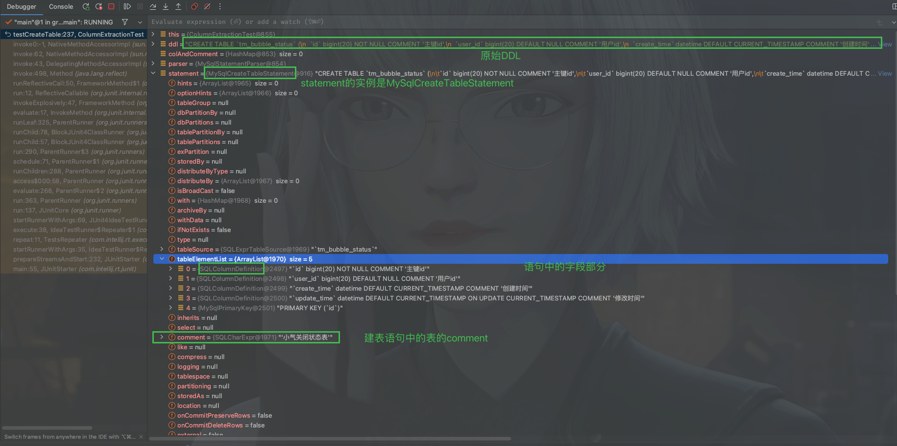
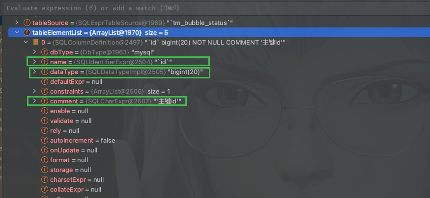

# [SQL]Druid SQL解析器

## 问题的开始

如何根据数据库中发生的DDL语句，从中解析得到每个表的Comment以及字段的Comment呢？

调研了一下开源的工具有哪些，目前知道阿里JSQLParser、Apache Calcite还有开源的Druid都支持SQL的解析，使用了一下发现JSQLParser很快但是API不好用，Calcite被很多开源工具使用，但是目前还不会具体使用（没做深入研究），听说Druid很强，于是仔细了解了一下，并且实现了在生产环境的应用。下面简单谈一谈Druid的使用。

## 快速上手

我们使用一段简短的SQL来解析并得到字段

~~~java
    @Test
    public void testCreateParse(){
        String ddl = "CREATE TABLE `tm_bubble_status` (\n" +
                "  `id` bigint(20) NOT NULL COMMENT '主键id',\n" +
                "  `user_id` bigint(20) DEFAULT NULL COMMENT '用户id',\n" +
                "  `create_time` datetime DEFAULT CURRENT_TIMESTAMP COMMENT '创建时间',\n" +
                "  `update_time` datetime DEFAULT CURRENT_TIMESTAMP ON UPDATE CURRENT_TIMESTAMP COMMENT '修改时间',\n" +
                "  PRIMARY KEY (`id`)\n" +
                ") ENGINE=InnoDB DEFAULT CHARSET=utf8mb4 COMMENT='小气关闭状态表'";
        // 新建 MySQL Parser
        SQLStatementParser parser = new MySqlStatementParser(ddl);

        // 使用Parser解析生成AST，这里SQLStatement就是AST
        SQLStatement statement = parser.parseStatement();

        // 使用visitor来访问AST
        MySqlSchemaStatVisitor visitor = new MySqlSchemaStatVisitor();
        statement.accept(visitor);

        // 从visitor中拿出你所关注的信息
        System.out.println(visitor.getColumns());

    }
~~~

上面使用MySqlStatementParser解析一个MySQL中的DDL建表语句，拿到字段信息，控制台输出：

~~~ini
[tm_bubble_status.id, tm_bubble_status.user_id, tm_bubble_status.create_time, tm_bubble_status.update_time]

Process finished with exit code 0
~~~

## 自定义解析案例

回到文章刚开始的问题，如果想要拿到语句中所有的字段以及它们的comment，该如何做呢？

直接放码吧！

### 解析CREATE语句

~~~java
    @Test
    public void testCreateTable() {
        String ddl = "CREATE TABLE `tm_bubble_status` (\n" +
                "  `id` bigint(20) NOT NULL COMMENT '主键id',\n" +
                "  `user_id` bigint(20) DEFAULT NULL COMMENT '用户id',\n" +
                "  `create_time` datetime DEFAULT CURRENT_TIMESTAMP COMMENT '创建时间',\n" +
                "  `update_time` datetime DEFAULT CURRENT_TIMESTAMP ON UPDATE CURRENT_TIMESTAMP COMMENT '修改时间',\n" +
                "  PRIMARY KEY (`id`)\n" +
                ") ENGINE=InnoDB DEFAULT CHARSET=utf8mb4 COMMENT='小气关闭状态表'";

        HashMap<String, String> colAndComment = new HashMap<>();
        try {
            MySqlStatementParser parser = new MySqlStatementParser(ddl);
            // 使用Parser解析生成AST，这里SQLStatement就是AST
            SQLCreateTableStatement statement = (SQLCreateTableStatement) parser.parseStatement();
            List<SQLColumnDefinition> columnDefinitions = statement.getColumnDefinitions();

            for (SQLColumnDefinition columnDefinition : columnDefinitions) {
                String colName = columnDefinition.getName().getSimpleName().replaceAll("`", "");
                String comment = columnDefinition.getComment().toString().replaceAll("'", "");
                colAndComment.put(colName, comment);
            }

            System.out.println(colAndComment);

        } catch (Exception e) {
            throw new IllegalArgumentException("DDL语法不正确");

        }
    }
~~~

控制台输出:

~~~ini
{update_time=修改时间, create_time=创建时间, user_id=用户id, id=主键id}
~~~

### 解析ALTER语句

~~~java
    @Test
    public void testAlterTable() {
        String ddl3 = "ALTER TABLE tm_app_banner\n" +
                "MODIFY `package_name` VARCHAR(100) DEFAULT NULL COMMENT '包名xx',\n" +
                "DROP COLUMN `image1`,\n" +
                "DROP COLUMN `image2`,\n" +
                "ADD COLUMN `images` VARCHAR(255) DEFAULT NULL COMMENT 'URL: xx',\n" +
                "MODIFY `status` TINYINT(1) DEFAULT '2' COMMENT '0:很好的,1:y,不好的:好的 heiei',\n" +
                "ADD COLUMN `white_list_flag` TINYINT(1) DEFAULT '1' COMMENT '好的嘛 OK',\n" +
                "ADD COLUMN `white_list_categorys` VARCHAR(11) DEFAULT NULL COMMENT '白名单状态 并且',\n" +
                "ADD COLUMN `hu_software_version` INT(11) DEFAULT '0' COMMENT 'hu_software_version and other'";
        try {
            MySqlStatementParser parser = new MySqlStatementParser(ddl3);
            // 使用Parser解析生成AST，这里SQLStatement就是AST
            SQLAlterTableStatement statement = (SQLAlterTableStatement) parser.parseStatement();

            List<SQLAlterTableItem> items = statement.getItems();
            HashMap<String, String> colAndComment = new HashMap<>();
            items.forEach(
                    x -> {
                        //如果是ADD语句
                        if (x instanceof SQLAlterTableAddColumn) {
                            for (SQLColumnDefinition column : ((SQLAlterTableAddColumn) x).getColumns()) {
                                String colName = column.getName().getSimpleName().replaceAll("`", "");
                                String comment = column.getComment().toString().replaceAll("'", "");
                                colAndComment.put(colName, comment);
                            }
                        }
                        //如果MODIFY语句
                        if (x instanceof MySqlAlterTableModifyColumn) {
                            SQLColumnDefinition newColumnDefinition = ((MySqlAlterTableModifyColumn) x).getNewColumnDefinition();
                            String colName = newColumnDefinition.getName().getSimpleName();
                            String comment = newColumnDefinition.getComment().toString();
                            colAndComment.put(colName, comment);
                        }
                    }
            );
            System.out.println(colAndComment);
        } catch (Exception e) {
            throw new IllegalArgumentException("DDL语法不正确");

        }
    }
~~~

控制台输出:

~~~ini
{images=URL: xx, `status`='0:很好的,1:y,不好的:好的 heiei', white_list_flag=好的嘛 OK, white_list_categorys=白名单状态 并且, `package_name`='包名xx', hu_software_version=hu_software_version and other}
~~~

上面之解析了ADD字段的部分和MODIFY字段的部分。

## 拓展

我们以一段代码为例，打一个断点，进入代码深入看看还可以做些什么。

在`testCreateTable`方法中的

~~~java
SQLCreateTableStatement statement = (SQLCreateTableStatement) parser.parseStatement();
~~~

这一行打一个断点。运行。

从断点中可以看到各种信息，再看下每个字段的细节

由此可以看到，如果想要拿到字段及其对应的类型，即可以从`SQLColumnDefinition`中拿到。