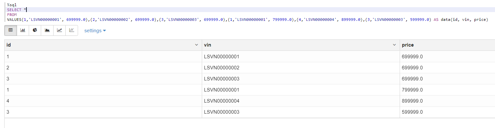
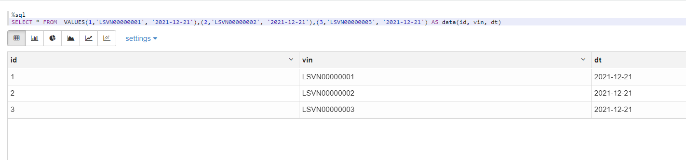
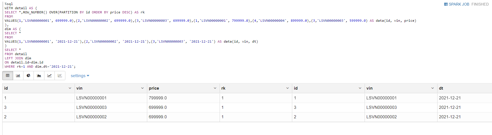
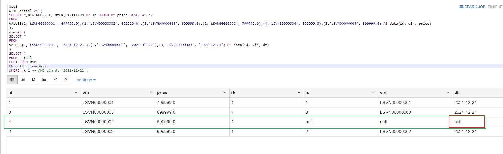
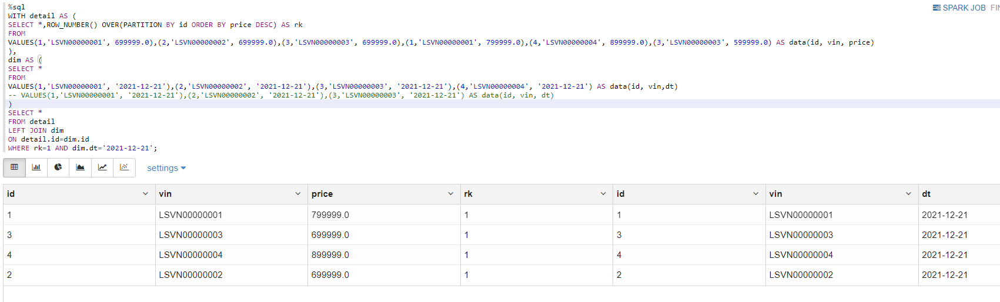
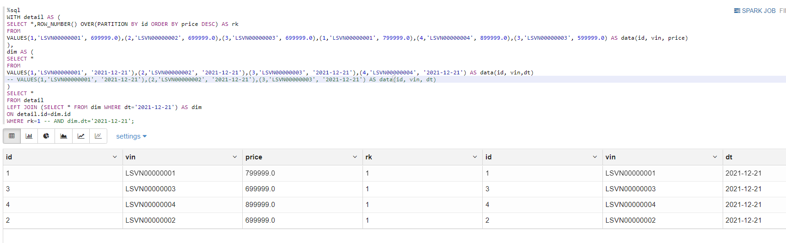

# [SQL]为什么LEFT JOIN后总数却与右表的总数一样了？

今天遇到一个这样的SQL问题，表A与表B使用`LEFT JOIN`之后，结果数据的总量却与表B相等了，研究了一番终于查到了原因。首先，一个毋庸置疑的认知是：**使用LEFT JOIN，结果数据集的数据总量一定取决于左表。** 造成今天遇到的SQL问题，SQL的写法也是有区别的，下面进行事件重演。

## 事件回放

下面使用SparkSQL造一批数据

表detail，含有字段id, vin, 和price

表dim

发生奇妙结果的SQL如下：

~~~sql
WITH detail AS (
SELECT *,ROW_NUMBER() OVER(PARTITION BY id ORDER BY price DESC) AS rk
FROM
VALUES(1,'LSVN00000001', 699999.0),(2,'LSVN00000002', 699999.0),(3,'LSVN00000003', 699999.0),(1,'LSVN00000001', 799999.0),(4,'LSVN00000004', 899999.0),(3,'LSVN00000003', 599999.0) AS data(id, vin, price)
),
dim AS (
SELECT *
FROM
VALUES(1,'LSVN00000001', '2021-12-21'),(2,'LSVN00000002', '2021-12-21'),(3,'LSVN00000003', '2021-12-21') AS data(id, vin, dt)
)
SELECT *
FROM detail
LEFT JOIN dim
ON detail.id=dim.id
WHERE rk=1 AND dim.dt='2021-12-21';
~~~

执行结果：

可以看到结果数据集的数据量和dim表的数据量保持一致，为3条。

## 事件分析

我们观察可以看到detail表含有6条记录，id去重后有4个，而dim表却有3个，在使用`ROW_NUMBER() OVER()`函数去重后得到的结果数据集按照预想应该有4条，可是却只有3条，原因就归结在那个where条件里-> `WHERE rk=1 AND dim.dt='2021-12-21';`

首先左表数据比右表多，如果不看`dim.dt='2021-12-21'`这个筛选条件，在左表中比右表多出来的记录里，join得到的dt应该为NULL，这很好理解，左表去join右表 按照on的条件join不到的即为NULL，那么在左表呈现的数据里，尽可能展示右表有的数据。

执行SQL：

~~~sql
WITH detail AS (
SELECT *,ROW_NUMBER() OVER(PARTITION BY id ORDER BY price DESC) AS rk
FROM
VALUES(1,'LSVN00000001', 699999.0),(2,'LSVN00000002', 699999.0),(3,'LSVN00000003', 699999.0),(1,'LSVN00000001', 799999.0),(4,'LSVN00000004', 899999.0),(3,'LSVN00000003', 599999.0) AS data(id, vin, price)
),
dim AS (
SELECT *
FROM
VALUES(1,'LSVN00000001', '2021-12-21'),(2,'LSVN00000002', '2021-12-21'),(3,'LSVN00000003', '2021-12-21') AS data(id, vin, dt)
)
SELECT *
FROM detail
LEFT JOIN dim
ON detail.id=dim.id
WHERE rk=1;
~~~

我们把那个条件删除重跑，得到以下结果：

我们再把条件`dim.dt='2021-12-21'`带入进去，可以得到结果集中`id=4`的记录将会被剔除。

## 问题根源？

总结一下上述的原因为:<u>左表的记录数比右表多，在最后使用where过滤的时候，去过滤右表中的数据。从而导致数据比左表少了。</u>

如何解决这种情况？

应该使用以下的SQL来避免歧义：

~~~sql
WITH detail AS (
SELECT *,ROW_NUMBER() OVER(PARTITION BY id ORDER BY price DESC) AS rk
FROM
VALUES(1,'LSVN00000001', 699999.0),(2,'LSVN00000002', 699999.0),(3,'LSVN00000003', 699999.0),(1,'LSVN00000001', 799999.0),(4,'LSVN00000004', 899999.0),(3,'LSVN00000003', 599999.0) AS data(id, vin, price)
),
dim AS (
SELECT *
FROM
VALUES(1,'LSVN00000001', '2021-12-21'),(2,'LSVN00000002', '2021-12-21'),(3,'LSVN00000003', '2021-12-21') AS data(id, vin, dt)
)
SELECT *
FROM detail
LEFT JOIN (SELECT * FROM dim WHERE dt='2021-12-21') AS dim
ON detail.id=dim.id
WHERE rk=1 -- AND dim.dt='2021-12-21';
~~~

如果左表的主键完全在右表中出现，那么上述两种SQL的写法都是OK的，不会造成数据量的偏差。重新造数验证一下，现在左表的id全部在右表中出现，即detail中的id完全在dim中：

第一种写法：

~~~sql
WITH detail AS (
SELECT *,ROW_NUMBER() OVER(PARTITION BY id ORDER BY price DESC) AS rk
FROM
VALUES(1,'LSVN00000001', 699999.0),(2,'LSVN00000002', 699999.0),(3,'LSVN00000003', 699999.0),(1,'LSVN00000001', 799999.0),(4,'LSVN00000004', 899999.0),(3,'LSVN00000003', 599999.0) AS data(id, vin, price)
),
dim AS (
SELECT *
FROM
VALUES(1,'LSVN00000001', '2021-12-21'),(2,'LSVN00000002', '2021-12-21'),(3,'LSVN00000003', '2021-12-21'),(4,'LSVN00000004', '2021-12-21') AS data(id, vin,dt)
-- VALUES(1,'LSVN00000001', '2021-12-21'),(2,'LSVN00000002', '2021-12-21'),(3,'LSVN00000003', '2021-12-21') AS data(id, vin, dt)
)
SELECT *
FROM detail
LEFT JOIN dim
ON detail.id=dim.id
WHERE rk=1 AND dim.dt='2021-12-21';
~~~

结果

第二种写法：

~~~sql
WITH detail AS (
SELECT *,ROW_NUMBER() OVER(PARTITION BY id ORDER BY price DESC) AS rk
FROM
VALUES(1,'LSVN00000001', 699999.0),(2,'LSVN00000002', 699999.0),(3,'LSVN00000003', 699999.0),(1,'LSVN00000001', 799999.0),(4,'LSVN00000004', 899999.0),(3,'LSVN00000003', 599999.0) AS data(id, vin, price)
),
dim AS (
SELECT *
FROM
VALUES(1,'LSVN00000001', '2021-12-21'),(2,'LSVN00000002', '2021-12-21'),(3,'LSVN00000003', '2021-12-21'),(4,'LSVN00000004', '2021-12-21') AS data(id, vin,dt)
-- VALUES(1,'LSVN00000001', '2021-12-21'),(2,'LSVN00000002', '2021-12-21'),(3,'LSVN00000003', '2021-12-21') AS data(id, vin, dt)
)
SELECT *
FROM detail
LEFT JOIN (SELECT * FROM dim WHERE dt='2021-12-21') AS dim
ON detail.id=dim.id
WHERE rk=1 -- AND dim.dt='2021-12-21';
~~~

结果

## 总结

发生以上情况原因有二：

- 1、两表join的字段，左表不完全存在于右表
- 2、在join完之后对右表的数据进行过滤

