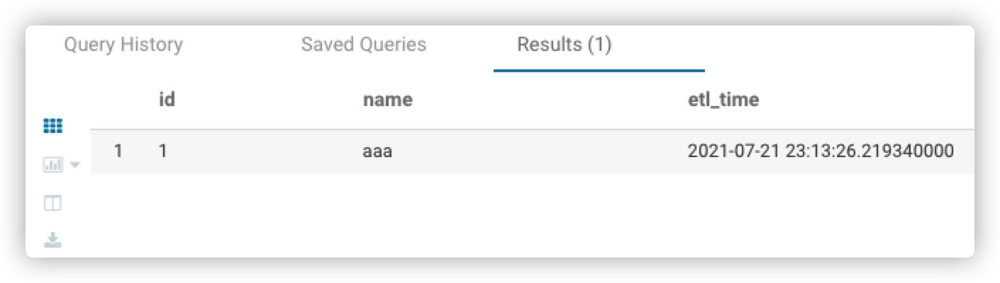
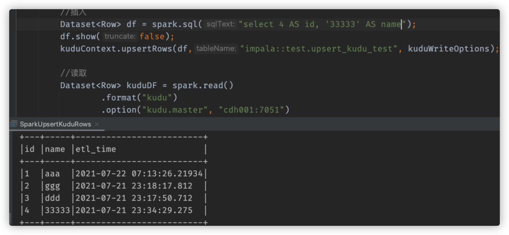
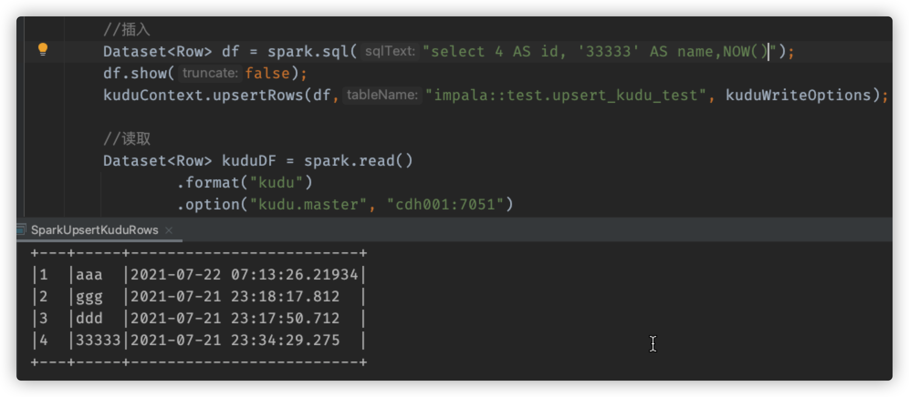
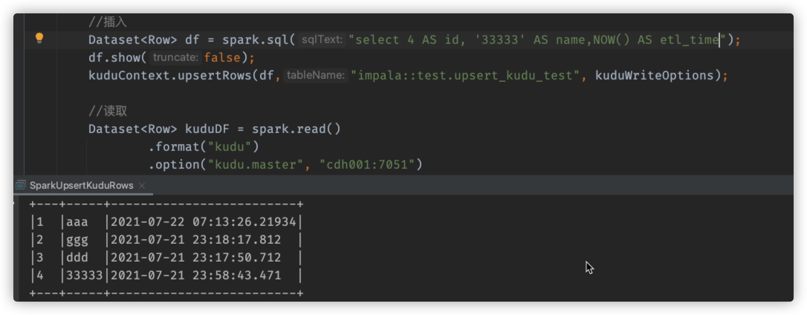

# 关于Kudu Upsert列的问题

今天做线索下发，涉及到spark修改kudu列的数据，发现了一个问题，kudu表中的数据始终没有被修改，于是晚间我在本地尝试着复现了一波，发现了一些问题，记录于此，明天去测试环境再测试一下。

## 需求起源

场景是这样的，<u>需求是原先存在于kudu表中的数据，有一列为主键，当该列的数据发生更新之后，直接将该条数据upsert。</u>

## 复现

### 建表

我在本地使用impala建了一个表，名为upsert_kudu_test

~~~sql
CREATE TABLE upsert_kudu_test(
id int,
name string,
etl_time TIMESTAMP,
PRIMARY KEY (id)
)
STORED AS kudu;
~~~

在kudu中其实际名为：impala::test.upsert_kudu_test

### 插入数据

使用impala可以直接插入数据

~~~sql
INSERT INTO test.upsert_kudu_test VALUES(1, 'aaa',NOW());
~~~

没有问题，impala可以直接查询出来

可是，实际情况是，任务是使用Spark在集群环境中跑的，对于kudu中列数据的插入和修改都是通过spark来完成的，于是，我模拟在本地使用spark来插入和修改改表的数据，代码如下：

~~~java
SparkSession spark = SparkSession.builder()
                .master("local[4]")
                .appName("UpsertKuduRows")
                .getOrCreate();

KuduContext kuduContext = new KuduContext("cdh001:7051", spark.sparkContext());
KuduWriteOptions kuduWriteOptions = new KuduWriteOptions(false, false, false, false, false);

//插入
Dataset<Row> df = spark.sql("select 2 AS id, 'ggg' AS name, NOW() AS etl_time");
df.show(false);
kuduContext.upsertRows(df,"impala::test.upsert_kudu_test", kuduWriteOptions);

//读取
Dataset<Row> kuduDF = spark.read()
        .format("kudu")
        .option("kudu.master", "cdh001:7051")
        .option("kudu.table", "impala::test.upsert_kudu_test")
        .load();

kuduDF.createOrReplaceTempView("test_view");
spark.sql("select * from test_view").show(false);
~~~

此时，表中成功插入了一条id=2，name=ggg，etl_time=2021-07-21 23:18:17.812的数据

### 出现问题

我开始思考我白天的时候为什么在upsert数据也就是更新数据的时候没有成功，我一开始以为是在创建KuduWriteOptions时，其第二个参数设置为true的原因，可是当我无论怎么设置它，都不太好使。

~~~properties
KuduWriteOptions holds configuration of writes to Kudu tables.
Params:
ignoreDuplicateRowErrors – when inserting, ignore any new rows that have a primary key conflict with existing rows
ignoreNull – update only non-Null columns if set true
repartition – if set to true, the data will be repartitioned to match the partitioning of the target Kudu table
repartitionSort – if set to true, the data will also be sorted while being repartitioned. This is only used if repartition is true.
handleSchemaDrift – if set to true, when fields with names that are not in the target Kudu table are encountered, the Kudu table will be altered to include new columns for those fields.
~~~

该参数名叫`ionoreNull`,尝试的过程中，尝试的过程中，我试着将etl_time直接不写，以为该数据就不会更新，可是结果出乎我意料，id=2的name成功更新了，etl_time却没有更新

1、原先数据为：

~~~
+---+-----+-------------------------+
|1  |aaa  |2021-07-22 07:13:26.21934|
|2  |ggg  |2021-07-21 23:18:17.812  |
|3  |ddd  |2021-07-21 23:17:50.712  |
|4  |22222|2021-07-21 23:34:29.275  |
+---+-----+-------------------------+
~~~

2、我使用如下语句upsert

~~~java
//插入
Dataset<Row> df = spark.sql("select 4 AS id, '33333' AS name");
df.show(false);
kuduContext.upsertRows(df,"impala::test.upsert_kudu_test", kuduWriteOptions);
~~~

此时数据变为

~~~sql
+---+-----+-------------------------+
|id |name |etl_time                 |
+---+-----+-------------------------+
|1  |aaa  |2021-07-22 07:13:26.21934|
|2  |ggg  |2021-07-21 23:18:17.812  |
|3  |ddd  |2021-07-21 23:17:50.712  |
|4  |33333|2021-07-21 23:34:29.275  |
+---+-----+-------------------------+
~~~

可以观察到，<u>name变了，可是时间却没有变</u>，好家伙，继续尝试，将etl_time加上，可是这次不写`AS etl_time`

3、使用如下代码插入数据

~~~java
//插入
Dataset<Row> df = spark.sql("select 4 AS id, '33333' AS name,NOW()");
df.show(false);
kuduContext.upsertRows(df,"impala::test.upsert_kudu_test", kuduWriteOptions);
~~~

此时数据变为：

~~~sql
+---+-----+-------------------------+
|1  |aaa  |2021-07-22 07:13:26.21934|
|2  |ggg  |2021-07-21 23:18:17.812  |
|3  |ddd  |2021-07-21 23:17:50.712  |
|4  |33333|2021-07-21 23:34:29.275  |
+---+-----+-------------------------+
~~~

可以观察到，<u>`etl_time`这个字段的值，并没有发生改变</u>

4、接着尝试，这次将`AS etl_time`加上

得到结果如下：

~~~sql
+---+-----+-------------------------+
|1  |aaa  |2021-07-22 07:13:26.21934|
|2  |ggg  |2021-07-21 23:18:17.812  |
|3  |ddd  |2021-07-21 23:17:50.712  |
|4  |33333|2021-07-21 23:58:43.471  |
+---+-----+-------------------------+
~~~

可以观察到，`etl_time`这个字段的值，这次改变了

## 结论

- 在使用spark去upsert kudu列的时候，一定得讲SELECT得到的DF每个字段加上该列的名字，即加上`AS COLUMN_NAME`，经过尝试
  - 不加`AS COLUMN_NAME`，kudu无法识别，不会进行更新
  - 加上了`AS COLUMN_NAME`，但是COLUMN_NAME错了，Kudu则会报错
- Kudu是列式存储